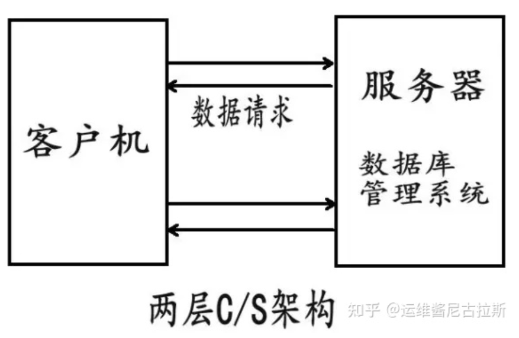

# C/S 與 B/S 架構比較

> 來源：origin/010-寫在前面/04-CS 架構和 BS 架構.md / 全文

> 大量運算可以放在服務端、原生客戶端或瀏覽器端，架構選擇取決於性能、安全、資料位置、授權控制與使用體驗等需求。有些軟件需要控制哪些電腦可以安裝或執行，這類情境可能更適合 C/S 架構。

## C/S 架構

C/S 架構軟件有一個特點，就是如果用戶要使用的話，需要下載一個客戶端，安裝後就可以使用。比如 QQ、OFFICE 軟件等。

這裡需要補充的是，客戶端不僅僅是一些簡單的操作，它也是會處理一些運算、業務邏輯的處理等。也就是說，客戶端也做著一些本該由服務器來做的一些事情。

### C/S 架構的優點

- C/S 架構的客戶端可以提供較豐富的界面、操作與本機能力。
- 在特定內網、專用設備或受控環境中，C/S 架構較容易配合權限與部署策略做安全控制；但安全性仍取決於整體設計與實作。
- 客戶端可以承擔部分運算或快取資料，某些場景下響應速度較快；實際速度仍取決於網路、服務器、客戶端與資料量。

### C/S 架構的缺點

- 需要安裝或更新專用客戶端，部署與維護成本較高。
- 用戶群通常較固定；如果面向大量不確定使用者，安裝門檻會比較高。
- 維護成本高，發生一次升級，則所有客戶端的程序都需要改變。

## B/S 架構

> B/S 架構的系統無須特別安裝，只有 Web 瀏覽器即可。

其實就是我們前端現在做的一些事情，大部分的邏輯交給後台來實現，我們前端大部分是做一些數據渲染、請求等比較少的邏輯。

B/S 架構的全稱為 Browser/Server，即瀏覽器/服務器結構。Browser 指的是 Web 瀏覽器，極少數事務邏輯在前端實現，但主要事務邏輯在服務器端實現。

B/S 架構常可用三層模型理解，分別為：

- 第一層表現層：主要負責使用者介面、互動與結果展示。
- 第二層邏輯層：主要在服務器端處理業務邏輯、請求與回應。
- 第三層數據層：主要負責資料儲存、查詢與管理，通常由服務器端邏輯層存取。

### B/S 架構的優點

- 客戶端無需安裝，有 Web 瀏覽器即可。
- B/S 架構可以直接放在廣域網上，通過一定的權限控制實現多客戶訪問的目的，交互性較強。
- B/S 架構無需升級多個客戶端，升級服務器即可。可以隨時更新版本，而無需用戶重新下載。

### B/S 架構的缺點

- 在跨瀏覽器上，B/S 架構不盡如人意。
- 表現要達到 C/S 程序的程度需要花費不少精力。
- 在速度和安全性上需要花費巨大的設計成本，這是 B/S 架構的最大問題。
