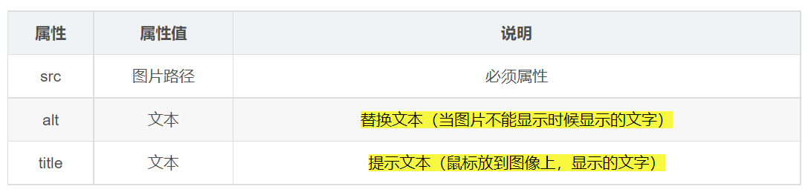

---
source:
  - 'origin/180-圖片標籤/01-圖片標籤.md / # 1. 圖像標籤和屬性介紹'
  - 'origin/180-圖片標籤/01-圖片標籤.md / # 2. 圖像標籤屬性的注意點'
  - 'origin/180-圖片標籤/01-圖片標籤.md / # 4. 圖像標籤的使用'
---

# img 標籤與常用屬性

## 圖像標籤介紹

- 場景 : 在網頁中顯示圖片。
- 單詞 image 的縮寫，意為圖像。
- 在基本用法中，`src` 是 `` 最常用的圖片來源屬性，用於指定圖像文件的路徑和文件名；若使用響應式圖片，也可能透過 `srcset` 提供圖片來源。
- `alt` 用於提供圖片的替代內容；有意義的圖片應寫可替代圖片資訊的文字，裝飾圖片可寫 `alt=""`。
- 特點 :
    - 單標籤。
    - **img** 標籤要展示對應的效果，需要藉助標籤的屬性進行設置。



```html

```

## 圖像標籤屬性的注意點

- 圖像標籤可以擁有很多屬性，必須寫在標籤名的後面。
- 屬性之間不分先後順序，標籤名與屬性、屬性與屬性之間均以空格分開。
- 屬性採取鍵值對的格式，即 **key = "value"** 的格式，**屬性 = "屬性值"**。

## width 和 height 屬性

- 如果只設置 `width` 或 `height` 中的一個，另一個沒設置的會 **自動等比例縮放** ( 此時圖片不會變形 )。
- 如果同時設置了 `width` 和 `height` 兩個，**若設置不當此時圖片可能會變形**。

## 圖像標籤的使用

```html
<body>
  <h4>圖像標籤的使用:</h4>
  <br>
  <hr>

  <h4> alt 替換文本 圖像顯示不出來的時候用文字替換:</h4>
   <br>
  <hr>

  <h4> title 提示文本 鼠標放到圖像上,提示的文字:</h4>
  <br>
  <hr>

  <h4> width、height</h4>
  <br>
  <hr>
</body>
```
