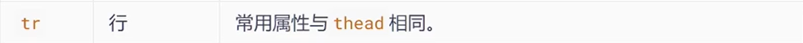
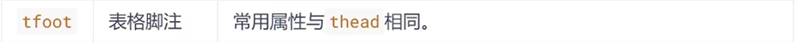

# 表格常用屬性

> 來源：origin/230-表格標籤/01-表格標籤.md / # **3. 常用屬性**

- table 常用屬性
  - ✍️ 表格標籤這部分屬性我們實際開發不常用，後面通過 CSS 來設置。

  ```html
  <!--
          這些屬性要寫到表格標籤 table 裡面去
          1. align: 規定表格相對周圍元素的對齊方式，屬性值有left、center、right。
          2. border: 設置了表格的邊框寬度。你可以將這個值調整為你想要的任何正整數，以設置邊框的寬度。
            2.1 border="0" 或不使用 border 屬性默認就是無邊框。
          3. cellpadding: 規定單元邊沿與其內容之間的空白，默認1像素
          4. cellspacing: 規定單元格之間的空白，默認2像素
          5. width: 規定表格的寬度
  -->

  <table align=center border="1" cellpadding="20" cellspacing="0" width="500">
      <!-- 中間省略 ... -->
  </table>
  ```

- thead 常用屬性

  

- tbody 常用屬性

  

- tr 常用屬性

  

- tfoot 常用屬性

  

- td 常用屬性

  

- th 常用屬性

  

<aside>
⚠️

**注意點 :**

- table 元素的 border 屬性主要影響表格外框的邊框寬度，不適合用來精細控制各單元格邊框，這類樣式之後要靠 CSS 控制。
- 給某個 th 或 td 設置了寬度之後，它所在的那一列的寬度就確定了。
- 給某個 th 或 td 設置了高度之後，通常會影響它所在同一行的高度；實際高度仍可能受內容與表格排版規則影響。
</aside>
