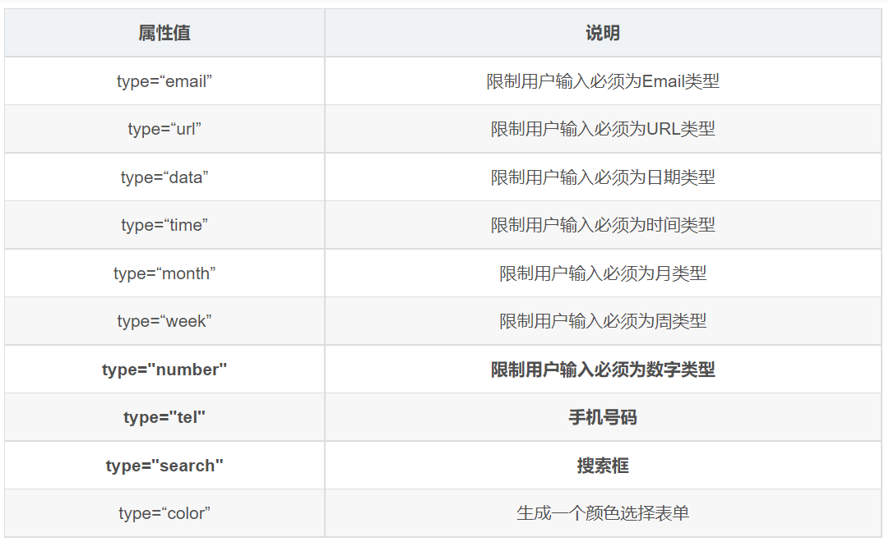

# HTML5 新增 input 類型

> 來源：origin/測試/03-表單控件.md / ### 新增input類型

新增的類型如下：



```html
<!-- 若要透過提交按鈕觸發瀏覽器內建表單驗證，範例應放在 form 表單域中。 -->
<form action="">
  <ul>
    <li>邮箱: <input type="email" /></li>
    <li>网址: <input type="url" /></li>
    <li>日期: <input type="date" /></li>
    <li>时间: <input type="time" /></li>
    <li>数量: <input type="number" /></li>
    <li>手机号码: <input type="tel" /></li>
    <li>搜索: <input type="search" /></li>
    <li>颜色: <input type="color" /></li>
    <!-- 當我們點擊提交按鈕就可以驗證表單了 -->
    <li><input type="submit" value="提交"></li>
  </ul>
</form>
```
