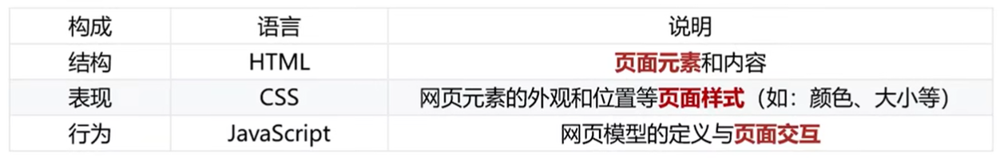

# Web 標準與三層分離

> 來源：origin/第01章_寫在前面/06-Web 標準.md / 全文

Web 標準的構成包含：

- 結構：HTML，表示頁面元素。
- 表現：CSS，表示頁面樣式。
- 行為：JavaScript，表示頁面交互的動態效果。

## 為甚麼需要了解 Web 標準？

不同瀏覽器的渲染引擎不同，對於相同代碼解析的效果會存在差異，如果用戶想看一個網頁，結果用不同瀏覽器打開效果不同，用戶體驗極差。

Web 標準的目標是讓不同瀏覽器依照共同規範實作，提升互通性與顯示結果的一致性，但實際效果仍可能受到瀏覽器版本、平台與功能支援影響。

## Web 標準的構成

Web 開發通常建議讓頁面實現結構、表現、行為三層分離。

簡單理解：結構主要寫在 HTML 文件中、表現主要寫在 CSS 文件中、行為主要寫在 JavaScript 文件中。
