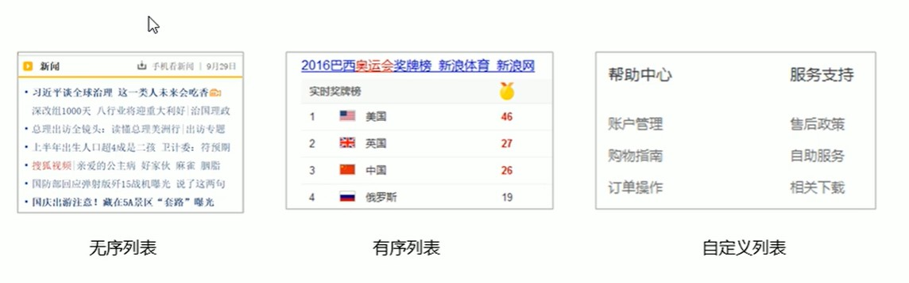
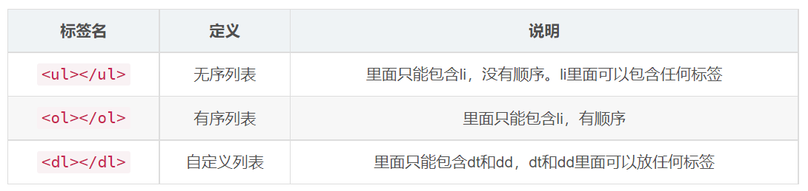

# 列表標籤基本概念

> 來源：origin/第22章_列表標籤/01-列表標籤.md / # 1. 列表標籤的介紹

> ✍️ 表格常用來呈現資料，列表則用來表示一組相關項目；版面排列與外觀通常交由 CSS 控制。

- 場景：在網頁中按照行展示關聯性的內容，如：新聞列表、排行榜、帳單等。
- 特點：按照行的方式，整齊顯示內容。
- 種類：無序列表、有序列表、自定義列表。

> 注意：圖中「可以包含任何標籤」是簡化說法，實際仍需符合 HTML 內容模型。
