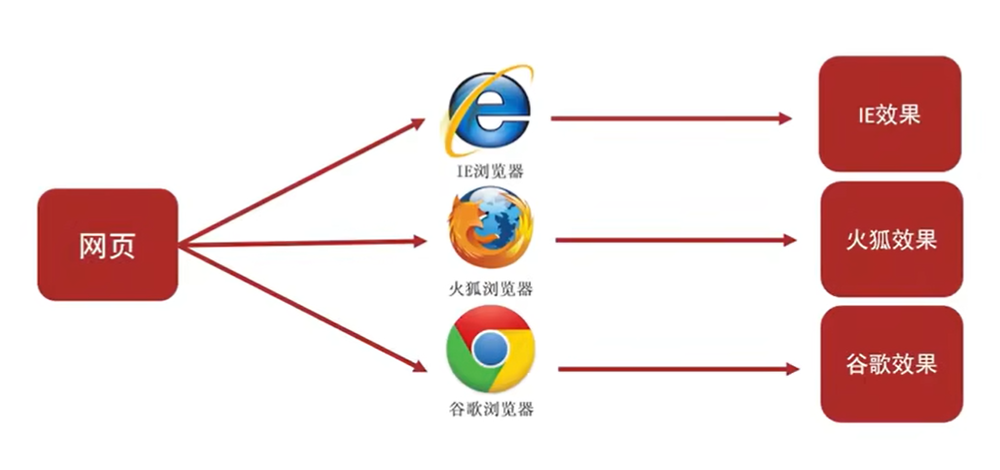

<!--
source_atomic:
  - atomic/010-寫在前面/08-Web-標準與三層分離.md
-->

# Web 標準與三層分離：HTML、CSS、JavaScript 各管各的

## 學習目標

- 說出 Web 標準的三層構成：結構、表現、行為，分別對應什麼技術。
- 理解為什麼業界需要 Web 標準。
- 理解「結構、表現、行為三層分離」的意義，以及 HTML 在其中該負責什麼。

## 問題情境

上一篇提到，不同瀏覽器的渲染引擎、版本、平台不同，可能讓同一段代碼呈現出不同的結果。如果每個瀏覽器都各自定義一套規則，開發者就要為每個瀏覽器寫不同的程式碼，使用者體驗也會因瀏覽器而異。Web 標準就是為了緩解這個問題而存在的；同時，它也定義了接下來要學的 HTML，在整個前端技術中該負責哪一塊。

## 一句話理解

Web 標準把網頁拆成結構（HTML）、表現（CSS）、行為（JavaScript）三層，讓不同瀏覽器可以依照共同規範實作，也讓開發者可以把「內容結構」「樣式」「互動行為」分開維護。

## 概念拆解

**為什麼需要 Web 標準**

不同瀏覽器的渲染引擎不同，對於相同的程式碼，解析出來的效果可能會有差異。如果使用者用不同瀏覽器打開同一個網頁，看到的結果卻不一樣，使用者體驗就會很差。

Web 標準的目標，就是讓不同瀏覽器依照共同的規範來實作，藉此提升互通性與顯示結果的一致性——但實際效果仍可能受到瀏覽器版本、平台與功能支援程度的影響（呼應「瀏覽器與渲染引擎」一篇提到的差異）。

**Web 標準的構成：結構、表現、行為**

Web 標準的構成大致可以分成三個部分：

- **結構**：HTML，表示頁面的元素與內容結構。
- **表現**：CSS，表示頁面的樣式（顏色、版面、間距等）。
- **行為**：JavaScript，表示頁面的互動與動態效果。

**三層分離是什麼意思**

Web 開發通常建議讓頁面實現「結構、表現、行為」三層分離。簡單理解就是：

- 結構主要寫在 HTML 檔案中。
- 表現主要寫在 CSS 檔案中。
- 行為主要寫在 JavaScript 檔案中。

三層分離的重點不只是「把程式碼放進不同檔案」，更重要的是**職責的分離**：HTML 描述「這裡有什麼內容、它們之間的結構關係是什麼」，而不去管「這段文字該是什麼顏色」或「點擊後要發生什麼事」——那些是 CSS 與 JavaScript 該負責的事。

## 範例：同一個按鈕，三層各管什麼

想像頁面上有一個「送出」按鈕：

- **結構（HTML）**：這裡有一個按鈕元素，文字內容是「送出」。
- **表現（CSS）**：這個按鈕長什麼樣子——背景顏色、大小、滑鼠移過去時的樣式變化。
- **行為（JavaScript）**：點擊這個按鈕之後，要執行什麼動作，例如送出表單、彈出提示。

如果把「背景顏色」這種表現層的設定，直接寫成 HTML 標籤的屬性（而不是用 CSS），就等於讓結構層去做表現層的工作，違反了三層分離的精神——即使畫面看起來是對的，維護起來也會比較困難（例如要改顏色時，得去翻每一個標籤，而不是只改一個 CSS 規則）。

## 對 HTML 學習的實務意義

這篇其實是接下來整本書的「學習地圖」：本書主要教的 HTML，對應的是**結構**這一層。學會 HTML 之後，應該慢慢養成一個習慣——當想要調整的是「畫面好不好看」，那通常是 CSS（表現層）的工作；當想要的是「使用者互動後會發生什麼」，那通常是 JavaScript（行為層）的工作。HTML 階段，先專注在「這個頁面有哪些內容、它們之間的結構與層級關係是什麼」。

## 常見錯誤

- **把表現層的設定寫進結構層**：例如直接在 HTML 標籤上設定顏色、間距等樣式屬性，而不是透過 CSS。短期看起來畫面是對的，但長期會讓結構與樣式混在一起，難以維護與重複使用。
- **以為三層分離只是「把程式碼放進三個檔案」**：三層分離真正的重點是「職責分離」——檔案分開只是結果，更重要的是每一層只做自己該做的事。即使技術上把所有東西寫在同一個檔案裡，仍可以、也應該保持職責上的分離。

## 重點整理

- Web 標準把網頁拆成結構（HTML）、表現（CSS）、行為（JavaScript）三層。
- Web 標準的目的是讓不同瀏覽器依共同規範實作，提升一致性，但仍可能受瀏覽器版本、平台與功能支援影響。
- 三層分離的核心是「職責分離」：HTML 負責結構與內容，CSS 負責樣式，JavaScript 負責互動行為。
- 接下來的學習重點是 HTML（結構層），但理解三層分離有助於知道 HTML 該負責什麼、不該負責什麼。

## 自我檢查

1. 如果要調整一個按鈕「點擊後變色」的效果，這主要應該寫在結構、表現，還是行為層？
2. 即使有 Web 標準，為什麼不同瀏覽器顯示同一個網頁的效果仍可能有差異？
3. 把網頁的顏色、間距直接寫在 HTML 標籤的屬性裡，會違反三層分離的什麼原則？可能造成什麼維護上的問題？
