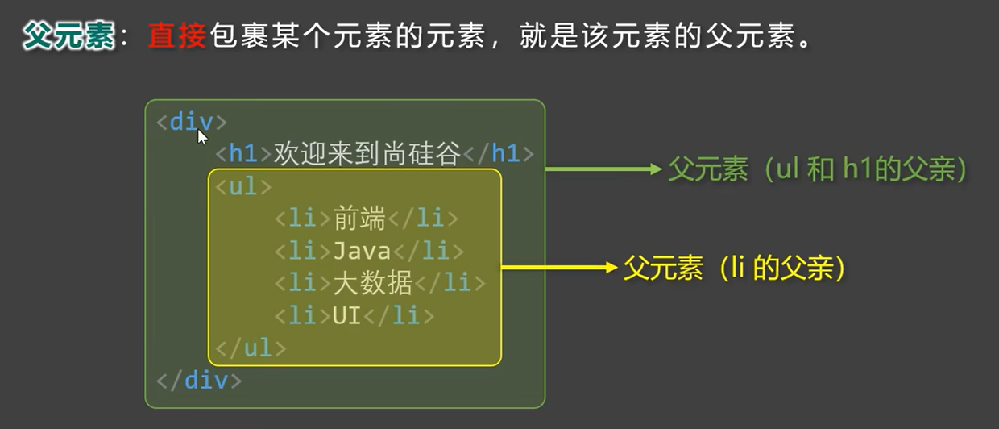
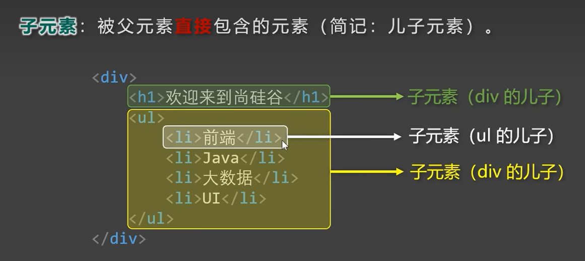
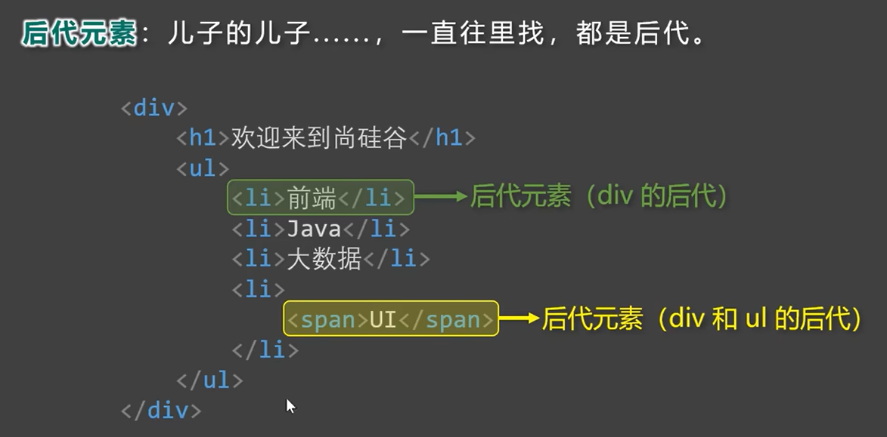

---
source_atomic:
  - atomic/020-HTML簡介/08-HTML標籤結構.md
  - atomic/020-HTML簡介/09-HTML元素關係.md
---

# HTML 標籤的結構與元素之間的關係

## 學習目標

讀完這篇筆記，你應該能夠：

- 說明標籤的組成方式，分辨單標籤與雙標籤。
- 看到一段巢狀的 HTML，能說出哪個元素是誰的父元素、子元素、祖先元素、後代元素、兄弟元素。
- 理解這些關係之後在 CSS、JavaScript 上會用到的地方。

## 問題情境

之後你會開始接觸像這樣的程式碼：

```html
<div>
  <p>這是一段文字，<strong>這裡有強調文字</strong>。</p>
  <p>這是另一段文字。</p>
</div>
```

這段程式碼裡，標籤一層包著一層。要看懂、寫對這樣的結構，你需要先知道兩件事：第一，「標籤」本身是怎麼組成的；第二，當標籤一層包一層時，這些標籤（或者說「元素」）之間是什麼關係。這兩件事，會是你之後讀懂任何 HTML 結構、之後學 CSS 選擇器、JavaScript 操作網頁元素的基礎。

## 一句話理解

**標籤是由起始標籤與結束標籤組成的容器，而這些容器互相包含或並列，就形成了父子、祖先後代、兄弟等元素關係。**

## 標籤的組成

一個常見的 HTML 標籤，是由以下幾個部分組成的：

- 標籤由 `<`、`>`、`/` 與英文單字（或字母）組成，被 `<` 和 `>` 包起來的英文字稱為「標籤名」。
- 大多數標籤會成對出現，稱為**雙標籤**：
  - 第一個叫做**起始標籤**，例如 `<p>`。
  - 第二個叫做**結束標籤**，例如 `</p>`，比起始標籤多了一個 `/`。
  - 起始標籤與結束標籤之間，放的就是這個標籤所「標記」的內容。
- 有些標籤必須是單獨出現的，稱為**單標籤**（也叫空元素），例如 ``、`<br>`，這類標籤沒有對應的結束標籤。


## 元素之間的關係

當雙標籤一層包著一層時，這些標籤（也就是「元素」）之間就形成了「關係」。整理之後，雙標籤之間的關係大致可以分成兩大類：

- **嵌套關係**：一個元素完整包在另一個元素裡面（父子、祖先後代）。
- **並列關係**：多個元素處於同一層、共用同一個父元素（兄弟）。

我們用前面的範例來逐一說明：

```html
<div>
  <p>這是一段文字，<strong>這裡有強調文字</strong>。</p>
  <p>這是另一段文字。</p>
</div>
```

### 父元素與子元素

直接包含另一個元素的，稱為**父元素**；被直接包含的，稱為**子元素**。

在範例中，`<div>` 直接包含兩個 `<p>`，所以 `<div>` 是這兩個 `<p>` 的父元素，這兩個 `<p>` 是 `<div>` 的子元素。同理，第一個 `<p>` 直接包含 `<strong>`，所以 `<p>` 是 `<strong>` 的父元素，`<strong>` 是 `<p>` 的子元素。





### 祖先元素與後代元素

父子關係是「直接」包含；如果包含關係中間還隔了其他層，就改用**祖先元素**與**後代元素**來描述。

在範例中，`<div>` 並沒有直接包含 `<strong>`（中間還隔了一個 `<p>`），但 `<div>` 仍然「包含」著 `<strong>`，所以 `<div>` 是 `<strong>` 的祖先元素，`<strong>` 是 `<div>` 的後代元素。

> 可以這樣記：**父子是「上下一層」的關係，祖先後代是「上下不限層數」的關係**——父元素一定是祖先元素，但祖先元素不一定是父元素。




### 兄弟元素

擁有相同父元素、處於同一層級的元素，互為**兄弟元素**。

在範例中，兩個 `<p>` 都是 `<div>` 的子元素、處於同一層，所以這兩個 `<p>` 互為兄弟元素。


## 常見錯誤

- **標籤沒有正確配對關閉，或巢狀順序錯亂**：例如寫成 `<div><p>內容</div></p>`（結束標籤順序顛倒），瀏覽器通常會嘗試自動修正，但修正後的結構往往不是你預期的樣子，容易導致版面跑掉、樣式套用錯誤，而且這種錯誤在畫面上有時不會立刻顯現，難以察覺。**避免方法**：養成「先寫起始標籤，馬上接著寫對應的結束標籤」的習慣，再把內容填進中間；巢狀標籤從外往內、從內往外時保持「後開的先關」的順序。
- **把「父元素」與「祖先元素」混為一談**：例如以為 `<div>` 是 `<strong>` 的父元素（實際上是祖先元素，因為中間還有 `<p>`）。這個混淆在之後學 CSS 選擇器時會直接造成問題——CSS 的「子選擇器」（`>`）只會選到直接子元素，「後代選擇器」（空白）則會選到所有層級的後代元素，如果分不清父子與祖先後代，寫出來的選擇器範圍就會不對。

## 實務上的意義

標籤結構與元素關係，看似只是「結構名詞」，但它們是之後兩個重要主題的基礎：

- **CSS 選擇器**：「子選擇器」「後代選擇器」「相鄰兄弟選擇器」等寫法，本質上就是在描述這篇筆記講的父子、祖先後代、兄弟關係。
- **JavaScript 操作 DOM**：之後用 JavaScript 抓取或修改頁面元素時，常常需要透過「找父元素」「找子元素」「找兄弟元素」的方式來定位目標，理解這些關係能幫助你更快寫出正確的程式碼。

## 重點整理

- 標籤由 `<`、`>`、`/` 與標籤名組成；多數標籤是「起始標籤＋內容＋結束標籤」的雙標籤，少數（如 ``、`<br>`）是沒有結束標籤的單標籤。
- 直接包含 → 父子關係；不限層數的包含 → 祖先後代關係；同一層、同一父元素下 → 兄弟關係。
- 父元素一定是祖先元素，但祖先元素不一定是父元素。
- 標籤沒配對好或巢狀順序錯誤，會讓瀏覽器自動修正成非預期的結構。

## 自我檢查

1. `` 和 `<p>` 哪一個是單標籤、哪一個是雙標籤？
2. 在 `<div><section><p>文字</p></section></div>` 中，`<p>` 的父元素與祖先元素分別是什麼？
3. 兩個標籤要算是「兄弟元素」，需要滿足什麼條件？
