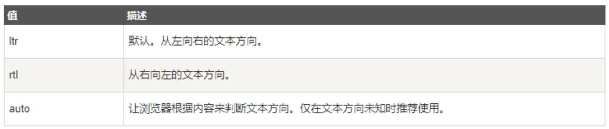

---
source_atomic:
  - atomic/050-全局屬性/06-dir-文字方向.md
  - atomic/050-全局屬性/11-lang-語言代碼.md
  - atomic/050-全局屬性/16-translate-翻譯控制.md
topics: [lang, dir, translate, 多語內容, 內容語意]
summary: "說明語言、文字方向與翻譯控制屬性如何協助瀏覽器、搜尋引擎與輔助工具理解內容。"
---

# lang、dir、translate：描述語言、文字方向與翻譯行為

## 學習目標

讀完這篇筆記，你應該能夠：

- 理解 `lang`、`dir`、`translate` 各自描述的內容語意。
- 知道為什麼語言、文字方向與翻譯控制不只是排版問題。
- 在多語內容中使用正確屬性協助瀏覽器與輔助工具理解內容。

## 問題情境

同一個網頁可能會出現不同語言的內容：

- 頁面主要使用繁體中文。
- 中間引用一段英文書名。
- 某些專有名詞不應被瀏覽器或翻譯工具翻譯。
- 某些語言需要由右至左顯示，例如阿拉伯文或希伯來文。

如果 HTML 沒有標記這些資訊，畫面可能仍然看得見，但瀏覽器、搜尋引擎、螢幕報讀器與翻譯工具都會缺少判斷依據。

## 一句話理解

`lang` 說明內容使用哪種語言，`dir` 說明文字方向，`translate` 說明內容是否應被翻譯。

## lang：指定內容語言

`lang` 屬性規定元素內容的語言。

```html
<p lang="zh-CN">这是一个段落。</p>
```

更常見的做法是在 `<html>` 上設定整份文件的主要語言：

```html
<html lang="zh-Hant">
  <head>
    <meta charset="UTF-8">
    <title>範例頁面</title>
  </head>
  <body>
    <p>這是一段繁體中文內容。</p>
  </body>
</html>
```

如果頁面中有局部內容使用另一種語言，也可以在局部元素上設定 `lang`。

```html
<p>
  這本書的英文標題是
  <cite lang="en">How Far Can You Go?</cite>。
</p>
```

`lang` 的價值不只在於標記文字，它也會影響：

- 螢幕報讀器的發音。
- 搜尋引擎對內容語言的理解。
- 瀏覽器翻譯與拼字檢查行為。

常用語言代碼可參考下表：


## dir：指定文字方向

`dir` 屬性規定元素內容的文字方向。



基本用法：

```html
<p dir="rtl">文本方向从右到左!</p>
```

常見值包含：

- `ltr`：left to right，由左至右。
- `rtl`：right to left，由右至左。
- `auto`：由瀏覽器根據內容自動判斷。

`dir` 是文字方向，不是單純的視覺對齊。若只是想讓文字靠右，應使用 CSS；若內容本身語言方向是由右至左，才應使用 `dir="rtl"`。

## translate：控制是否翻譯

`translate` 屬性規定元素內容是否要翻譯。

當作品名稱、品牌名稱、程式碼術語或專有名詞不應被翻譯時，可以使用 `translate="no"`。

```html
<p>
  The question in the
  <cite translate="no">How Far Can You Go?</cite>
  applies to...
</p>
```

也可以在 `<html>` 上設定整站禁止翻譯：

```html
<!DOCTYPE html>
<html translate="no">
<head>
  <meta charset="UTF-8">
  <meta name="viewport" content="width=device-width, initial-scale=1.0">
</head>
<body>
  <p>
    The question in the
    <cite>How Far Can You Go?</cite>
    applies to...
  </p>
</body>
</html>
```

整站禁止翻譯要謹慎使用。若只是少數專有名詞不應翻譯，通常只需要在局部元素上設定 `translate="no"`。

## 綜合範例

```html
<html lang="zh-Hant">
<body>
  <article>
    <h1>多語內容範例</h1>

    <p>
      這本書的英文標題是
      <cite lang="en" translate="no">How Far Can You Go?</cite>。
    </p>

    <p lang="ar" dir="rtl">
      هذا نص عربي قصير.
    </p>
  </article>
</body>
</html>
```

這段程式碼中：

- `<html lang="zh-Hant">` 表示頁面主要語言是繁體中文。
- `<cite lang="en" translate="no">` 表示書名是英文，而且不要翻譯。
- `<p lang="ar" dir="rtl">` 表示段落是阿拉伯文，文字方向由右至左。

## 常見錯誤

### 錯誤一：整份文件缺少 lang

```html
<html>
  <body>這是一個頁面。</body>
</html>
```

畫面可以顯示，但輔助工具與搜尋引擎少了語言資訊。建議補上主要語言。

```html
<html lang="zh-Hant">
```

### 錯誤二：把 dir 當成文字靠右

```html
<p dir="rtl">這段只是想靠右顯示。</p>
```

如果只是排版靠右，應使用 CSS：

```html
<p class="align-right">這段只是想靠右顯示。</p>
```

```css
.align-right {
  text-align: right;
}
```

### 錯誤三：忘記保護不該翻譯的專有名詞

如果作品名稱、品牌名稱或產品名被自動翻譯，使用者可能反而看不懂。這種情況可以使用 `translate="no"`。

## 實務判斷

- 頁面的主要語言應放在 `<html lang="...">`。
- 局部外語內容可以在該元素上另外設定 `lang`。
- 文字方向由內容語言決定時使用 `dir`；視覺對齊交給 CSS。
- `translate="no"` 適合保護專有名詞，不要隨意禁止整站翻譯。

## 重點整理

- `lang` 描述內容語言。
- `dir` 描述文字方向。
- `translate` 描述是否應被翻譯。
- 這些屬性會影響瀏覽器、輔助工具、搜尋引擎與翻譯工具如何理解內容。

## 自我檢查

- 為什麼 `<html>` 上通常應該設定 `lang`？
- `dir="rtl"` 和 CSS 的 `text-align: right` 有什麼差別？
- 哪些內容適合加上 `translate="no"`？
