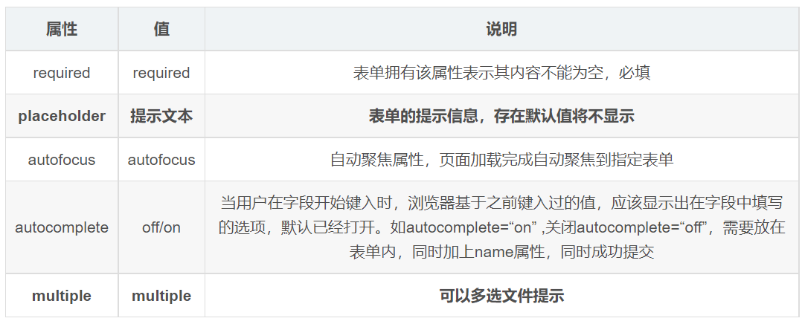

<!--
source_atomic:
  - atomic/240-表單標籤/08-新增input類型.md
  - atomic/240-表單標籤/13-新增表單屬性與placeholder樣式.md
-->

# HTML5 輸入類型與表單屬性

## 學習目標

讀完這篇筆記，你應該能夠：

- 使用常見 HTML5 input 類型描述資料格式。
- 理解瀏覽器原生驗證與輸入介面的基本作用。
- 使用 `required`、`autofocus`、`autocomplete`、`placeholder` 改善表單體驗。
- 知道前端表單屬性不能取代後端驗證。

## 使用情境

如果欄位要填的是信箱、網址、日期、數字或顏色，只使用 `type="text"` 雖然能輸入，但瀏覽器不知道這筆資料的格式。HTML5 提供多種 input 類型，讓欄位語意更清楚，也能啟用瀏覽器內建的輸入輔助與基本驗證。

一句話理解：

> HTML5 input 類型讓瀏覽器知道「這欄資料應該長什麼樣子」，表單屬性則用來補充必填、提示、自動完成等互動規則。

## 常見 HTML5 input 類型


常見類型包括：

- `email`：電子郵件。
- `url`：網址。
- `date`：日期。
- `time`：時間。
- `number`：數字。
- `tel`：電話。
- `search`：搜尋文字。
- `color`：顏色選擇。

注意：原始對照表中的 `type="data"` 應理解為 `type="date"`。

## 基本範例

```html
<form action="/profile" method="post">
  <label>
    郵箱:
    <input type="email" name="email" required>
  </label>

  <label>
    網址:
    <input type="url" name="website">
  </label>

  <label>
    生日:
    <input type="date" name="birthday">
  </label>

  <label>
    數量:
    <input type="number" name="count">
  </label>

  <input type="submit" value="提交">
</form>
```

範例拆解：

- `type="email"` 讓瀏覽器用電子郵件格式檢查欄位。
- `type="url"` 讓欄位預期網址格式。
- `type="date"` 可能顯示日期選擇器，依瀏覽器而定。
- `type="number"` 適合數字資料。
- `required` 讓欄位成為必填。

## 新增表單屬性



常見屬性可以這樣使用：

```html
<form action="/search">
  <input
    type="search"
    name="keyword"
    required
    placeholder="請輸入關鍵字"
    autofocus
    autocomplete="off"
  >
  <input type="submit" value="搜尋">
</form>
```

屬性說明：

- `required`：欄位必填，未填時瀏覽器會阻止提交並提示。
- `placeholder`：欄位空白時顯示提示文字。
- `autofocus`：頁面載入後自動聚焦到這個欄位。
- `autocomplete`：控制瀏覽器是否提供自動完成建議。

## placeholder 樣式

可以使用 `::placeholder` 修改提示文字樣式：

```css
input::placeholder {
  color: pink;
}
```

這只會影響 placeholder 的顯示樣式，不會改變欄位的真正值。

## 常見錯誤

### 以為 tel 會自動驗證手機格式

```html
<input type="tel" name="phone">
```

`tel` 主要是告訴瀏覽器這是電話輸入欄位，行動裝置可能顯示較適合輸入電話的鍵盤。但各地電話格式差異很大，瀏覽器不一定會自動驗證手機格式。

### 把 placeholder 當成 label

```html
<input type="email" name="email" placeholder="電子郵件">
```

placeholder 在使用者開始輸入後會消失，不能取代欄位名稱。較好的寫法是：

```html
<label for="email">電子郵件</label>
<input id="email" type="email" name="email" placeholder="name@example.com">
```

### 只依賴前端驗證

`required`、`email`、`url` 等屬性能改善體驗，但使用者仍可能繞過前端限制。重要資料一定要在後端再次驗證。

### 亂用 autofocus

`autofocus` 會搶走頁面焦點。若頁面有多個互動區或需要先閱讀內容，過度使用會干擾使用者。

## 實務判斷準則

- 能描述資料格式時，選擇比 `text` 更精確的 input type。
- 必填欄位可使用 `required`，但後端仍要驗證。
- placeholder 用來給範例或補充提示，不要取代 label。
- `autocomplete` 應依資料性質決定，常見個人資料可開啟，敏感或一次性資料可關閉。
- 不同瀏覽器對日期、時間、顏色等控件的呈現可能不同，版面設計要保留彈性。

## 重點整理

- HTML5 input 類型能提供更明確的資料語意。
- `email`、`url`、`number` 等類型可啟用瀏覽器基本驗證或輸入輔助。
- `required`、`placeholder`、`autofocus`、`autocomplete` 可以改善表單互動。
- `::placeholder` 可調整提示文字樣式。
- 前端驗證是使用者體驗，不是完整安全防線。

## 自我檢查

1. 如果欄位要填電子郵件，為什麼不建議只使用 `type="text"`？
2. `placeholder` 可以取代 `label` 嗎？為什麼？
3. `required` 能不能保證後端收到的資料一定正確？
