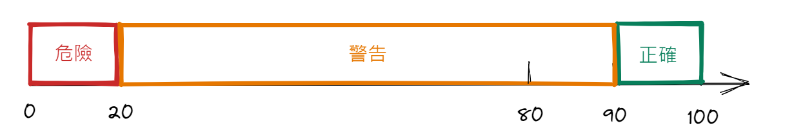

<!--
source_atomic:
  - atomic/280-度量衡標籤/01-meter-度量衡標籤.md
-->

# meter 度量衡標籤：表示已知範圍內的測量值

## 學習目標

讀完這篇筆記，你應該能夠：

- 理解 `<meter>` 標籤用來表示什麼語意。
- 使用 `value`、`min`、`max` 設定一個已知範圍內的測量值。
- 判斷什麼時候應該用 `<meter>`，什麼時候應該改用 `<progress>`。
- 看懂 `low`、`high`、`optimum` 如何補充測量值的狀態語意。

## 使用情境

當你要在頁面上顯示一個「已知範圍內的數值」時，可以使用 `<meter>`。

常見情境包含：

- 手機電量：目前是 50%，範圍是 0 到 100。
- 磁碟用量：目前用了 80GB，總容量是 100GB。
- 評分數值：目前分數是 4.5，滿分是 5。

這些情境的共同點是：範圍已經知道，而且目前值可以放在這個範圍中被理解。

## 一句話理解

`<meter>` 是用來表示「已知範圍內的測量值」的 HTML 標籤。

它不是單純把數字顯示出來，而是告訴瀏覽器與輔助技術：這個數字是一個有上下限、可評估狀態的度量值。

## 標籤語意

`<meter>` 定義的是 scalar measurement，也就是標量測量值。它也常被稱為 gauge，意思接近「量表」或「儀表」。

例如：

```html
<meter value="50" min="0" max="100"></meter>
```

這段 HTML 表示：

- 目前值是 `50`。
- 最小值是 `0`。
- 最大值是 `100`。
- 這個值位於一個已知範圍中。

如果只是想印出數字 `50`，不需要 `<meter>`；如果想讓這個數字具有「測量值」的語意，才適合使用 `<meter>`。

## 基本語法

```html
<meter value="50" min="0" max="100"></meter>
```

最基本的 `<meter>` 通常會包含：

- `value`：目前的測量值，必要屬性。
- `min`：測量範圍的最小值。
- `max`：測量範圍的最大值。

`value` 必須落在合理的度量範圍中，否則讀者和瀏覽器都很難正確理解這個量表代表什麼。

## 常用屬性

| 屬性 | 作用 |
| --- | --- |
| `value` | 規定目前的度量值，這是必要屬性。 |
| `min` | 規定度量範圍的最小值。 |
| `max` | 規定度量範圍的最大值。 |
| `low` | 規定被視為偏低的範圍界線。 |
| `high` | 規定被視為偏高的範圍界線。 |
| `optimum` | 規定最理想或最佳的值。 |

`low`、`high`、`optimum` 不只是視覺設定，它們是在補充這個數值的語意。例如同樣是 `70`，在電量情境可能代表狀態良好，但在磁碟用量情境可能已經偏高。

## 範例一：設定低值與高值範圍


```html
<span>手機電量 : </span>
<meter value="50" min="0" max="100" low="20" high="80"></meter><br>
```

這個範例表示手機電量目前是 `50`，整體範圍是 `0` 到 `100`。

逐段拆解：

- `<span>手機電量 : </span>`：顯示量表前面的文字說明。
- `<meter>`：表示接下來是一個已知範圍內的測量值。
- `value="50"`：目前值是 50。
- `min="0"`：範圍最小值是 0。
- `max="100"`：範圍最大值是 100。
- `low="20"`：20 以下可被視為偏低。
- `high="80"`：80 以上可被視為偏高。

這樣寫的重點不是「畫出一條像進度條的東西」，而是用 HTML 表達：這是一個有上下限、能被判斷高低狀態的電量數值。

## 範例二：設定最佳值



```html
<span>手機電量 : </span>
<meter value="70" min="0" max="100" low="20" high="80" optimum="90"></meter><br>
```

這個範例多了 `optimum="90"`，表示在這個情境中，接近 90 是比較理想的狀態。

逐段拆解：

- `value="70"`：目前值是 70。
- `low="20"`：20 以下偏低。
- `high="80"`：80 以上偏高。
- `optimum="90"`：90 是最理想的值。

`optimum` 的意義會依情境改變。手機電量接近 90 通常是好事，但磁碟用量接近 90 可能代表空間快滿了。因此設定 `optimum` 前，要先確認這個數值在你的業務情境中代表「越高越好」、「越低越好」，還是「接近某個中間值最好」。

## meter 與 progress 的差異

`<meter>` 不應該用來表示任務進度。如果你要標記進度條，應該使用 `<progress>`。

| 情境 | 建議標籤 | 原因 |
| --- | --- | --- |
| 手機電量目前 50% | `<meter>` | 這是已知範圍內的測量值。 |
| 磁碟已使用 80GB / 100GB | `<meter>` | 這是容量用量的度量。 |
| 檔案下載到 60% | `<progress>` | 這是任務完成進度。 |
| 表單送出處理中 | `<progress>` | 這是流程或任務進行狀態。 |

判斷時可以問一句話：這個數字是在描述「某個值的狀態」，還是在描述「某件事完成到哪裡」？

- 描述值的狀態：用 `<meter>`。
- 描述任務完成進度：用 `<progress>`。

## 常見錯誤

### 錯誤一：用 meter 表示下載進度

```html
<!-- 不建議 -->
<meter value="60" min="0" max="100">60%</meter>
```

如果這段是在表示檔案下載完成 60%，就不適合使用 `<meter>`。下載進度是任務進行狀態，不是度量衡數值。

較適合的寫法是：

```html
<progress value="60" max="100">60%</progress>
```

### 錯誤二：只給 value，卻沒有清楚範圍

```html
<!-- 不完整 -->
<meter value="50"></meter>
```

這樣雖然可以寫，但讀者不一定知道 50 是滿分 100、滿分 5，還是其他範圍。實務上建議把 `min` 和 `max` 一起寫清楚，讓語意更完整。

```html
<meter value="50" min="0" max="100"></meter>
```

### 錯誤三：沒有文字說明量表代表什麼

```html
<!-- 語意不夠清楚 -->
<meter value="70" min="0" max="100"></meter>
```

畫面上只有一個量表時，使用者可能不知道它代表電量、容量、評分還是其他數值。通常應該搭配文字標籤或上下文說明。

```html
<span>手機電量：</span>
<meter value="70" min="0" max="100">70%</meter>
```

## 實務判斷準則

適合使用 `<meter>` 的情況：

- 數值有明確的最小值與最大值。
- 數值本身是在描述狀態，而不是流程進度。
- 這個值可以被判斷為偏低、正常、偏高或接近最佳值。
- 使用者需要理解目前值在整體範圍中的位置。

不適合使用 `<meter>` 的情況：

- 任務進度，例如下載、上傳、安裝、載入。
- 沒有明確範圍的普通數字。
- 只是為了做出類似進度條的視覺效果。

## 重點整理

- `<meter>` 表示已知範圍內的測量值，也就是 gauge。
- `value` 是必要屬性，用來設定目前值。
- `min` 和 `max` 定義度量範圍，實務上建議明確寫出。
- `low`、`high`、`optimum` 用來補充偏低、偏高與最佳值的語意。
- `<meter>` 不用來表示任務進度；進度應該用 `<progress>`。

## 自我檢查

1. 如果要顯示「手機電量目前 40%，總範圍是 0 到 100」，應該使用 `<meter>` 還是 `<progress>`？
2. 如果要顯示「檔案下載完成 40%」，應該使用 `<meter>` 還是 `<progress>`？為什麼？
3. `value`、`min`、`max` 分別負責表達什麼？
4. `low`、`high`、`optimum` 是只影響畫面外觀，還是也在補充語意？
