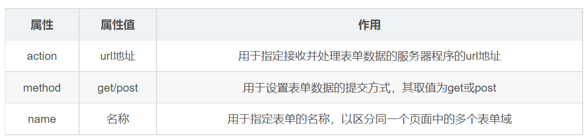

# 表單入門與 form 基本結構

## 學習目標

讀完這篇筆記，你應該能夠：

- 說明表單在網頁中的用途。
- 分辨表單域、表單控件與提示信息。
- 使用 `<form>` 建立可以提交資料的表單範圍。
- 理解 `action`、`method`、`name`、`target` 這些常見屬性的角色。

## 問題情境

如果網頁只是顯示文章、圖片或連結，使用者只能閱讀內容。

但很多頁面需要讓使用者輸入資料，例如註冊帳號、登入、搜尋、留言、填寫訂單。這些「收集使用者資料」的情境，就需要表單。

## 一句話理解

表單是網頁用來「收集使用者輸入，並把資料送出去」的 HTML 結構。

## 表單由哪幾個部分組成？

一個完整的表單通常包含三個部分：

| 組成 | 說明 | 例子 |
| --- | --- | --- |
| 表單域 | 包住整個表單資料的範圍 | `<form>` |
| 表單控件 | 使用者實際輸入或選擇的地方 | `<input>`、`<select>`、`<textarea>` |
| 提示信息 | 告訴使用者要填什麼 | 文字、`<label>`、placeholder |


## form 標籤的作用

`<form>` 是表單域，用來定義哪些表單控件屬於同一份表單。

當使用者點擊提交按鈕時，瀏覽器會把 `<form>` 範圍內的表單資料送到指定位置。

```html
<form action="/register" method="post" name="registerForm">
  <label for="username">帳號</label>
  <input type="text" id="username" name="username">

  <button type="submit">送出</button>
</form>
```

## 常用屬性



| 屬性 | 作用 | 常見寫法 |
| --- | --- | --- |
| `action` | 指定表單資料要送到哪個位址 | `action="/login"` |
| `method` | 指定提交方式 | `method="get"`、`method="post"` |
| `name` | 表單名稱，方便程式識別 | `name="loginForm"` |
| `target` | 指定提交後結果在哪裡開啟 | `target="_blank"` |

## 範例拆解

```html
<form action="/search" method="get" name="searchForm">
  <label for="keyword">搜尋關鍵字</label>
  <input type="text" id="keyword" name="keyword">
  <button type="submit">搜尋</button>
</form>
```

這段程式碼中：

- `<form>`：定義表單範圍。
- `action="/search"`：表單送出後，資料會提交到 `/search`。
- `method="get"`：使用查詢參數的方式提交資料，常見於搜尋。
- `name="keyword"`：輸入框資料的名稱，送出時會和使用者輸入的值一起提交。
- `<button type="submit">`：提交表單。

## 常見錯誤

### 把輸入框放在 form 外面

```html
<input type="text" name="username">

<form action="/login" method="post">
  <button type="submit">登入</button>
</form>
```

這個輸入框不在 `<form>` 裡，提交時不會自然跟著這份表單一起送出。

### 正確寫法

```html
<form action="/login" method="post">
  <input type="text" name="username">
  <button type="submit">登入</button>
</form>
```

## 實務判斷

- 只要需要收集使用者資料，就應該先思考表單結構。
- 表單控件要放在對應的 `<form>` 裡，資料提交流程才清楚。
- 初學時可以先掌握 `action`、`method`、`name` 三個屬性；其他屬性再依需求補上。

## 重點整理

- 表單用來收集使用者資料。
- `<form>` 是表單域，負責包住一組要提交的表單控件。
- 表單控件負責輸入或選擇，提示信息負責引導使用者。
- `name` 很重要，因為它決定提交資料時的欄位名稱。
