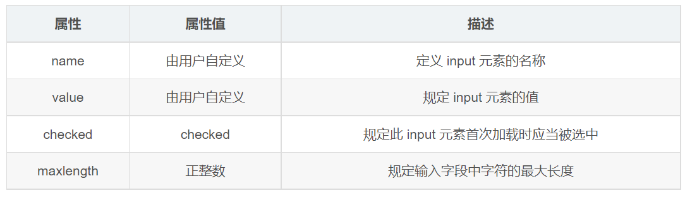

# input 表單控件與常用類型

## 學習目標

讀完這篇筆記，你應該能夠：

- 理解 `<input>` 在表單中的角色。
- 使用 `type` 切換不同輸入控件。
- 分辨文字框、密碼框、單選框、複選框、隱藏域與檔案欄位的用途。
- 知道 `name`、`value`、`checked`、`maxlength` 等常用屬性如何影響提交資料。
- 使用 HTML5 新增的 input 類型建立更合適的輸入欄位。

## 問題情境

表單需要收集不同種類的資料：帳號是單行文字，密碼要遮蔽顯示，性別可能是單選，興趣可能是複選，生日可能是日期，Email 應該符合信箱格式。

這些需求大多可以從同一個標籤開始：`<input>`。

## 一句話理解

`<input>` 是表單中最常用的輸入控件，透過 `type` 屬性決定它要呈現成哪一種輸入方式。

## input 的基本概念

`input` 在英文中有「輸入」的意思。在 HTML 表單中，`<input>` 用來收集使用者輸入或選擇的資料。

`<input>` 是單標籤，不需要寫成 `<input></input>`。

```html
<input type="text" name="username">
```

這段程式碼中：

- `type="text"` 表示這是一個單行文字輸入框。
- `name="username"` 表示提交資料時，這個欄位的資料名稱是 `username`。

## type 決定控件類型

同樣是 `<input>`，只要 `type` 不同，控件的用途就不同。


常見類型可以先這樣分類：

| 類型 | 用途 |
| --- | --- |
| `text` | 單行文字輸入 |
| `password` | 密碼輸入，輸入內容會被遮蔽 |
| `radio` | 單選按鈕 |
| `checkbox` | 複選框 |
| `hidden` | 隱藏欄位，送出使用者看不到的固定資料 |
| `file` | 檔案上傳欄位 |
| `submit` | 提交表單 |
| `reset` | 還原表單初始狀態 |
| `button` | 普通按鈕，通常搭配 JavaScript |

## input 常用屬性



常用屬性可以先掌握這幾個：

| 屬性 | 常見用途 |
| --- | --- |
| `name` | 表單提交時的資料名稱 |
| `value` | 欄位的預設值，或單選、複選提交時送出的值 |
| `checked` | 讓 radio 或 checkbox 預設選中 |
| `maxlength` | 限制可輸入的最大字元數 |
| `placeholder` | 顯示輸入提示文字 |
| `multiple` | 允許選擇多個檔案或多個值 |

`name` 和 `value` 是理解表單提交時很重要的兩個屬性。`name` 像資料欄位名稱，`value` 則是要送出的資料值。

## 常見 input 類型範例

```html
<form action="/register" method="post">
  <label for="username">帳號</label>
  <input
    type="text"
    id="username"
    name="username"
    placeholder="請輸入帳號"
    maxlength="20"
  >

  <label for="password">密碼</label>
  <input
    type="password"
    id="password"
    name="password"
    placeholder="請輸入密碼"
    maxlength="16"
  >

  <p>性別</p>
  <label>
    <input type="radio" name="gender" value="female" checked>
    女
  </label>
  <label>
    <input type="radio" name="gender" value="male">
    男
  </label>

  <p>興趣</p>
  <label>
    <input type="checkbox" name="hobby" value="reading">
    閱讀
  </label>
  <label>
    <input type="checkbox" name="hobby" value="music">
    音樂
  </label>

  <input type="hidden" name="tag" value="100">

  <label for="avatar">上傳頭像</label>
  <input type="file" id="avatar" name="avatar">

  <button type="submit">送出</button>
</form>
```

## 範例拆解

### 文字框與密碼框

```html
<input type="text" name="username">
<input type="password" name="password">
```

`type="text"` 適合帳號、姓名、標題等單行文字。`type="password"` 適合密碼，瀏覽器會遮蔽輸入內容。

密碼欄位通常不會使用 `value` 預先填入密碼，因為這沒有實務意義，也可能造成安全與使用體驗問題。

### 單選框

```html
<input type="radio" name="gender" value="female"> 女
<input type="radio" name="gender" value="male"> 男
```

同一組 radio 要使用相同的 `name`，瀏覽器才知道它們屬於同一組互斥選項。`value` 是表單提交時真正送出的值。

### 複選框

```html
<input type="checkbox" name="hobby" value="reading"> 閱讀
<input type="checkbox" name="hobby" value="music"> 音樂
```

checkbox 適合可以同時選多個答案的情境。是否共用同一個 `name`，要依後端接收資料的格式設計。

### 隱藏域

```html
<input type="hidden" name="tag" value="100">
```

隱藏域不會顯示在畫面上，常用來在提交表單時一併帶上固定資料。它不是安全機制，使用者仍可能透過開發者工具看到或修改它。

### 檔案欄位

```html
<input type="file" name="avatar">
<input type="file" name="photos" multiple>
```

`type="file"` 用於上傳檔案。加上 `multiple` 時，可以選擇多個檔案。

如果要真的透過表單提交檔案，外層 `<form>` 通常需要使用 `method="post"`，並加上 `enctype="multipart/form-data"`，瀏覽器才會用適合檔案內容的格式送出資料。

```html
<form action="/upload" method="post" enctype="multipart/form-data">
  <input type="file" name="avatar">
  <button type="submit">上傳</button>
</form>
```

## HTML5 新增 input 類型

HTML5 提供了更多符合資料型態的 input 類型，例如 Email、網址、日期、時間、數字、電話、搜尋與顏色。


```html
<form action="/profile" method="post">
  <label>
    Email
    <input type="email" name="email">
  </label>

  <label>
    網站
    <input type="url" name="website">
  </label>

  <label>
    生日
    <input type="date" name="birthday">
  </label>

  <label>
    預約時間
    <input type="time" name="appointmentTime">
  </label>

  <label>
    數量
    <input type="number" name="quantity">
  </label>

  <label>
    手機號碼
    <input type="tel" name="phone">
  </label>

  <label>
    搜尋
    <input type="search" name="keyword">
  </label>

  <label>
    顏色
    <input type="color" name="themeColor">
  </label>

  <button type="submit">提交</button>
</form>
```

如果要讓瀏覽器內建驗證在提交時生效，這些欄位應放在 `<form>` 中，並透過提交按鈕觸發提交。

## 常見錯誤

### radio 沒有使用相同 name

```html
<input type="radio" name="female" value="female"> 女
<input type="radio" name="male" value="male"> 男
```

這樣兩個 radio 不是同一組，使用者可能同時選到兩個。

正確寫法：

```html
<input type="radio" name="gender" value="female"> 女
<input type="radio" name="gender" value="male"> 男
```

### 把 value 當成提示文字

```html
<input type="text" name="username" value="請輸入帳號">
```

`value` 是欄位的實際值，不只是提示。若使用者沒有修改，可能會把「請輸入帳號」送出去。

適合用 `placeholder` 提示：

```html
<input type="text" name="username" placeholder="請輸入帳號">
```

### 忘記給選項設定 value

```html
<input type="checkbox" name="hobby"> 閱讀
```

沒有 `value` 時，後端收到的資料可能不夠清楚。建議明確寫出提交值：

```html
<input type="checkbox" name="hobby" value="reading"> 閱讀
```

## 重點整理

- `<input>` 透過 `type` 決定控件類型。
- 多數要提交的欄位都應該有 `name`。
- radio 同一組選項要共用同一個 `name`。
- checkbox 適合多選，`value` 應明確表示被選到時要提交什麼。
- `hidden` 可提交使用者看不到的固定資料，但不能當成安全保護。
- HTML5 input 類型能讓欄位語意更清楚，也能搭配瀏覽器內建驗證。
