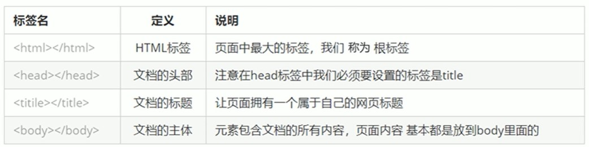

# HTML 文件骨架與基本結構

## 學習目標

讀完這篇筆記，你應該能夠：

- 說明 HTML 文件為什麼需要固定骨架。
- 看懂 `<!DOCTYPE html>`、`<html>`、`<head>`、`<body>` 的基本角色。
- 寫出一份最基本的 HTML5 文件結構。
- 分辨哪些內容是給瀏覽器與文件設定看的，哪些內容會顯示在頁面上。

## 問題情境

寫文章時，我們通常會有標題、正文、結尾等基本結構。HTML 文件也一樣，不是隨便把標籤堆在一起就好。

瀏覽器需要先知道這是一份 HTML 文件，也需要知道文件設定放在哪裡、真正要顯示給使用者看的內容放在哪裡。這些固定結構，就是 HTML 文件的骨架。

## 一句話理解

HTML 文件骨架是一份網頁的基本結構，用來告訴瀏覽器文件類型、語言、設定資料，以及頁面真正要顯示的內容。

## HTML 文件就像一篇文章

一篇文章通常會有固定結構，例如：

- 標題
- 前言
- 正文
- 結尾

網頁也有固定結構，例如：

- 整份文件
- 文件設定
- 網頁標題
- 頁面主體

HTML 會透過特定標籤描述這些結構。每一個網頁通常都會從基本骨架開始，再把頁面內容寫進對應的位置。




## HTML5 基本結構

一份最基本的 HTML5 文件可以這樣寫：

```html
<!DOCTYPE html>
<html lang="zh-Hant">
  <head>
    <meta charset="UTF-8">
    <title>我的第一個網頁</title>
  </head>
  <body>
    <h1>HTML 文件骨架</h1>
    <p>這是顯示在網頁上的內容。</p>
  </body>
</html>
```

這份文件通常會存成 `.html` 或 `.htm` 檔案。瀏覽器讀取後，會把 `<body>` 裡的內容顯示成網頁。

## 骨架標籤拆解

| 結構 | 作用 |
| --- | --- |
| `<!DOCTYPE html>` | 告訴瀏覽器這份文件使用 HTML5 標準 |
| `<html>` | 整份 HTML 文件的根元素 |
| `lang="zh-Hant"` | 宣告文件主要語言，這裡表示繁體中文 |
| `<head>` | 放文件設定與給瀏覽器讀取的資訊 |
| `<meta charset="UTF-8">` | 設定文件字元編碼，避免文字亂碼 |
| `<title>` | 設定瀏覽器分頁或搜尋結果中顯示的標題 |
| `<body>` | 放真正會顯示在網頁畫面上的內容 |

初學時可以先記住：`head` 主要放設定，`body` 主要放畫面內容。

## `head` 與 `body` 的差異

`<head>` 裡的內容大多不會直接顯示在頁面正文中，它主要提供文件資訊與設定。

常見內容包含：

- 字元編碼
- 網頁標題
- CSS 檔案連結
- SEO 相關資訊
- 給瀏覽器或搜尋引擎讀取的資料

`<body>` 則是使用者真正會在網頁畫面上看到的內容，例如：

- 標題
- 段落
- 圖片
- 連結
- 表格
- 表單

```html
<head>
  <title>顯示在瀏覽器分頁上的標題</title>
</head>

<body>
  <h1>顯示在網頁上的主標題</h1>
  <p>這段文字會出現在頁面內容中。</p>
</body>
```

## 實務寫法

建立新 HTML 檔案時，可以先使用這個基本模板：

```html
<!DOCTYPE html>
<html lang="zh-Hant">
  <head>
    <meta charset="UTF-8">
    <meta name="viewport" content="width=device-width, initial-scale=1.0">
    <title>文件標題</title>
  </head>
  <body>
    <h1>頁面標題</h1>
    <p>頁面內容從這裡開始。</p>
  </body>
</html>
```

其中 `viewport` 設定常用於讓網頁在手機與不同螢幕寬度下有更合理的顯示基礎。它不是原始骨架中一定會出現的最小內容，但在現代網頁開發中很常見。

## 常見錯誤

### 錯誤一：把頁面內容寫在 `head`

錯誤寫法：

```html
<head>
  <h1>我的網站</h1>
</head>
```

`<head>` 是放文件設定的位置，不應該把要顯示在頁面正文中的標題或段落放在這裡。

正確寫法：

```html
<head>
  <title>我的網站</title>
</head>
<body>
  <h1>我的網站</h1>
</body>
```

### 錯誤二：省略文件宣告後還以為沒有差

錯誤寫法：

```html
<html>
  <head>
    <meta charset="UTF-8">
    <title>Document</title>
  </head>
  <body>
    <p>內容</p>
  </body>
</html>
```

有些瀏覽器仍然會嘗試顯示，但缺少 `<!DOCTYPE html>` 可能讓瀏覽器無法明確以標準模式理解文件。

正確寫法：

```html
<!DOCTYPE html>
<html lang="zh-Hant">
  <head>
    <meta charset="UTF-8">
    <title>Document</title>
  </head>
  <body>
    <p>內容</p>
  </body>
</html>
```

### 錯誤三：忘記設定字元編碼

如果沒有設定字元編碼，中文內容在某些情況下可能出現亂碼。

建議在 `<head>` 中加入：

```html
<meta charset="UTF-8">
```

## 重點整理

- HTML 頁面也稱為 HTML 文件，常見副檔名是 `.html` 或 `.htm`。
- HTML 文件有固定骨架，讓瀏覽器知道如何理解整份文件。
- `<!DOCTYPE html>` 宣告 HTML5 文件類型。
- `<html>` 是整份 HTML 文件的根元素。
- `<head>` 放文件設定與資訊，`<body>` 放使用者會看到的頁面內容。
- 寫 HTML 時應先建立完整骨架，再逐步放入頁面內容。

## 自我檢查

- 你能寫出一份基本 HTML5 文件骨架嗎？
- 你能說明 `head` 和 `body` 的差異嗎？
- 如果中文網頁出現亂碼，你會先檢查哪個設定？
