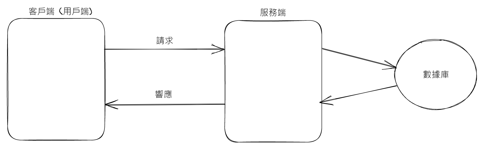

# Web 入門與前後端分工

## 學習目標

讀完這篇筆記，你應該能夠：

- 說明 Web 是什麼，以及它和瀏覽器、網頁資源的關係。
- 分辨前端與後端在 Web 系統中的主要工作。
- 理解客戶端、服務端與終端這幾個容易混用的名詞。

## 問題情境

開始學 HTML 之前，先要知道自己正在進入哪一個系統。

HTML 不是單獨存在的技術。它通常會透過瀏覽器被讀取，透過網路傳輸，並與服務器上的資料或程式互相配合。理解 Web、前端、後端、客戶端和服務端，能幫助你知道一個網頁從哪裡來、由誰處理、最後如何出現在使用者眼前。

## Web 是什麼

Web 是 World Wide Web，也就是全球資訊網。它是一個建立在網際網路上的資訊系統，透過 HTTP 或 HTTPS 等通訊協定，把不同地方的文件、圖片、影音與其他資源連接起來。

從使用者角度看，Web 像是一個巨大的資訊庫。你在瀏覽器輸入網址、點擊連結、打開網頁時，其實是在透過網路取得某個資源，再由瀏覽器把它呈現出來。

HTML 在這個過程中負責描述網頁內容與結構，例如標題、段落、圖片、連結、表格與表單。

## JavaWeb 是什麼

JavaWeb 指的是使用 Java 語言編寫，並可以透過瀏覽器訪問的 Web 程式或 Web 應用。

入門時可以先這樣理解：

- Web 是一個可以透過瀏覽器訪問與共享資源的平台。
- JavaWeb 是用 Java 技術開發、部署在 Web 環境中的應用。
- 使用者通常不需要直接執行 Java 程式，而是透過瀏覽器訪問服務器上的應用。

這個概念不會影響 HTML 的基本語法學習，但有助於理解「網頁背後可能還有服務端程式」。

## 前端與後端的分工

前端主要負責展示與互動，後端主要負責資料、邏輯與服務。



可以用一句話先記住：

```text
前端展示資料，後端提供資料。
```

這句話是入門理解，不是完整定義。實務上前端也會處理互動邏輯、表單驗證、畫面狀態與部分資料整理；後端則常負責資料庫存取、權限驗證、業務規則、API 與系統整合。

## 資料庫、服務器與中轉站

在常見 Web 系統中，還會遇到兩個名詞：

| 名詞 | 入門理解 |
| --- | --- |
| 資料庫 | 用來儲存資料，例如會員資料、文章內容、訂單紀錄。 |
| 服務器 | 對外提供服務的電腦、程式或系統，可作為資料與請求的中轉站。 |

當使用者操作網頁時，前端可能向後端發出請求；後端再讀取資料庫、處理邏輯，最後把結果回傳給前端顯示。

## 客戶端與服務端

客戶端和服務端本質上都可以是電腦、程式或系統。差別不在於硬體一定多高級，而在於它們在某個場景中扮演的角色。

| 名詞 | 重點 |
| --- | --- |
| 客戶端 | 發出請求、接受服務的一方。 |
| 服務端 | 提供資料、功能或服務的一方。 |

在網站情境中，使用者打開瀏覽器訪問網站，瀏覽器所在的電腦通常扮演客戶端；存放網站、處理請求、回傳內容的系統通常扮演服務端。

在 App 情境中，手機裡安裝的 App 通常是客戶端；提供資料、API、登入驗證或其他功能的後端系統，則是服務端。

## 前端 / 後端不完全等於客戶端 / 服務端

這兩組名詞很容易混用，但它們描述的角度不同：

| 分類 | 描述角度 | 常見例子 |
| --- | --- | --- |
| 前端 / 後端 | 應用分工 | 畫面展示、互動邏輯、資料處理、業務規則 |
| 客戶端 / 服務端 | 網路角色 | 發出請求的一方、提供服務的一方 |

入門時可以暫時把「前端」理解成使用者看到與操作的部分，把「後端」理解成提供資料與服務的部分。但實務上仍要記得：前端 / 後端是開發分工，客戶端 / 服務端是網路角色。

## 終端是什麼

終端是一個更容易因情境而改變意思的詞。

在這章的語境中，可以先把終端理解成「操作某個系統的介面」。例如：

- Windows 中的 cmd 視窗可以叫做終端。
- macOS 或 Linux 中的命令列介面也可以叫做終端。

終端不等於瀏覽器，也不等於服務端。它通常是在操作系統或開發流程中，讓使用者輸入命令、控制程式或查看輸出的介面。

## 常見誤解

### 誤解一：服務端一定是一台很高級的電腦

服務端的重點是「提供服務」。它可以是高性能主機，也可以是在你電腦上啟動的一個本地服務程式。

### 誤解二：前端只負責畫面，完全沒有邏輯

前端確實負責使用者看到與操作的部分，但現代前端也會處理互動、狀態、資料格式、表單驗證與請求流程。

### 誤解三：客戶端一定等於前端

很多 Web 情境中可以這樣粗略理解，但嚴格來說，客戶端 / 服務端描述的是請求與服務的角色；前端 / 後端描述的是應用開發分工。

## 重點整理

- Web 是建立在網際網路上的資訊系統，讓使用者透過瀏覽器訪問各種資源。
- HTML 是 Web 中描述網頁內容與結構的重要語言。
- 前端主要面向展示與互動，後端主要面向資料、邏輯與服務。
- 客戶端是發出請求的一方，服務端是提供服務的一方。
- 終端通常指操作系統或開發環境中的命令列操作介面。
