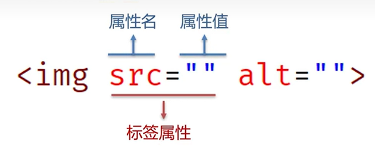

<!--
source_atomic:
  - atomic/第04章_HTML基本結構標籤/04-標籤屬性.md
-->

# HTML 標籤屬性

## 學習目標

讀完這篇筆記，你應該能夠：

- 理解屬性是用來補充標籤資訊的語法。
- 知道屬性應該寫在開始標籤或單標籤內。
- 能分辨一般屬性與布林屬性的基本寫法。
- 避免重複屬性、缺少空格、屬性值亂寫等常見錯誤。

## 問題情境

只有標籤名稱時，HTML 可以表達「這是什麼內容」。但很多時候，標籤還需要更多資訊。

例如：

- `<a>` 需要知道要連到哪裡。
- `` 需要知道圖片來源與替代文字。
- `<input>` 需要知道輸入類型，或是否停用。
- `<html>` 需要透過 `lang` 告訴瀏覽器文件語言。

這些額外資訊，就是透過屬性提供。

## 一句話理解

HTML 屬性是寫在標籤上的補充資訊，用來描述這個標籤應該如何被理解或如何運作。

## 屬性長什麼樣子

多數屬性由「屬性名」與「屬性值」組成：

```html
<p title="提示文字">把滑鼠移到這段文字上</p>
```

在這個例子中：

- `p` 是標籤名稱。
- `title` 是屬性名。
- `"提示文字"` 是屬性值。
- `title="提示文字"` 整體就是一個屬性。

屬性通常寫在開始標籤內：

```html
<a href="https://example.com">前往範例網站</a>
```

單標籤也可以有屬性：

```html
<input type="text" placeholder="請輸入姓名">
```

## 屬性的位置

屬性必須寫在開始標籤或單標籤內，不是寫在結束標籤，也不是寫在標籤外面。




正確寫法：

```html
<p title="提示文字">這是一段文字</p>
```

錯誤寫法：

```html
<p>這是一段文字</p title="提示文字">
```

結束標籤只負責結束元素，不放屬性。

## 一個標籤可以有多個屬性

同一個標籤上可以同時存在多個屬性，屬性之間用空格分隔：

```html
<input type="email" name="email" placeholder="請輸入電子郵件">
```

拆開來看：

- `type="email"`：指定輸入類型。
- `name="email"`：指定欄位名稱。
- `placeholder="請輸入電子郵件"`：提供輸入提示。

屬性之間通常沒有固定順序，但標籤名稱與第一個屬性之間必須有空格。

## 布林屬性

有些屬性比較特別，只要屬性名出現，就代表啟用該狀態，這類常被稱為布林屬性。

```html
<input disabled>
```

`disabled` 表示這個輸入欄位被停用。它不需要再寫成一般的 `屬性名="屬性值"` 形式。

實務上也常看到這種寫法：

```html
<input disabled="disabled">
```

兩者都能表達停用狀態；初學時先理解重點：布林屬性的存在本身就代表該狀態成立。

## 屬性書寫建議

HTML 對屬性寫法有一定容錯，但正式撰寫時應該養成穩定一致的習慣。

建議寫法：

- 屬性名使用小寫。
- 屬性值使用雙引號包住。
- 標籤名稱與屬性之間要有空格。
- 多個屬性之間要有空格。
- 不要在同一個標籤上重複寫同名屬性。
- 不要亂寫不存在或不適用於該標籤的屬性。

例如：

```html

```

比起省略引號或大小寫混用，這種寫法更容易閱讀，也更適合團隊維護。

## 常見錯誤

### 標籤名和屬性之間沒有空格

錯誤寫法：

```html
<inputtype="text">
```

正確寫法：

```html
<input type="text">
```

瀏覽器需要透過空格分辨標籤名稱與屬性。

### 重複寫同名屬性

錯誤寫法：

```html
<input type="text" type="password">
```

同一個標籤上不要寫兩個相同屬性。這會讓程式碼語意混亂，也可能造成後面的屬性值無法如預期生效。

正確寫法：

```html
<input type="password">
```

### 把屬性寫到結束標籤

錯誤寫法：

```html
<a>查看文件</a href="/docs">
```

正確寫法：

```html
<a href="/docs">查看文件</a>
```

屬性要寫在開始標籤中。

## 實務判斷

學習每個 HTML 標籤時，不要只背標籤名稱，也要一起理解它常用的屬性。

例如：

| 標籤 | 常見屬性 | 用途 |
| --- | --- | --- |
| `<html>` | `lang` | 標示文件語言 |
| `<a>` | `href` | 指定連結目標 |
| `` | `src`, `alt` | 指定圖片來源與替代文字 |
| `<input>` | `type`, `name`, `disabled` | 指定輸入欄位行為與狀態 |

不同標籤會支援不同屬性，也有一些通用屬性可以出現在許多標籤上。實務上應以 HTML 標準與瀏覽器支援為準，不要把某個標籤的屬性直接套到所有標籤上。

## 重點整理

- 屬性用來提供標籤的附加資訊。
- 屬性寫在開始標籤或單標籤內。
- 一般屬性常見格式是 `屬性名="屬性值"`。
- 布林屬性只要出現屬性名，就表示狀態成立。
- 標籤名稱與屬性之間、屬性與屬性之間，都要用空格分隔。
- 屬性名建議小寫，屬性值建議使用雙引號。
- 不要在同一個標籤上重複寫同名屬性。

