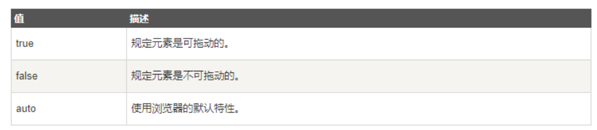

<!--
source_atomic:
  - atomic/第05章_全局屬性/07-draggable-屬性.md
  - atomic/第05章_全局屬性/08-dropzone-屬性.md
-->

# 拖放互動屬性

## 學習目標

讀完這篇筆記，你應該能夠：

- 使用 `draggable` 指定元素是否可被拖動。
- 理解 `draggable` 需要搭配 JavaScript 拖放事件才會形成完整互動。
- 知道 `<a>` 與圖片預設可拖動。
- 理解 `dropzone` 屬於已棄用屬性，現代 HTML 不建議使用。

## 問題情境

有些介面需要讓使用者拖動項目，例如任務看板、檔案上傳區、排序清單或拖曳卡片。HTML 的 `draggable` 可以告訴瀏覽器某個元素是否允許被拖動，但真正的拖放行為通常還需要 JavaScript 事件配合。

## 一句話理解

`draggable` 決定元素能不能被拖動；拖到哪裡、放下後做什麼，通常要靠 JavaScript 處理。

## `draggable`：指定元素是否可拖動

`draggable` 屬性規定元素是否可拖動。

```html
<div draggable="true">可以拖動的元素</div>
```

鏈接與圖像預設是可拖動的；其他元素通常需要明確設定 `draggable="true"`。



常見值：

| 值 | 意思 |
| --- | --- |
| `true` | 元素可被拖動 |
| `false` | 元素不可被拖動 |
| `auto` | 由瀏覽器依元素預設行為判斷 |

## 基本拖放範例

下面範例讓 `Adiv` 可以被拖到 `Bdiv` 裡。

```html
<style>
  .box-a {
    width: 200px;
    height: 200px;
    background-color: orange;
  }

  .box-b {
    width: 400px;
    height: 400px;
    background-color: gray;
  }
</style>

<div id="Adiv" class="box-a" draggable="true">
  A：拖曳的元素
</div>

<div id="Bdiv" class="box-b">
  B：A 被拖進的元素
</div>

<script>
  const Adiv = document.getElementById('Adiv');
  const Bdiv = document.getElementById('Bdiv');

  Bdiv.ondragover = function (event) {
    event.preventDefault();
  };

  Bdiv.ondrop = function (event) {
    event.preventDefault();
    this.appendChild(Adiv);
  };

  Adiv.ondragstart = function () {
    this.style.backgroundColor = 'yellow';
  };

  Adiv.ondrag = function () {
    console.log('drag 事件');
  };

  Adiv.ondragend = function () {
    this.style.backgroundColor = 'orange';
    console.log('dragend 事件');
  };
</script>
```

## 範例拆解

- `draggable="true"`：讓 `Adiv` 可以被拖動。
- `ondragstart`：拖曳開始時觸發，範例中把背景變成黃色。
- `ondrag`：拖曳過程中觸發。
- `ondragend`：拖曳結束時觸發，範例中把背景改回橘色。
- `ondragover`：拖曳元素停留在目標區域上方時觸發。
- `event.preventDefault()`：在 `dragover` 中允許目標元素接收 `drop`。
- `ondrop`：拖曳元素實際放下時觸發，範例中把 `Adiv` 移進 `Bdiv`。

這個範例的核心是：HTML 只負責宣告元素可拖動，互動流程由 JavaScript 事件完成。

## `dropzone`：已棄用的拖放屬性

`dropzone` 屬性曾用於規定當被拖動的資料拖放到元素上時，資料應被複製、移動或建立連結。

歷史用法示例：

```html
<div dropzone="copy"></div>
```

舊式屬性值包含：

| 值 | 歷史用途 |
| --- | --- |
| `copy` | 拖動資料會產生副本 |
| `move` | 拖動資料會被移動到新位置 |
| `link` | 拖動資料會產生指向原始資料的連結 |

`dropzone` 已屬於 obsolete 屬性，現代 HTML 不建議使用。實作拖放互動時，通常使用 Drag and Drop API 搭配 JavaScript 事件處理。

## 實務注意事項

拖放互動要特別注意可及性與替代操作。並不是每個使用者都能或都方便使用滑鼠拖曳。

如果拖放會改變資料順序或移動項目，通常應提供額外操作方式，例如：

- 上移、下移按鈕。
- 選單操作。
- 鍵盤可操作的排序功能。

## 常見錯誤

### 只加 `draggable` 卻期待完整功能

```html
<div draggable="true">任務卡片</div>
```

這只表示元素可以被拖動，不代表放下後會自動排序、移動或儲存。完整互動仍需要 JavaScript。

### 在現代頁面使用 `dropzone`

不建議：

```html
<div dropzone="move"></div>
```

現代 HTML 應避免使用 `dropzone`，改用拖放事件處理。

## 延伸參考

- [原生JS的拖拽属性draggable（详解）](https://blog.csdn.net/weixin_46726346/article/details/128149227)
- [javascript拖拽功能](https://juejin.cn/post/7157917666580103198)

## 重點整理

- `draggable` 規定元素是否可拖動。
- 鏈接與圖片預設可拖動。
- `draggable` 常與 JavaScript 拖放事件一起使用。
- `dropzone` 是已棄用屬性，現代 HTML 不建議使用。
- 拖放互動應考慮鍵盤與非拖曳替代操作。
