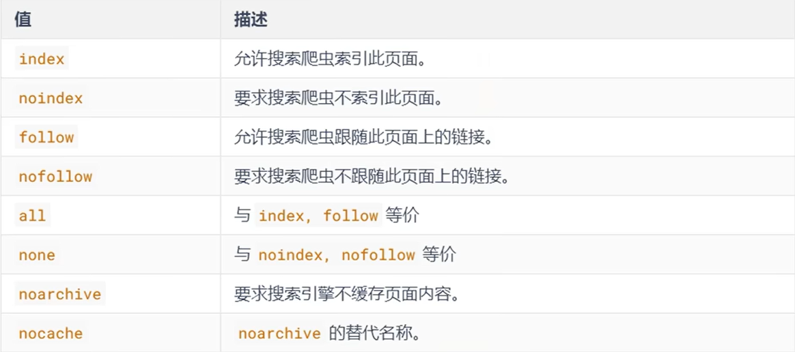

<!--
source_atomic:
  - atomic/第08章_meta標籤/04-robots搜尋爬蟲設定.md
  - atomic/第08章_meta標籤/05-keywords與description.md
-->

# 搜尋引擎與摘要 meta 設定

## 學習目標

讀完這篇筆記，你應該能夠：

- 理解 `description` 如何幫助描述頁面內容。
- 知道 `keywords` 的歷史用途與現代使用限制。
- 使用 `robots` meta 提供搜尋爬蟲索引與跟隨連結的指示。
- 分辨 meta 設定、搜尋結果摘要與搜尋排名之間的關係。

## 問題情境

當一個網頁被搜尋引擎讀取時，搜尋引擎不只看頁面上顯示的文字，也會參考 `<head>` 中的 metadata。

常見需求包含：

- 給頁面一段簡短描述。
- 提供搜尋結果摘要的候選文字。
- 告訴搜尋爬蟲是否可以索引這個頁面。
- 告訴搜尋爬蟲是否可以跟隨頁面上的連結。

這些設定不能保證搜尋引擎一定照做，也不能把品質不好的內容變成高排名內容，但能讓頁面描述更清楚、控制規則更明確。

## 一句話理解

搜尋相關 meta 是放在 `<head>` 裡的頁面描述與爬蟲指示，用來協助搜尋引擎理解頁面，但不能取代高品質內容與正確網站結構。

## 基本寫法

```html
<head>
  <meta name="description" content="這是一個介紹 HTML meta 標籤的教學頁面。">
  <meta name="keywords" content="HTML, meta, description, robots">
  <title>HTML meta 標籤教學</title>
</head>
```

這段程式碼中：

- `description`：描述頁面內容。
- `keywords`：記錄頁面相關關鍵詞。
- `robots`：需要限制或明確指定爬蟲行為時，才另外加入。

## `description`：頁面摘要描述

```html
<meta name="description" content="這是一個描述內容">
```

`description` 用來提供頁面摘要。搜尋引擎可能把它作為搜尋結果摘要的候選來源之一。

需要注意的是，搜尋引擎不一定原封不動使用 `description`。它可能依使用者查詢、頁面正文與搜尋結果情境，自行改寫摘要。


較好的 `description` 通常具備幾個特徵：

- 能準確描述本頁內容。
- 不堆砌關鍵字。
- 不寫與頁面內容不相符的承諾。
- 文字簡潔，讓使用者能快速判斷是否要點進來。

## `keywords`：關鍵詞記錄

```html
<meta name="keywords" content="關鍵詞1, 關鍵詞2, 關鍵詞3">
```

`keywords` 曾經常被拿來記錄頁面關鍵詞，但在現代搜尋引擎最佳化中，不應把它視為主要排名手段。

你可以把它理解成頁面相關詞的記錄，而不是讓頁面排名變好的保證。


初學者最容易誤解的是：以為塞入很多熱門詞就能提升搜尋結果表現。實務上，搜尋引擎更重視頁面內容品質、結構、連結、使用者需求匹配，以及站點整體可信度。

## `robots`：搜尋爬蟲指示

```html
<meta name="robots" content="noindex, nofollow">
```

`robots` meta 用來對搜尋爬蟲提出指示。公開頁面通常不需要特別寫 `index, follow`；需要限制索引、限制連結跟隨，或指定特殊搜尋呈現規則時，再加入 `robots` 設定。

常見值可以組合使用：

| 值 | 基本意思 |
| --- | --- |
| `index` | 允許索引這個頁面。 |
| `noindex` | 要求不要索引這個頁面。 |
| `follow` | 允許跟隨頁面上的連結。 |
| `nofollow` | 要求不要跟隨頁面上的連結。 |

原始教材中的 robots 設定值整理如下：



不同搜尋引擎或 crawler 支援的指令可能不同。像 `noarchive`、`nocache` 這類值屬於歷史或特定平台指令，是否有效要查目標 crawler 官方文件；例如 Google Search 已不使用這兩個規則。重要頁面上線前，應以目標平台的官方文件與實際測試為準。

## 範例拆解

```html
<head>
  <meta name="description" content="用初學者能理解的方式介紹 HTML meta 標籤。">
  <title>HTML meta 標籤入門</title>
</head>
```

這個範例表示：

- `description` 提供一段搜尋摘要候選文字。
- `title` 仍然很重要，因為搜尋結果通常也會參考頁面標題。
- 沒有特別設定 `robots`，代表不額外限制搜尋爬蟲。

如果某個頁面只是內部測試頁，不希望出現在搜尋結果，可以改成：

```html
<meta name="robots" content="noindex, nofollow">
```

## 常見錯誤

### 把 `keywords` 當成 SEO 捷徑

較不理想：

```html
<meta name="keywords" content="HTML, HTML教學, 免費課程, 熱門, 最好, 第一名, 前端, 網頁">
```

這種堆砌關鍵詞的寫法不會讓頁面自然變得有價值，也可能讓 metadata 變得不可信。

### 用 `robots` 保護私密內容

`robots` 是給爬蟲的指示，不是權限控管。

如果內容不能被外部看到，應使用登入、權限、伺服器設定或其他安全機制。不要只靠：

```html
<meta name="robots" content="noindex">
```

### `description` 和頁面內容不一致

如果摘要寫得很吸引人，但頁面正文沒有提供對應內容，使用者即使點進來也會失望。好的 `description` 應該是準確摘要，而不是廣告標語。

## 實務使用原則

一般公開頁面可以先從這組設定開始：

```html
<meta name="description" content="用一句精準文字描述這個頁面的內容。">
```

公開頁面通常可以省略 `robots`。如果頁面不希望出現在搜尋結果，或不希望爬蟲跟隨頁面連結，再依需求加入 `noindex`、`nofollow` 等設定。

至於 `keywords`，除非專案、CMS 或內部流程需要記錄，否則不必為了 SEO 強行加入。

## 參考資料

- [HTML基础语法（2）-网页关键词和页面描述](https://blog.csdn.net/weixin_45586870/article/details/120138274)

## 重點整理

- `description` 提供頁面摘要，是搜尋結果摘要的候選來源之一。
- 搜尋引擎可能依查詢與頁面內容改寫摘要。
- `keywords` 不應被視為現代搜尋排名保證。
- `robots` 用來提供索引與連結跟隨指示；公開頁面通常可省略 `index, follow`。
- `robots` 不是安全權限控管。
- 搜尋相關 meta 應服務於準確描述與清楚指示，而不是投機式堆疊。

## 自我檢查

- 我是否能寫出一段準確的 `description`？
- 我是否知道 `keywords` 為什麼不能當成 SEO 捷徑？
- 我是否能說明 `noindex` 與 `nofollow` 的差別？
