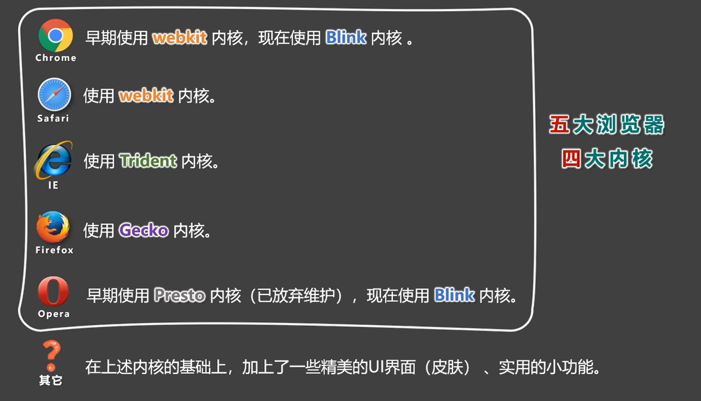
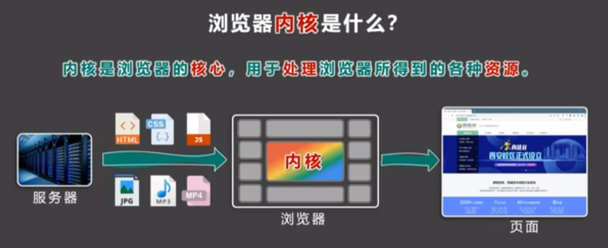

# 瀏覽器

> 瀏覽器是網頁顯示、運行的平台。常用的瀏覽器有 IE、火狐、谷歌、Safari 和 Opera 等。

- 五大主流瀏覽器 → IE、火狐、谷歌、Safari 和 Opera 。
    
    
    
- 各家瀏覽器的內核 → 瀏覽器出品的公司不同，內在的渲染引擎也是不同的。
    
    
    

# **瀏覽器內核是什麼 ?**

> 渲染引擎 ( 瀏覽器內核 ) → 瀏覽器中專門對代碼進行解析渲染的部分。負責讀取網頁內容，整理訊息，計算網頁的顯示方式並顯示頁面。

當我們看一個網頁的時候，是由瀏覽器向服務器請求資源回來。瀏覽器得到這些資源之後，就要將這些資源進行處理，而處理靠的就是我們的瀏覽器內核。內核處理完之後，就可以看到精美的頁面了。

- 注意點 :
    - 渲染引擎不同，導致解析 **相同代碼的速度、性能、效果也不同的**。
        - 因為不同瀏覽器的渲染引擎不同，解析的效果也就存在著差異。
