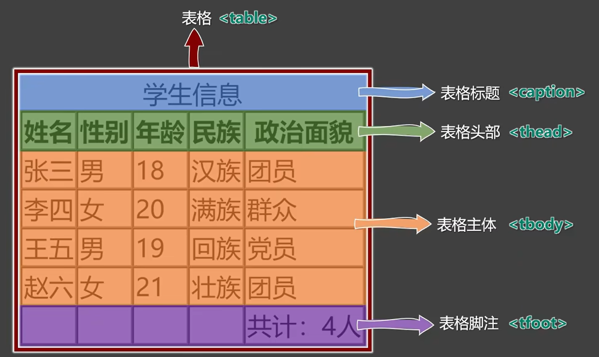
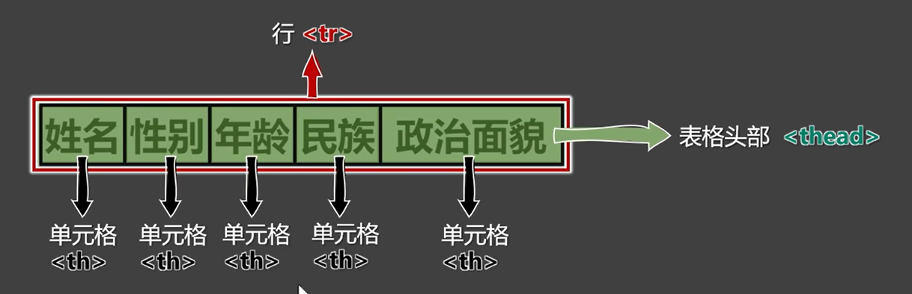
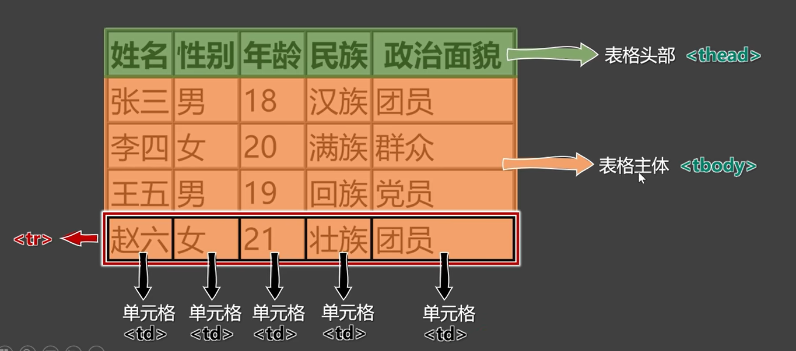
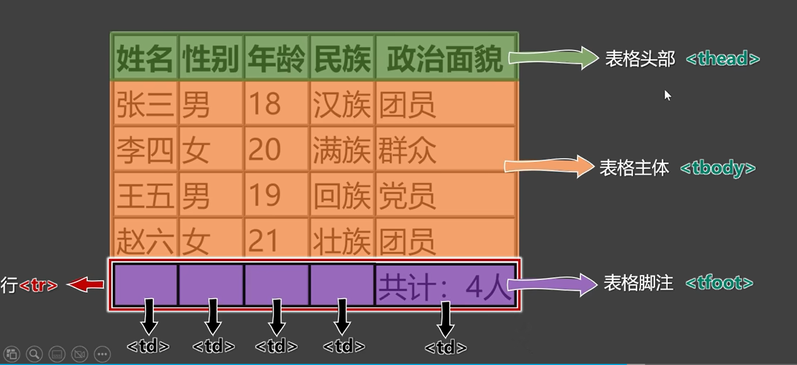
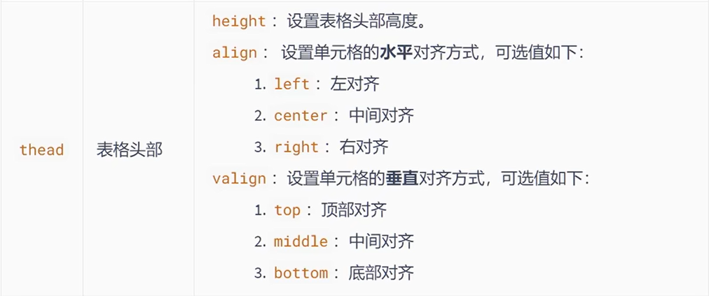
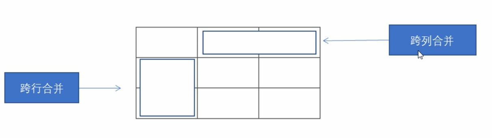

# **1. 表格的基本語法**

> 💡 表格不是用來布局的，而是用來展示數據的。
> 

表格主要用於顯示、展示數據，因為它可以讓數據顯示得非常規整，可讀性非常好，特別是後台展示數據的時候，能夠熟練運用表格就顯得非常重要，一個清爽簡約的表格能夠把複雜的數據表現的很有條理。

- `<table></table>` 是用來定義表格的標籤。
- `<tr></tr>` 標籤是用於定義表格中的行，必須嵌套在`<table></table>` 標籤中。
- `<th></th>` 用來定義表格中的表頭，表頭單元格里面的內容加粗居中顯示。
- `<td></td>` 用於定義表格中的單元格，必須嵌套在 `<tr></tr>` 標籤中。
    - 字母 td 指表格數據，即數據單元格的內容。

```html
<table>
  <tr>
      <th>姓名</th>
      <th>性別</th>
      <th>年齡</th>
  </tr>
  <tr>
      <td>劉德華</td>
      <td>男</td>
      <td> 56 </td>
  </tr>
  <tr>
      <td>張學友</td>
      <td>男</td>
      <td> 58 </td>
  </tr>
  <tr>
      <td>郭富城</td>
      <td>男</td>
      <td> 51 </td>
  </tr>
  <tr>
      <td>黎明</td>
      <td>男</td>
      <td> 57 </td>
  </tr>
</table>
```

# **2. caption、thead、tbod、tfoot 介紹**

> 一個完整的表格由: 表格標題、表格頭部、表格主體、表格腳注四個部分組成。
> 
- 表格涉及到的標籤
    - table 表格
    - caption 表格標題
    - thead 表格頭部
    - tbody 表格主體
    - tfoot 表格腳注
    - tr 每一行
    - th、td 每一個單元格
        - 表格頭部中用 th。
        - 表格主體、表格腳注中用 td。
- 表格示意圖
    
    
    
- thead示意圖
    
    
    
- tbody 示意圖
    
    
    
- tfoot 示意圖
    
    
    

```html
<table border="1">
  <caption>段考成績</caption>
  <thead>
    <tr>
      <th>科目</th>
      <th>分数</th>
    </tr>
  </thead>
  <tbody>
    <tr>
      <td>语文</td>
      <td>99</td>
    </tr>
    <tr>
      <td>数学</td>
      <td>60</td>
    </tr>
  </tbody>
  <tfoot>
    <tr>
      <td>总分</td>
      <td>159</td>
    </tr>
  </tfoot>
</table>
```

# **3. 常用屬性**

- table 常用屬性
    - ✍️ 表格標籤這部分屬性我們實際開發不常用，後面通過 CSS 來設置。
    
    ```html
    <!--
            這些屬性要寫到表格標籤 table 裡面去
            1. align: 規定表格相對周圍元素的對齊方式，屬性值有left、center、right。
            2. border: 設置了表格的邊框寬度。你可以將這個值調整為你想要的任何正整數，以設置邊框的寬度。
              2.1 border="0" 或不使用 border 屬性默認就是無邊框。
            3. cellpading: 規定單元邊沿與其內容之間的空白，默認1像素
            4. cellspacing: 規定單元格之間的空白，默認2像素
            5. width: 規定表格的寬度
    -->
    
    <table align=center border="1" cellpadding="20" cellspacing="0" width="500">
    	<!-- 中間省略 ... -->
    </table>
    
    ```
    
- thead 常用屬性
    
    
    
- tbody 常用屬性
    
    
    
- tr 常用屬性
    
    
    
- tfoot 常用屬性
    
    
    
- td 常用屬性
    
    
    
- th 常用屬性
    
    
    

<aside>
⚠️

**注意點 :**

- table 元素的 border 屬性可以控制表格邊框，但 border 值的大小並不控制單元格邊框的高度，只能控制表格最外邊框的寬度，這問題之後要靠 CSS 控制。
- 給某個 th 或 td 設置了寬度之後，它所在的那一列的寬度就確定了。
- 給某個 th 或 td 設置了高度之後，它所在的那一列的高度就確定了。
</aside>

# **4. 合併單元格**

> 特殊情況下，可以把多個單元格合併為一個單元格。
> 



- 跨行合併: `rowspan = "合併單元格的個數"`。
- 跨列合併: `colspan = "合併單元格的個數"`。

<aside>
👉

**合併單元格三部曲**

- Step 1: 先確定是跨行還是跨列合併。
- Step 2: 找到目標單元格，寫上合併方式 = 合併的單元格數量。
- Step 3: 刪除多餘的單元格。
</aside>

```html
<table width="500" height="249" border="1" cellspacing="0">
  <tr>
      <td></td>
      <td colspan="2"></td>
  </tr>

  <tr>
      <td rowspan="2"></td>
      <td></td>
      <td></td>
  </tr>

  <tr>
      <td></td>
      <td></td>
  </tr>
</table>
```
