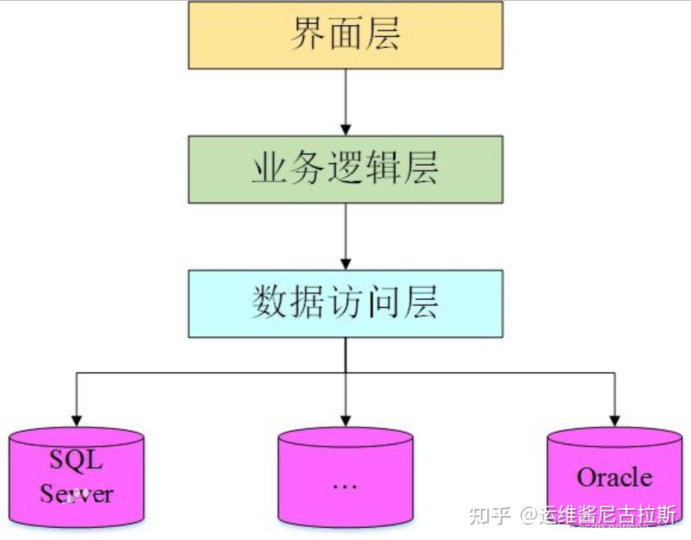

# C/S 架構和 B/S 架構

>💡總歸一句就是瀏覽器無法支撐巨量的運算量，所以還是得靠 C/S 架構。又或者是有些軟件是需要細分到哪些電腦可以安裝的，就好比導彈系統並不是每台電腦都可以安裝上的，就算搞到導彈系統安裝包，我這台電腦也安裝不上，因為我這台電腦是沒有被授權的。所以還是得靠 C/S 架構。

# **C/S 架構**

- C/S 架構軟件有一個特點，就是如果用戶要使用的話，需要下載一個客戶端，安裝後就可以使用。比如 QQ、OFFICE 軟件等。
- 這裡需要補充的是，客戶端不僅僅是一些簡單的操作，它也是會處理一些運算，業務邏輯的處理等。**也就是說，客戶端也做著一些本該由服務器來做的一些事情**。
- 示意圖
    
    
    
- 優點
    - C/S 架構的界面和操作可以很豐富。 （客戶端操作界面可以隨意排列，滿足客戶的需要）
    - 安全性能可以很容易保證。（因為只有兩層的傳輸，而不是中間有很多層）。
    - 由於只有一層交互，因此響應速度較快。 （直接相連，中間沒有什麼阻隔或岔路，比如 QQ，每天那麼多人在線，也不覺得慢）
- 缺點 ( 用 QQ 做類比 )
    - 適用面窄，通常用於局域網中。
    - 用戶群固定。由於程序需要安裝才可使用，因此不適合面向一些不可知的用戶。
    - 維護成本高，發生一次升級，則所有客戶端的程序都需要改變。

# **B/S 架構**

> B/S 架構的系統無須特別安裝，只有 Web 瀏覽器即可。

> 其實就是我們前端現在做的一些事情，大部分的邏輯交給後台來實現，我們前端大部分是做一些數據渲染，請求等比較少的邏輯。

- B/S 架構的全稱為 Browser/Server，即瀏覽器/服務器結構。
    - Browser 指的是 Web 瀏覽器，極少數事務邏輯在前端實現，但主要事務邏輯在服務器端實現。
- 與 C/S 架構只有兩層不同的是，B/S 架構有三層，分別為：
    
    
    
    - 第一層表現層：主要完成用戶和後台的交互及最終查詢結果的輸出功能。
    - 第二層邏輯層：主要是利用服務器完成客戶端的應用邏輯功能。
    - 第三層數據層：主要是接受客戶端請求後獨立進行各種運算。
- 優點
    - 客戶端無需安裝，有 Web 瀏覽器即可。
    - B/S 架構可以直接放在廣域網上，通過一定的權限控制實現多客戶訪問的目的，交互性較強。
    - B/S 架構無需升級多個客戶端，升級服務器即可。可以隨時更新版本，而無需用戶重新下載啊什麼的。
- 缺點
    - 在跨瀏覽器上，B/S 架構不盡如人意。
    - 表現要達到 C/S 程序的程度需要花費不少精力。
    - 在速度和安全性上需要花費巨大的設計成本，這是 B/S 架構的最大問題。
