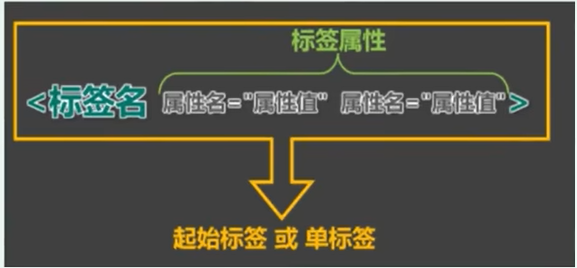

# **1. 文檔類型聲明標籤**

- 文檔類型聲明，作用就是告訴瀏覽器使用哪種 HTML 版本來顯示網頁。

```html
<!-- 這句代碼的意思是 : 當前頁面採取的是 HTML5 版本來顯示網頁。 -->
<!DOCTYPE html>
```

- **注意點 :**
    - `<!DOCTYPE>` 聲明位於文檔中的最前面的位置，處於 `<html>` 標籤之前。
    - `<!DOCTYPE>`不是一個 HTML 標籤，它就是文檔類型聲明標籤。

# **2. lang語言種類**

- `lang` 用來定義當前文檔顯示的語言。
    - zh-CN 定義語言為中文。
    - en 定義語言為英語。

```html
<html lang="en">
	<!-- 省略其他 ... -->
</html>
```

# **3. 字符集**

在標籤內，可以通過 標籤的 charset 屬性來規定 HTML 文檔應該使用哪種字符編碼。

```html
<head>
  <meta charset="UTF-8">
</head>
```

> charset 常用的值有 : GB2312 、BIG5 、GBK 和 UTF-8，其中 UTF-8 也被稱為萬國碼，基本包含了全世界所有國家需要用到的字符。
> 

# **4. 標籤屬性**

> 用於給標籤提供附加信息。
> 




- 可以寫在單標籤或雙標籤中，形式如下 :
    
    ```html
    <marquee loop="1" bgcolor="green">
      尚硅谷，讓天下沒有難學的技術!!!
    </marquee>
    ```
    
- 有些特殊的屬性沒有屬性名，只有屬性值，如下:
    
    ```html
    <input disabled>
    ```
    
- 屬性注意點 :
    - 不同的標籤，有不同的屬性；也有一些通用的屬性 ( 在任何標籤內都能寫 )。
    - 屬性名、屬性值不能亂寫，都是 W3C 規定好的。
    - 屬性名、屬性值，都不區分大小寫，但推薦小寫。
    - 雙引號、單引號都可以，甚至不寫都行，但還是推薦雙引號。
    - 標籤中不要出現同名屬性，否則後寫的會失效，例如 :
        
        ```html
        <!-- 後寫的會失效 -->
        <input type="text" type="password">
        ```
        
    - 標籤的屬性寫在 **開始標籤內部**。
    - 標籤上可以同時存在多個屬性。
    - 屬性之間以空格隔開。
    - 標籤名屬性之間 **必須以空格隔開**。
    - 屬性之間沒有順序之分。

# **5. 注釋**

> 程序員在寫代碼時，也會添加注釋，方便下次看到此處時方便想起功能和含意。
> 

```html
<!--  注释语句 	-->
```

- HTML 中的注釋以 "`<!--`" 開頭，以 "`-->`" 結束。
- 注釋裡面的內容是給程序員看的，這個代碼是不執行、不顯示到頁面中的。
- 添加注釋是為了更好的理解代碼的功能，便於相關人員理解和閱讀代碼，程序是不執行注釋內容的。
