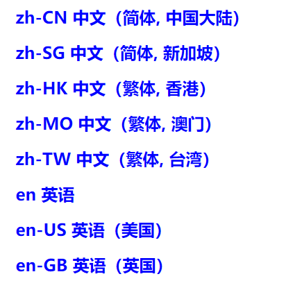

> lang 屬性規定元素內容的語言。

- 在 HTML5 中 lang 屬性可用於任何的 HTML 元素 ，它會驗證任何HTML元素，但不一定是有用。
- 在 HTML4 中 lang 屬性不能用於：`<base>、<br>、<frame>、<frameset>、<hr>、<iframe>、<param>、<script>`。
- 屬性值為語言代碼，用於規定元素內容的語言代碼，如下 ( 展開 )
    
        
```html
<body>
  <p lang="en">这是一个段落。</p>
</body>
```
