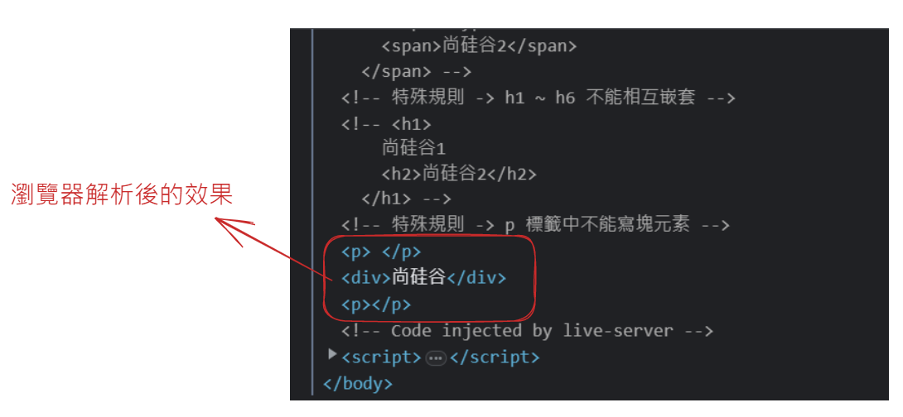

> **參考資料**
> 
> - [行内元素有哪些，块级元素有哪些，空(void)元素有哪些](https://docs.pingcode.com/ask/32810.html)
> - [區塊元素 行內元素 空元素特點？分別有哪些？](https://medium.com/@small2883/%E5%8D%80%E5%A1%8A%E5%85%83%E7%B4%A0-%E8%A1%8C%E5%85%A7%E5%85%83%E7%B4%A0-%E7%A9%BA%E5%85%83%E7%B4%A0%E7%89%B9%E9%BB%9E%E5%88%86%E5%88%A5%E6%9C%89%E5%93%AA%E4%BA%9B-19f8c05f16f6)

# 0. 塊級元素、行內元素簡介

**块级元素，顾名思义，该元素呈现 块 状，所以它有自己的宽度和高度，也就是可自定义 width 和 height。除此之外，块级元素比较霸道，它独自占据一行高度（float浮动除外），一般可以作为其他容器使用，可容纳块级元素和行内元素。块级元素有以下特点：**

- 每个块级元素都是独自占一行；
- 高度，行高，外边距（margin）以及内边距（padding）都可以控制；
- 元素的宽度如果不设置的话，默认为父元素的宽度 (父元素宽度100%)；
- 多个块状元素标签写在一起，默认排列方式为从上至下。
- 區塊元素常見包括 div、p、h1~h6、ul、ol、li、dl、dt、dd、form、table、hr、blockquote、address、menu、pre.....等等

**行内元素不可以设置宽（width）和高（height），但可以与其他行内元素位于同一行，行内元素内一般不可以包含块级元素。行内元素的高度一般由元素内部的字体大小决定，宽度由内容的长度控制。 行内元素有以下特点：**

- 不会独占一行，相邻的行内元素会排列在同一行里，直到一行排不下才会自动换行，其宽度随元素的内容而变化；
- 高宽无效，对外边距（margin）和内边距（padding）仅设置左右方向有效 上下无效；
- 设置行高有效，等同于给父级元素设置行高；
- 元素的宽度就是它包含的文字或图片的宽度，不可改变；
- 行内元素中不能放块级元素，a 链接里面不能再放链接。
- 行內元素常見包括 span、em、i、b、strong、a、img、input、br、select、textarea、q、bdo、sub、sup...等等

# 1. 塊級元素特點 → 獨佔一行

```html
<body>
<!-- 塊級元素特點: 獨佔一行 --><marquee>尚硅谷</marquee>
  <h1>尚硅谷</h1>
  <p>尚硅谷</p>
  <div>尚硅谷</div>
</body>
```

# 2. 行內元素特點 → 不獨佔一行

```html
<!-- 行內元素特點 : 不獨佔一行 -->
<input type="text">
<span>尚硅谷</span>
```

# 3. 規則一 → 塊級元素中能寫行內元素、塊級元素(幾乎什麼都能寫)

```html
<!-- 規則一: 塊級元素中能寫行內元素、塊級元素(幾乎什麼都能寫) -->
<div>
  <span>尚硅谷1</span>
  <input type="text">
  <div>尚硅谷2</div>
</div>
```

# 4. 規則二 → 行內元素中能寫行內元素，但不能寫塊級元素

```html
<!-- 規則二: 行內元素中能寫行內元素，但不能寫塊級元素 -->
<span>
    <span>尚硅谷1</span>
    <input type="text">
    <span>尚硅谷2</span>
</span>
```

# **5. 特殊規則 → h1~h6不能相互嵌套**

```html
<!-- 特殊規則 -> h1 ~ h6 不能相互嵌套 -->
<h1>
    尚硅谷1
    <h2>尚硅谷2</h2>
</h1>
```

- 瀏覽器解析後的效果
    
    
    

# 6. 特殊規則 → p標籤中不能寫塊元素

```html
<!-- 特殊規則 -> p 標籤中不能寫塊元素 -->
<p>
  <div>尚硅谷</div>
</p>
```

- 瀏覽器解析後的效果
    
    
    

# 7. 特殊規則 → a標籤無所不能，但a標籤不能包含它本身

```html
<!-- <a href="https://example.com">這是一個超連結</a> -->
<!-- <a href="https://example.com"><em>這是強調的文字</em></a> -->
<a href="https://example.com">
  <div>這是一個包含在 a 標籤中的區塊元素</div>
</a>
```

- `<a>` 標籤內部不能包含另一個 `<a>` 標籤。這樣的巢狀結構在 HTML 規範中是不被允許的，可能會導致不正確的顯示和行為。

```html
<a href="https://example.com">
    <a>這是一個超連結</a>
</a>
```
