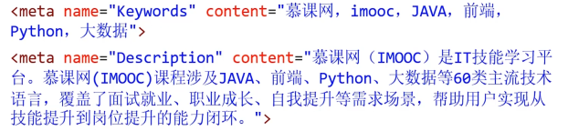
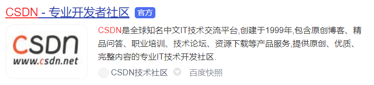

- 配置字符編碼
    
    ```html
    <!-- 配置字符編碼 -->
    <meta charset="UTF-8">
    ```
    
- 針對 IE 瀏覽器的一個兼容性設置
    
    ```html
    <!-- 針對 IE 瀏覽器的一個兼容性設置，總是使用最新的文檔模式進行渲染。 -->
    <meta http-equiv="X-UA-Compatible" content="IE=edge">
    ```
    
- 針對移動端的一個配置
    
    ```html
    <!-- 針對移動端的一個配置 -->
    <meta name="viewport" content="width=device-width, initial-scale=1.0">
    ```
    
- 配置網頁作者
    
    ```html
    <!-- 配置網頁作者  -->
    <meta name="author" content="kevin">
    ```
    
- 配置網頁生成工具
    
    ```html
    <!-- 配置網頁生成工具   -->
    <meta name="generator" content="Visual Studio Code">
    ```
    
- 配置定義網頁版權信息
    
    ```html
    <!-- 配置定義網頁版權信息  -->
    <meta name="copyright" content="2023-2027版權所有">
    ```
    
- 配置網頁自動刷新
    
    ```html
    <!-- 自動刷新 -->
    <meta http-equiv="refresh" content="3;url=https://www.bilibili.com/">
    ```
    
- 針對搜索引擎爬蟲配置
    
    ```html
    <!-- 針對搜索引擎爬蟲配置 -->
    <meta name="robots" content="此處可選值見下表">
    ```
    
    
    
- 關鍵字和描述訊息
    
    ```html
    <!-- 可以解讀為 "你要描述（meta）的內容名稱（name），內容（content）是什麼"。 -->
    <meta name="keywords" content="關鍵詞1, 關鍵詞2, 關鍵詞3">
    <meta name="description" content="這是一個描述內容">
    ```
    
    
    
    **页面描述也就是搜索引擎显示的简介词语，**如下
    
    
    
    - **參考文章  ⇒**  [HTML基础语法（2）-网页关键词和页面描述](https://blog.csdn.net/weixin_45586870/article/details/120138274)
- 社交媒體分享配置（Open Graph）：
    
    ```jsx
    <meta property="og:title" content="網頁標題">
    <meta property="og:description" content="網頁描述">
    <meta property="og:image" content="圖片URL">
    ```
