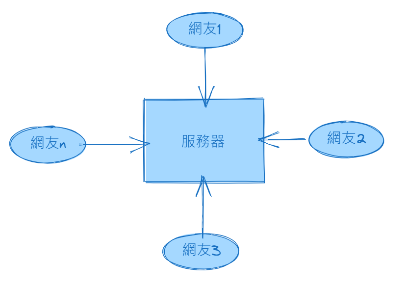

# Web 服務器

> 所屬章節：第一章｜寫在前面  
> 關鍵字：Web 伺服器、Web 服務器、網站伺服器、主機、HTTP、本地開發伺服器、遠端伺服器、部署  
> 建議回查情境：想理解網站為什麼需要部署到伺服器上、分不清 Web 伺服器和一般電腦的差異、想快速確認本地與遠端伺服器的用途

## 本節導讀

這一節要先釐清三件很容易混在一起的事：

- 網站為什麼需要伺服器
- `Web 伺服器` 到底是在指機器、程式，還是提供服務的角色
- 本地開發伺服器與遠端伺服器有什麼差別

閱讀時先抓住一句核心：

- **誰在接收 Web 請求、誰在回應瀏覽器，誰就是 Web 服務的一部分。**

## 你會在這篇學到什麼

- 為什麼網站通常需要部署到伺服器上
- `Web 伺服器` 的基本意思
- 本地開發伺服器與遠端伺服器的差異
- 為什麼「伺服器」既可能指角色，也可能指機器

## 這篇在解決什麼問題？

- 初學時常會把「伺服器是一台電腦」「Web 伺服器是一種程式」「網站放在遠端主機上」這幾件事混在一起。
- 也常會以為只有很特別的硬體才能叫伺服器。
- 這篇的目標，就是先把這幾個層次拆開：角色、程式、機器、部署位置。

## 先講結論

- 網站如果只放在自己電腦裡、又沒有對外提供存取方式，通常只有自己能方便地開啟。
- 如果希望其他使用者穩定地透過網路訪問網站，就需要把網站放到能長時間提供服務的環境上。
- 這種提供 Web 內容的系統，常被統稱為 `Web 伺服器`。
- 在日常語境裡，`Web 伺服器` 有時指提供 Web 服務的程式，有時也指承載這些服務的主機；閱讀時要看上下文。

## 為什麼網站需要伺服器？

你自己的電腦當然也能跑網站，但它通常不是為了這件事而設計的。

如果網站要讓其他人透過網路持續訪問，通常會希望它具備這些條件：

- 可以長時間穩定運作
- 可以被其他裝置連線
- 可以部署、更新與維護
- 能在需要時擴充資源或管理權限

所以實務上，網站通常不會只留在開發者自己的電腦裡，而是會部署到更適合持續提供服務的環境中。

## 什麼是 Web 伺服器？

### 狹義理解

狹義來說，`Web 伺服器` 指的是：

- 接收 `HTTP/HTTPS` 請求
- 回傳網頁、圖片、樣式、腳本或其他 Web 資源

的程式或服務。

也就是說，它關心的是：

- 有沒有接收請求
- 有沒有把 Web 資源回傳出去

### 廣義理解

廣義來說，人們也常把承載這些服務的主機直接叫做 `Web 伺服器`。

所以在學習時，最好把兩個層次分開：

- 一個是「提供 Web 服務的程式 / 系統」
- 一個是「承載這些程式的機器或環境」

這樣你之後在看文章時，就比較不容易被詞帶著跑。

## 伺服器一定是很特別的電腦嗎？

不一定。

- 伺服器本質上也是電腦。
- 它和一般個人電腦最大的差別，不一定是外觀，而是它扮演的角色與使用方式。
- 當一台機器被拿來持續提供服務、接收請求、回傳結果時，它就可以在這個情境下被稱為伺服器。

所以伺服器可以是：

- 高效能實體主機
- 雲端虛擬機
- 容器化環境
- 在學習階段，你自己電腦上啟動的本地服務

## 本地開發伺服器與遠端伺服器

### 本地開發伺服器

- 指在自己電腦上啟動、主要用於開發與測試的伺服器。
- 它通常方便開發者自己存取，也可能只開放給同一台電腦或局域網內的裝置使用。
- 這類伺服器常用來驗證頁面、功能與開發流程是否正常。

例如：

- 你在前端專案裡執行 `npm run dev`
- 啟動的本地預覽服務
- 在自己電腦上跑起來的測試網站

這些都可以視為本地開發伺服器。

### 遠端伺服器

- 指部署在其他主機或雲端環境中的伺服器。
- 當網站或系統被部署到遠端伺服器後，其他使用者就能透過網路、網址或指定入口來訪問它。
- 這也是正式上線時最常見的做法。

例如：

- 公司正式上線的官網
- 部署到雲端主機上的後台系統
- 讓外部使用者能透過網址訪問的服務

## 這兩者最核心的差別是什麼？

重點不只是「在哪裡」，更是「拿來做什麼」。

- 本地開發伺服器：重點在開發、測試、驗證
- 遠端伺服器：重點在穩定對外提供服務

所以差別核心在於：

- 部署位置
- 存取範圍
- 使用目的

## 常見混淆點

- `Web 伺服器` 有時指服務程式，有時指承載服務的主機；閱讀教材時要看上下文。
- 伺服器不等於後端程式，但後端程式通常會跑在伺服器上。
- 本地開發伺服器和遠端伺服器的差別，重點在部署位置與使用目的，不只是「能不能上網」。
- 一般電腦也可以在某個情境下扮演伺服器，不是只有特殊機器才能叫伺服器。

## 一句話抓核心

- Web 伺服器的核心任務，是接收 Web 請求並回傳內容；而在日常語境裡，人們也常把承載這些服務的主機一起叫做伺服器。

## 延伸閱讀

- [返回第一章：寫在前面](./README.md)
- [返回首頁](../README.md)
