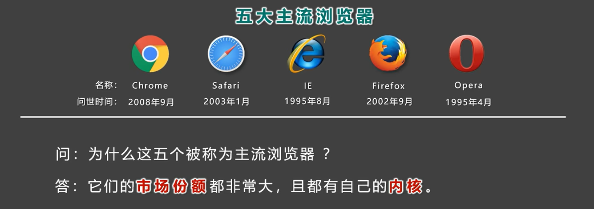

# 瀏覽器

> 所屬章節：第一章｜寫在前面  
> 關鍵字：瀏覽器、渲染引擎、JavaScript 引擎、瀏覽器內核、Chrome、Safari、Firefox、Edge、IE  
> 建議回查情境：想先知道瀏覽器在 Web 中扮演什麼角色、想理解瀏覽器內核是什麼、想確認不同瀏覽器為什麼顯示效果可能不同

## 本節導讀

這一節先說明瀏覽器在 Web 中到底做了什麼，再進一步整理「瀏覽器內核」這個常見但容易被講得過度簡化的概念。

閱讀時請先抓住一個核心：

- **瀏覽器不是只負責把畫面打開，它還會負責請求、解析、執行與顯示。**

## 你會在這篇學到什麼

- 瀏覽器在 Web 中的基本角色
- 常見瀏覽器有哪些
- 瀏覽器實際上會做哪些事
- 瀏覽器內核與頁面顯示效果的關係

## 這篇在解決什麼問題？

- 初學前端時，常會聽到「瀏覽器」「瀏覽器內核」「渲染引擎」這幾個詞，但不容易分清它們的關係。
- 也常會把瀏覽器想得太單純，以為它只是把網站畫面打開而已。
- 這篇的目標，就是先穩住一個基本概念：瀏覽器不只是顯示工具，它也是 Web 執行環境的重要一部分。

## 先講結論

- 瀏覽器是使用者存取 Web 內容的客戶端軟體。
- 它會向伺服器請求資源，解析 `HTML`、`CSS`、`JavaScript`，再把頁面呈現給使用者。
- 所謂「瀏覽器內核」，在入門教材裡常被用來指瀏覽器中負責解析與渲染頁面的核心部分，但這通常是簡化說法。

## 常見瀏覽器

- 常見的桌面或行動瀏覽器包含 `Chrome`、`Safari`、`Firefox`、`Edge` 等。
- 較早期的教材也常會提到 `IE` 和 `Opera`，這些名稱在學習歷史背景時仍可能出現。

## 瀏覽器實際上做了哪些事？

瀏覽器不是只把畫面打開，它通常還會做下面這些事：

- 向伺服器發送請求，取得網頁、圖片、樣式檔、腳本等資源
- 解析頁面內容，理解結構與樣式
- 執行頁面中的腳本，處理互動行為
- 把最終結果渲染成使用者看到的畫面
- 管理快取、歷史紀錄、Cookie、部分安全機制等瀏覽行為

你可以把它想成一個整合型工具：

- 它既是請求資源的客戶端
- 也是解析與執行頁面的運行環境
- 最後還要把結果呈現給使用者

## 瀏覽器內核是什麼？

在很多入門教材裡，「瀏覽器內核」常被拿來指瀏覽器中負責解析與渲染頁面的核心部分。

這種說法不是完全錯，但它比較偏向入門層級的簡化。

如果講得更精確一點，瀏覽器通常還包含：

- 渲染引擎
- `JavaScript` 引擎
- 網路模組
- 快取機制
- 使用者介面相關模組
- 安全與程序管理相關機制

所以：

- 把「瀏覽器內核」完全等同於「渲染引擎」，是一種方便入門的簡化說法
- 但之後要知道，它們並不是完全同一層意思

## 為什麼不同瀏覽器的顯示效果可能不同？

- 不同瀏覽器使用的核心實作、版本與支援能力不完全相同。
- 因此，同一份程式碼在不同瀏覽器上，可能會出現解析速度、效能或顯示結果的差異。
- 這也是為什麼前端開發會重視 Web 標準與跨瀏覽器相容性。

你可以簡單理解成：

- 瀏覽器雖然都在做「解析與顯示」
- 但它們不是完全同一套實作
- 所以結果可能不會百分之百一致

## 為什麼前端開發要在意瀏覽器差異？

因為使用者不一定都用同一款瀏覽器、同一個版本、同一個作業系統。

如果程式碼只在某個環境正常，換個瀏覽器就出問題，使用體驗就會變差。  
所以前端開發不只是在寫頁面，也要考慮：

- 不同瀏覽器的支援程度
- 不同裝置上的呈現差異
- 某些新特性的相容性問題

## 常見混淆點

- 瀏覽器不只是顯示畫面的工具，它也負責請求資源、解析內容與執行腳本。
- 「瀏覽器內核」在教材裡常是概括性說法；若要講得更精確，至少要把渲染引擎和其他核心模組分開看。
- 頁面在不同瀏覽器上有差異，不一定只和渲染引擎有關，也可能與版本、功能支援與瀏覽器設定有關。

## 一句話抓核心

- 瀏覽器是存取 Web 的客戶端，而所謂瀏覽器內核，通常指它解析與呈現頁面的核心能力；但更精確地說，瀏覽器本身還包含其他重要模組。

## 延伸閱讀

- [返回第一章：寫在前面](./README.md)
- [返回首頁](../README.md)
