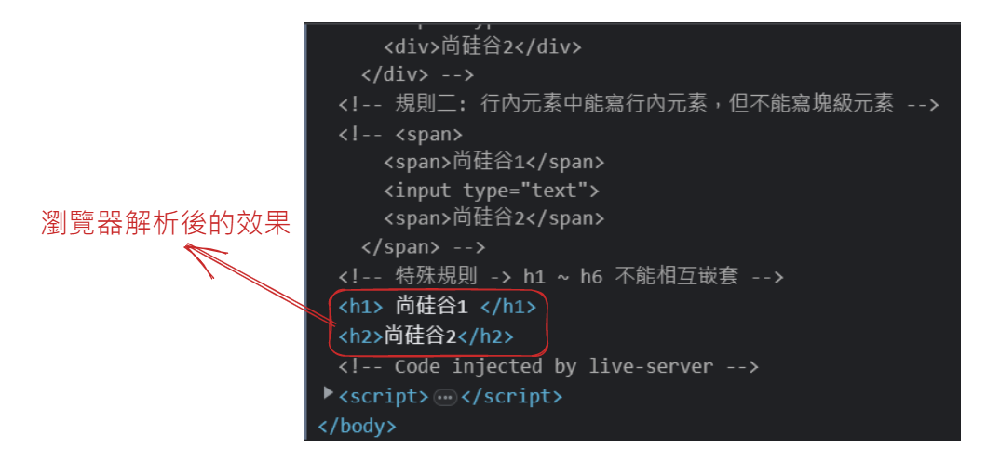

# HTML 塊級元素與行內元素

所屬章節：[第七章｜HTML 塊級元素與行內元素](./README.md)

## 本節導讀

這篇在整理 HTML 中最常見的兩種元素型態：塊級元素與行內元素。  
重點不只是背出有哪些標籤，而是先理解它們在版面排列、寬高表現與巢狀規則上的差異。  
如果你常在寫標籤時搞不清哪些元素能換行、能不能包別的元素、為什麼瀏覽器會自動改寫結構，這篇就是主要回查入口。

## 關鍵字

- 主題：HTML 塊級元素、HTML 行內元素
- 別名：區塊元素、內聯元素
- 英文：block-level element、inline element
- 常見搜尋：塊級元素和行內元素差別、哪些標籤是塊級元素、`p` 能不能包 `div`、`a` 能不能包 `a`
- 易混淆：塊級元素 vs 行內元素、`p` vs `div`、`a` 可包區塊元素 vs `a` 不可包 `a`

## 建議回查情境

- 當你想快速分清塊級元素與行內元素的版面行為時
- 當你忘記元素之間能不能互相嵌套時
- 當你看到瀏覽器自動修正標籤結構，想知道為什麼時

## 30 秒複習入口

- 塊級元素通常獨佔一行，行內元素通常不會獨佔一行。
- 塊級元素通常比較能容納其他元素；行內元素一般只能再放行內元素。
- 特殊規則最常考的是：`h1` 到 `h6` 不能互相嵌套、`p` 不能放塊元素、`a` 不能包另一個 `a`。

## 速查區

### 核心定義

- 塊級元素：通常會獨佔一行，可控制寬高，常作為區塊容器使用。
- 行內元素：通常不獨佔一行，寬度多由內容決定，通常與其他行內元素排列在同一行。

### 關鍵規則 / 判準

- 塊級元素幾乎什麼都能寫，通常可包含行內元素與其他塊級元素。
- 行內元素能寫行內元素，但一般不能寫塊級元素。
- `h1` 到 `h6` 不能相互嵌套。
- `p` 標籤中不能寫塊元素。
- `a` 標籤能包很多內容，但不能包含另一個 `a` 標籤。

### 常見錯誤

- 把行內元素當成塊級元素使用，誤以為一定能直接設定寬高。
- 在 `p` 裡放 `div` 等塊元素，導致瀏覽器自動調整結構。
- 看到 `a` 能包區塊元素後，就誤以為它也能巢狀包另一個 `a`。

### 一句話對比

- 塊級元素偏向「一塊一塊往下排」；行內元素偏向「在同一行內依內容排列」。

## 正文

### 0. 塊級元素、行內元素簡介

> **塊級元素，顧名思義，該元素呈現塊狀，所以它有自己的寬度和高度，也就是可自定義 `width` 和 `height`。除此之外，塊級元素比較霸道，它獨自占據一行高度（`float` 浮動除外），一般可以作為其他容器使用，可容納塊級元素和行內元素。塊級元素有以下特點：**

- 每個塊級元素都是獨自占一行。
- 高度、行高、外邊距（`margin`）以及內邊距（`padding`）都可以控制。
- 元素的寬度如果不設定，預設為父元素的寬度（父元素寬度 `100%`）。
- 多個塊狀元素標籤寫在一起，預設排列方式為從上至下。
- 區塊元素常見包括 `div`、`p`、`h1` ~ `h6`、`ul`、`ol`、`li`、`dl`、`dt`、`dd`、`form`、`table`、`hr`、`blockquote`、`address`、`menu`、`pre` 等。

> **行內元素不可以設定寬（`width`）和高（`height`），但可以與其他行內元素位於同一行。行內元素內一般不可以包含塊級元素。行內元素的高度一般由元素內部的字體大小決定，寬度由內容的長度控制。行內元素有以下特點：**

- 不會獨占一行，相鄰的行內元素會排列在同一行裡，直到一行排不下才會自動換行，其寬度隨元素內容而變化。
- 高寬無效，對外邊距（`margin`）和內邊距（`padding`）僅設定左右方向有效，上下無效。
- 設定行高有效，等同於給父級元素設定行高。
- 元素的寬度就是它包含的文字或圖片的寬度，不可改變。
- 行內元素中不能放塊級元素，`a` 連結裡面不能再放連結。
- 行內元素常見包括 `span`、`em`、`i`、`b`、`strong`、`a`、`img`、`input`、`br`、`select`、`textarea`、`q`、`bdo`、`sub`、`sup` 等。

### 1. 塊級元素特點 → 獨佔一行

```html
<body>
  <!-- 塊級元素特點：獨佔一行 -->
  <marquee>尚硅谷</marquee>
  <h1>尚硅谷</h1>
  <p>尚硅谷</p>
  <div>尚硅谷</div>
</body>
```

### 2. 行內元素特點 → 不獨佔一行

```html
<!-- 行內元素特點：不獨佔一行 -->
<input type="text">
<span>尚硅谷</span>
```

### 3. 規則一 → 塊級元素中能寫行內元素、塊級元素（幾乎什麼都能寫）

```html
<!-- 規則一：塊級元素中能寫行內元素、塊級元素（幾乎什麼都能寫） -->
<div>
  <span>尚硅谷1</span>
  <input type="text">
  <div>尚硅谷2</div>
</div>
```

### 4. 規則二 → 行內元素中能寫行內元素，但不能寫塊級元素

```html
<!-- 規則二：行內元素中能寫行內元素，但不能寫塊級元素 -->
<span>
  <span>尚硅谷1</span>
  <input type="text">
  <span>尚硅谷2</span>
</span>
```

### 5. 特殊規則 → `h1` ~ `h6` 不能相互嵌套

```html
<!-- 特殊規則：h1 ~ h6 不能相互嵌套 -->
<h1>
  尚硅谷1
  <h2>尚硅谷2</h2>
</h1>
```

- 瀏覽器解析後的效果

  

### 6. 特殊規則 → `p` 標籤中不能寫塊元素

```html
<!-- 特殊規則：p 標籤中不能寫塊元素 -->
<p>
  <div>尚硅谷</div>
</p>
```

- 瀏覽器解析後的效果

  

### 7. 特殊規則 → `a` 標籤無所不能，但 `a` 標籤不能包含它本身

```html
<!-- <a href="https://example.com">這是一個超連結</a> -->
<!-- <a href="https://example.com"><em>這是強調的文字</em></a> -->
<a href="https://example.com">
  <div>這是一個包含在 a 標籤中的區塊元素</div>
</a>
```

- `<a>` 標籤內部不能包含另一個 `<a>` 標籤。這樣的巢狀結構在 HTML 規範中是不被允許的，可能會導致不正確的顯示和行為。

```html
<a href="https://example.com">
  <a>這是一個超連結</a>
</a>
```

## 自測問題

1. 塊級元素與行內元素在「是否獨佔一行」上最大的差別是什麼？
2. 為什麼在 `p` 標籤中放 `div` 會出現瀏覽器重新解析結構的情況？
3. 為什麼 `a` 標籤雖然能包很多內容，卻仍然不能再包另一個 `a`？

## 參考資料

- [行内元素有哪些，块级元素有哪些，空(void)元素有哪些](https://docs.pingcode.com/ask/32810.html)
- [區塊元素 行內元素 空元素特點？分別有哪些？](https://medium.com/@small2883/%E5%8D%80%E5%A1%8A%E5%85%83%E7%B4%A0-%E8%A1%8C%E5%85%A7%E5%85%83%E7%B4%A0-%E7%A9%BA%E5%85%83%E7%B4%A0%E7%89%B9%E9%BB%9E%E5%88%86%E5%88%A5%E6%9C%89%E5%93%AA%E4%BA%9B-19f8c05f16f6)

## 延伸閱讀

- 前置知識：[HTML 基本結構標籤](../第四章_HTML基本結構標籤/第04章_HTML基本結構標籤.md)
- 相關主題：[第五章｜全局屬性](../第五章_全局屬性/README.md)
- 返回章節入口：[第七章｜HTML 塊級元素與行內元素](./README.md)
