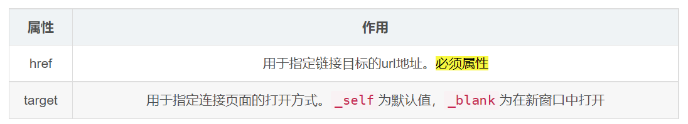

# 超鏈接標籤

> 所屬章節：第二十一章｜超鏈接標籤  
> 關鍵字：超鏈接標籤、`a`、anchor、`href`、`target`、外部鏈結、內部鏈結、下載連結、錨點連結、`download`、`mailto`、`tel`、`javascript:`  
> 建議回查情境：想知道 `<a>` 怎麼寫、想分清不同連結類型、想知道 `href="#"` / `href=""` 差在哪、想做錨點跳轉、下載連結或喚起應用

## 本節導讀

這篇整理 HTML 的超鏈接標籤 `<a>`。  
重點不只是「點了會跳頁」，而是理解它到底能連到哪些目標、不同 `href` 寫法代表什麼、`target` 怎麼影響開啟方式，以及哪些寫法只是教材常見示例、實務上要更保守使用。

原始內容有幾個明顯問題：章次寫成第 22 章、把 `href` 說成絕對必填、`#` / 空連結 / `javascript:` 的定位不夠穩，部分敘述也偏講稿式。  
這裡改成較穩定的學習順序：先理解 `<a>` 基本用途與屬性，再看各種連結型態、錨點、下載與常見混淆點。

## 你會在這篇學到什麼

- `<a>` 是什麼、基本語法怎麼寫
- `href`、`target` 各自在做什麼
- 外部連結、內部連結、檔案連結、錨點連結怎麼分
- `href="#"`、`href=""`、`javascript:` 分別代表什麼
- 如何用 `<a>` 喚起電話、郵件或其他應用

## 30 秒複習入口

- `<a>` 用來建立超鏈接，讓使用者從目前位置跳到另一個資源或位置。
- `href` 指向目標位置；`target` 影響開啟方式。
- `#錨點名稱` 會跳到頁面中對應 `id` 的位置。
- `download` 可用來提示瀏覽器下載資源，而不是直接開啟。
- `javascript:` 能執行程式碼，但通常不是現代前端最建議的互動做法。

## 速查區

### 核心概念

- `<a>` 的核心任務是建立可點擊的連結。
- 這個連結不只可以指向另一個網頁，也可以指向檔案、同頁位置、電話、郵件或其他應用。

### 關鍵規則 / 判準

- `href` 指定連結目標；沒有 `href` 的 `<a>` 不算真正可導航的超鏈接。
- `target="_self"` 是預設在目前頁籤開啟；`target="_blank"` 會在新頁籤或新視窗開啟。
- `href="#id"` 會跳到當前頁面中對應的錨點。
- `href=""` 常會導向目前文件本身，效果常接近重新載入當前頁。
- `download` 用來提示瀏覽器下載檔案。

### 常見使用場景

- 導向外部網站
- 導向站內其他頁面
- 連到圖片、影片、PDF、ZIP 等檔案
- 在長頁面中做目錄與錨點跳轉
- 點擊後喚起電話或郵件應用

### 常見混淆點

- `<a>` 不等於只能連到網頁。
- `href="#"` 和 `href=""` 不一樣。
- `javascript:` 雖然能用，但不應當成一般互動按鈕的預設方案。
- `<a>` 可以包住很多內容，但不代表所有巢狀互動元素都適合混在一起。

### 一句話抓核心

- 超鏈接標籤的重點不只是「跳頁」，而是讓使用者能從當前內容跳到另一個資源、位置或應用。

## 正文筆記

### 這篇在解決什麼問題？

- 在 HTML 裡，如果你想讓使用者點擊某個內容後跳到另一個地方，最常用的就是 `<a>`。
- 但只會寫 `<a href="...">` 還不夠；你還需要分清不同目標類型、開啟方式，以及某些特殊寫法的實際效果。

## 1. `<a>` 標籤在做什麼？

- `<a>` 是 anchor 的縮寫，常翻成錨點或超鏈接標籤。
- 它的核心用途是建立一個可點擊的連結，讓使用者跳到另一個目標。

```html
<a href="目標地址">文字內容</a>

<!-- 例子 -->
<a href="https://www.baidu.com/">百度</a>
```

### 它可以包住什麼內容？

- 現代 HTML 裡，`<a>` 可以包住文字、圖片，甚至某些區塊內容。
- 但更穩定的理解是：你可以把一整塊內容做成連結區域，但不要把它和其他互動元素亂混，避免可用性問題。

```html
<a href="https://example.com">
  <div>這是一個包含在 a 標籤中的區塊元素</div>
</a>
```

## 2. 常見屬性怎麼理解？



### `href`

- `href` 用來指定連結目標的位置。
- 它通常是超鏈接真正發生導航的關鍵。
- 若沒有 `href`，`<a>` 可以存在，但不再是一般意義上的可導航超鏈接。

### `target`

- `target` 用來指定連結開啟方式。

#### `_self`

- 預設值。
- 在目前頁籤或目前瀏覽上下文中開啟。

#### `_blank`

- 通常會在新頁籤或新視窗中開啟。
- 初學時先這樣理解即可。

## 3. 常見連結類型怎麼分？

### 外部連結

- 連到其他網站或不同網域的頁面。

```html
<a href="http://www.qq.com" target="_self">騰訊</a>
<a href="http://www.itcast.cn" target="_blank">傳智播客</a>
```

### 內部連結

- 連到自己網站中的其他頁面。
- 實務上通常會搭配相對路徑使用。

```html
<a href="./test.html" target="_blank">公司簡介</a>
```

### 檔案連結

- `<a>` 也可以直接連到圖片、影片、音頻、PDF 或壓縮檔。
- 至於是直接開啟還是下載，還要看瀏覽器支援與資源類型。

```html
<!-- 瀏覽器常能直接開啟的檔案 -->
<a href="./images/image_1776144979279_9e2f3efe.jpg">看圖片</a>
<a href="./media/movie.mp4">看影片</a>
<a href="./media/music.mp3">聽音樂</a>
<a href="./media/test.pdf">看 PDF 檔</a>

<!-- 瀏覽器常傾向下載的檔案 -->
<a href="./test.zip">內部資源</a>

<!-- 提示瀏覽器下載 -->
<a href="./media/test.pdf" download="一份PDF檔.pdf">下載 PDF 檔案</a>
```

### 注意點

- 若瀏覽器能直接處理資源，可能會直接開啟。
- 若瀏覽器無法直接處理，通常會轉成下載流程。
- `download` 屬性可用來提示下載。

## 4. `href="#"`、`href=""`、錨點連結差在哪？

### `href="#某個id"`

- 這是標準錨點連結。
- 會跳到頁面中 `id="某個id"` 的位置。

```html
<a href="#two">第二季</a>
<h3 id="two">第二季介紹</h3>
```

### `href="#"`

- 常見效果是跳到當前頁面頂部或文件開頭附近。
- 它不是「空連結」的唯一寫法，而是指向當前頁面最上方的片段位置。

```html
<div style="height: 2000px;">空盒子</div>
<a href="#">回到頂部</a>
```

### `href=""`

- 這通常會把目標解讀成當前文件本身。
- 在很多情況下，效果會接近重新載入目前頁面。

```html
<a href="">刷新本頁面</a>
```

## 5. 錨點連結怎麼做？

- 作用是讓使用者快速定位到頁面中的某個位置。
- 做法很簡單：在連結中寫 `#名字`，再在目標元素上放對應的 `id`。

```html
<!-- 跳轉到本頁的錨點 -->
<a href="#two">第二季</a>
<h3 id="two">第二季介紹</h3>

<!-- 跳轉到其他頁面的錨點 -->
<a href="./測試頁面.html#test1">跳轉到測試頁面的 test1 錨點</a>
```

## 6. 特殊用途的超鏈接

### 執行 JavaScript

- 你可以把 `href` 寫成 `javascript:...` 來執行程式碼。
- 但更穩定的理解是：這是歷史上常見的寫法，現代實務上通常不把它當成首選互動方案。

```html
<a href="javascript:alert('Hello, World!');">點擊我</a>
```

### 喚起指定應用

- `<a>` 也可以喚起裝置上的電話、郵件或其他應用。

```html
<a href="tel:10010">電話聯繫</a>
<a href="mailto:10010@qq.com">郵件聯繫</a>
<a href="line://msg/text/Hello%20World">使用 LINE 發送消息</a>
```

## 7. 網頁元素也可以做成連結

- 可點擊的不一定只能是文字。
- 圖片、區塊內容等，也都可以包在 `<a>` 裡，變成整塊可點擊的連結區域。

```html
<a href="http://www.baidu.com">
  
</a>
```

## 常見問法

### `href` 一定要寫嗎？

- 如果你要的是「真正能導航的超鏈接」，通常要寫。
- 沒有 `href` 的 `<a>` 可以存在，但不應直接把它當成一般連結來理解。

### `href="#"` 和 `href=""` 差在哪？

- `href="#"` 偏向跳到當前頁面的頂部或文件開頭位置。
- `href=""` 則通常會把目標解讀成目前文件本身，效果常接近重新載入頁面。

### `download` 一定會強制下載嗎？

- 它是提示下載的重要手段，但實際行為仍可能受瀏覽器與資源來源影響。
- 初學時先把它理解成「比單純連到檔案更接近下載意圖」即可。

### `javascript:` 為什麼不建議當成一般互動方案？

- 因為它把行為直接寫進 `href`，可讀性與維護性通常比較差。
- 現代實務上，若需求本質是按鈕互動，通常更傾向用按鈕與事件處理。

## 自測問題

1. `<a>` 的核心用途是什麼？
2. `href` 和 `target` 各自在處理什麼？
3. 外部連結、內部連結、檔案連結、錨點連結各自差在哪？
4. `href="#"` 和 `href=""` 的效果有什麼不同？
5. 為什麼 `javascript:` 不適合當成一般互動寫法的預設方案？

## 延伸閱讀

- [第二十一章｜超鏈接標籤](./README.md)
- [第六章｜路徑](../第六章_路徑/README.md)
- [返回首頁](../README.md)
