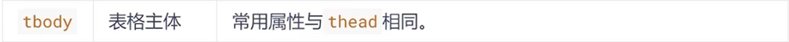
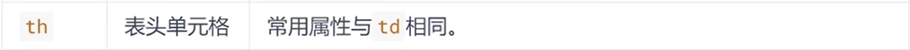

# 表格標籤

> 所屬章節：第二十三章｜表格標籤  
> 關鍵字：表格、table、`table`、`tr`、`th`、`td`、`caption`、`thead`、`tbody`、`tfoot`、表頭、表格主體、表格腳注、合併單元格、`rowspan`、`colspan`  
> 建議回查情境：想知道表格的基本結構怎麼寫、想分清 `th` 和 `td`、想理解 `caption` / `thead` / `tbody` / `tfoot` 的作用、想做跨列或跨行合併

## 本節導讀

這篇整理 HTML 的表格標籤。  
核心不是把內容排成一格一格而已，而是理解表格適合拿來表達什麼資料、表格有哪些結構區塊，以及合併單元格時應該怎麼思考。

原始內容主體方向是對的，但有幾個需要先修正的地方：章次誤寫成第 24 章、`tbody` 被誤寫成 `tbod`，以及部分屬性說明與寬高描述不夠精確。  
這裡改成較穩定的學習順序：先理解表格的用途與基本結構，再看進階區塊、舊式屬性與合併單元格。

## 你會在這篇學到什麼

- 表格在 HTML 中的真正用途
- `table`、`tr`、`th`、`td` 各自在做什麼
- `caption`、`thead`、`tbody`、`tfoot` 的作用
- 舊式表格屬性怎麼理解，為什麼現代實務多半交給 CSS
- `rowspan` 和 `colspan` 怎麼做合併單元格

## 30 秒複習入口

- 表格主要用來展示結構化資料，不是拿來做整頁布局。
- `table` 是整張表，`tr` 是列，`th` 是表頭儲存格，`td` 是資料儲存格。
- `caption` 是表格標題，`thead` / `tbody` / `tfoot` 分別是表頭、主體、腳注區塊。
- `rowspan` 用來跨列合併，`colspan` 用來跨欄合併。
- `border`、`align`、`cellpadding` 等舊式 HTML 屬性可以認識，但現代實務通常優先用 CSS 控制樣式。

## 速查區

### 核心概念

- 表格適合表達有欄位與列關係的資料，例如成績表、報表、清單、統計結果。
- 如果內容本質是資料對照與欄列關係，表格就很合適。
- 如果只是想排版，通常不應把表格當作布局工具。

### 關鍵規則 / 判準

- `table` 是表格最外層容器。
- `tr` 代表一列資料。
- `th` 代表表頭儲存格，通常用來放欄位名稱。
- `td` 代表一般資料儲存格。
- `caption`、`thead`、`tbody`、`tfoot` 是幫助表格結構更清楚的區塊。
- `rowspan` 控制向下跨列，`colspan` 控制向右跨欄。

### 常見使用場景

- 成績表
- 排名與報表資料
- 後台列表
- 規格比較表
- 需要欄位標題與資料對照的內容

### 常見混淆點

- 表格不是通用布局工具。
- `th` 和 `td` 的差別不只在粗體外觀，還在語意角色。
- `tbody` 是表格主體區塊，不是 `tbod`。
- `width` 影響較常對應欄的寬度，`height` 影響較常對應列的高度，不能混著理解。

### 一句話抓核心

- 表格標籤的重點是把有欄列關係的資料表達清楚，而不是把頁面硬排成格子。

## 正文筆記

### 這篇在解決什麼問題？

- 當你要在頁面上呈現一組有欄位、有列、可互相比對的資料時，只用段落或列表通常不夠清楚。
- HTML 的表格標籤就是為了這種資料展示需求而存在。

## 1. 表格的基本語法

> 表格不是用來布局的，而是用來展示數據的。

- 表格主要用來顯示具有欄列關係的資料。
- 它的優勢是能把資料整理得更規整，讓讀者更容易做橫向與縱向比較。
- 在後台資料呈現、成績表、報表或比較表中，表格很常見。

- `<table>`：定義整張表格。
- `<tr>`：定義表格中的一列。
- `<th>`：定義表頭儲存格。
- `<td>`：定義一般資料儲存格。

```html
<table>
  <tr>
    <th>姓名</th>
    <th>性別</th>
    <th>年齡</th>
  </tr>
  <tr>
    <td>劉德華</td>
    <td>男</td>
    <td>56</td>
  </tr>
  <tr>
    <td>張學友</td>
    <td>男</td>
    <td>58</td>
  </tr>
  <tr>
    <td>郭富城</td>
    <td>男</td>
    <td>51</td>
  </tr>
  <tr>
    <td>黎明</td>
    <td>男</td>
    <td>57</td>
  </tr>
</table>
```

### 怎麼理解這段結構？

- 第一個 `tr` 放的是表頭，因此裡面用 `th`。
- 後面的 `tr` 放的是資料列，因此裡面用 `td`。
- `th` 預設常會有粗體與置中效果，但更重要的是它代表表頭語意。

## 2. `caption`、`thead`、`tbody`、`tfoot` 是什麼？

> 一個較完整的表格，常會分成表格標題、表頭、主體與腳注幾個部分。

- `caption`：表格標題。
- `thead`：表格頭部。
- `tbody`：表格主體。
- `tfoot`：表格腳注或彙總區。
- `tr`：每一列。
- `th`、`td`：每個儲存格。


```html
<table border="1">
  <caption>段考成績</caption>
  <thead>
    <tr>
      <th>科目</th>
      <th>分數</th>
    </tr>
  </thead>
  <tbody>
    <tr>
      <td>語文</td>
      <td>99</td>
    </tr>
    <tr>
      <td>數學</td>
      <td>60</td>
    </tr>
  </tbody>
  <tfoot>
    <tr>
      <td>總分</td>
      <td>159</td>
    </tr>
  </tfoot>
</table>
```

### 為什麼要分這些區塊？

- 讓表格結構更清楚。
- 方便閱讀與維護。
- 之後若要做樣式控制、列印或程式處理，也更容易分區理解。

## 3. 常用屬性怎麼理解？

- 教材中常會先介紹一些舊式 HTML 表格屬性。
- 這些屬性有助於理解表格曾經怎麼控制外觀，但現代實務通常會改用 CSS 處理樣式。

### `table` 常見舊式屬性

```html
<!--
1. align: 表格相對周圍元素的對齊方式，如 left、center、right
2. border: 設定表格邊框
3. cellpadding: 儲存格邊框與內容之間的內距
4. cellspacing: 儲存格與儲存格之間的間距
5. width: 表格寬度
-->

<table align="center" border="1" cellpadding="20" cellspacing="0" width="500">
  <!-- 中間省略 -->
</table>
```

### 其他元素的常見屬性

- `thead`、`tbody`、`tfoot`、`tr`、`td`、`th` 也曾有一些舊式屬性可直接寫在 HTML 上。
- 這些屬性在教材中可以先認識，但實際開發通常以 CSS 為主。







### 注意點

- `border` 可以控制表格外框與邊框顯示方式，但更細的視覺控制通常交給 CSS。
- 對某個儲存格設定寬度時，常會影響該欄的寬度分配。
- 對某個儲存格設定高度時，常會影響該列的高度分配。

## 4. 合併單元格

> 特殊情況下，可以把多個相鄰的單元格合併為一個單元格。


- 跨列合併：`colspan="合併的欄數"`。
- 跨列合併會向右延伸。
- 跨行合併：`rowspan="合併的列數"`。
- 跨行合併會向下延伸。

### 合併單元格三步驟

1. 先判斷是要跨列還是跨行。
2. 在目標儲存格上寫 `colspan` 或 `rowspan`。
3. 刪除被合併掉、已不需要保留的多餘儲存格。

```html
<table width="500" height="249" border="1" cellspacing="0">
  <tr>
    <td></td>
    <td colspan="2"></td>
  </tr>

  <tr>
    <td rowspan="2"></td>
    <td></td>
    <td></td>
  </tr>

  <tr>
    <td></td>
    <td></td>
  </tr>
</table>
```

## 5. 這一章最需要記住什麼？

- 表格是為了展示資料，不是為了做整頁布局。
- `th` 是表頭儲存格，`td` 是一般資料儲存格。
- `caption`、`thead`、`tbody`、`tfoot` 能讓表格結構更清楚。
- 舊式 HTML 屬性可以認識，但樣式控制實務上多半交給 CSS。
- `rowspan` 與 `colspan` 的差別，在於一個是跨列、一個是跨欄。

## 常見問法

### `th` 和 `td` 差在哪？

- `th` 代表表頭儲存格。
- `td` 代表一般資料儲存格。
- 差別不只在預設外觀，更在於它們的語意角色。

### `caption` 一定要寫嗎？

- 不一定。
- 但如果表格需要清楚標題，`caption` 會是很直接的做法。

### `tbody` 可以省略嗎？

- 在某些情況下瀏覽器會自動補出表格主體區塊。
- 但學習與整理時，明確寫出 `tbody` 會更容易理解結構。

### `rowspan` 和 `colspan` 最容易搞混的是什麼？

- `rowspan` 是向下跨列。
- `colspan` 是向右跨欄。

## 自測問題

1. 為什麼表格不應該當成一般頁面布局工具？
2. `table`、`tr`、`th`、`td` 各自在做什麼？
3. `caption`、`thead`、`tbody`、`tfoot` 分別在表格中扮演什麼角色？
4. `rowspan` 和 `colspan` 各自控制哪種合併？
5. 為什麼教材中的表格 HTML 屬性要認識，但實務上常改由 CSS 控制？

## 延伸閱讀

- [第二十三章｜表格標籤](./README.md)
- [第二十二章｜列表標籤](../第二十二章_列表標籤/README.md)
- [返回首頁](../README.md)
