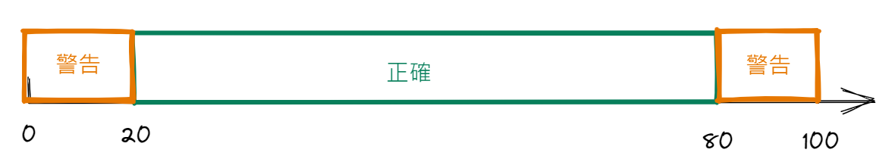

# 度量衡標籤（`<meter>`）

> 所屬章節：第二十八章｜度量衡標籤  
> 關鍵字：度量衡標籤、`meter`、gauge、標量測量、範圍值、電量條、磁碟用量、`progress`  
> 建議回查情境：想知道 `<meter>` 是做什麼的、想分清 `<meter>` 和 `<progress>` 的差別、想確認 `value` / `min` / `max` / `low` / `high` / `optimum` 怎麼搭配時

## 本節導讀

這篇整理 HTML 的 `<meter>` 標籤，也就是常說的度量衡標籤。  
它的用途不是表示「任務做了多少進度」，而是表示某個數值在已知範圍內的位置，例如電量、磁碟使用量、考試分數、溫度區間等。

原始內容方向是對的，但還不足以直接當成穩定筆記：`value` 被寫成必填、屬性之間的關係沒有講清楚、`meter` 和 `progress` 的差別只被簡短提醒，讀者容易只記住零碎屬性名稱。  
這裡採「輕度修復」重構，保留原本用手機電量示範的方向，但先穩住概念，再整理屬性規則與例子。

## 你會在這篇學到什麼

- `<meter>` 在解決什麼問題
- 什麼情況適合用 `<meter>`，什麼情況要改用 `<progress>`
- `value`、`min`、`max`、`low`、`high`、`optimum` 分別在做什麼
- 為什麼同樣是條狀顯示，`meter` 和 `progress` 不能混用

## 30 秒複習入口

- `<meter>` 用來表示已知範圍內的測量值，不是任務進度。
- 常見場景有電量、磁碟用量、分數、溫度。
- `value` 是目前數值，但不是必填；沒寫時會有預設值。
- `min` / `max` 定義整體範圍，`low` / `high` 定義偏低與偏高區間，`optimum` 定義理想值或理想區域。
- 如果你要表示「上傳到 70%」、「下載完成 3/10」，那應該用 `<progress>`。

## 速查區

### 核心概念

- `<meter>` 表示某個數值位於已知範圍中的哪裡。
- 它適合描述狀態或測量值，不適合描述工作完成進度。
- 它常被視為 gauge，也就是儀表或刻度概念。

### 什麼時候用 `<meter>`

- 電量還剩多少
- 磁碟已用空間比例
- 考試分數落在哪個區間
- 某個數值是否接近理想範圍

### 什麼時候不要用 `<meter>`

- 上傳進度
- 下載進度
- 安裝進度
- 任務完成百分比

這類情況應該改用 `<progress>`。

### 重要屬性

- `value`：目前數值。
- `min`：範圍最小值，預設為 `0`。
- `max`：範圍最大值，預設為 `1`。
- `low`：偏低區間的上界。
- `high`：偏高區間的下界。
- `optimum`：理想值或理想區域所在位置。

### 常見錯誤

- 以為 `value` 一定要寫。
- 把 `<meter>` 當成進度條使用。
- 只記屬性名字，卻沒理解 `low` / `high` / `optimum` 是在描述區間判準。
- 沒先想清楚最小值和最大值，導致數值範圍不合理。

### 一句話抓核心

- `<meter>` 是拿來顯示「某個測量值落在已知範圍中的哪裡」，不是拿來顯示「任務做完了多少」。

## 正文筆記

### 1. `<meter>` 在解決什麼問題？

有些數值不是單純想顯示一個數字，而是想讓使用者一眼看出它在整體範圍中的位置。  
例如手機電量剩多少、磁碟空間用了多少、分數目前高不高，這些都屬於「已知範圍內的測量值」。

`<meter>` 就是為這類情況設計的。  
它不是表示流程進度，而是表示數值狀態。

### 2. `<meter>` 和 `<progress>` 差在哪？

這兩個標籤外觀都可能像條狀圖，所以很容易混淆，但語意不同：

- `<meter>`：表示測量值或狀態值，範圍已知。
- `<progress>`：表示任務完成進度。

可以這樣記：

- 「電量剩 70%」適合用 `<meter>`
- 「檔案上傳到 70%」適合用 `<progress>`

差別不在畫面長得像不像，而在你表達的是「狀態」還是「進度」。

### 3. 重要屬性怎麼理解？

#### `value`

- 表示目前的數值。
- 它不是必填；若未指定或格式錯誤，會有預設值。
- 實務上通常還是會寫，因為沒有目前值就很難表達測量結果。

#### `min`

- 表示範圍最小值。
- 若未指定，預設為 `0`。

#### `max`

- 表示範圍最大值。
- 若未指定，預設為 `1`。

#### `low`

- 表示偏低區間的上界。
- 用來告訴瀏覽器：低於哪個位置，可視為較低或較不理想。

#### `high`

- 表示偏高區間的下界。
- 用來告訴瀏覽器：高於哪個位置，可視為較高。

#### `optimum`

- 表示理想值，或理想區域所在位置。
- 它會配合 `low` 和 `high`，讓瀏覽器理解哪一段範圍比較理想。

### 4. 屬性之間的關係怎麼看？

先有整體範圍，再談區間判準：

1. `min` 和 `max` 先定義總範圍
2. `value` 表示目前數值落在哪
3. `low` 和 `high` 補充「偏低」與「偏高」的界線
4. `optimum` 補充「最理想」大致在哪一段

因此真正的閱讀順序是：

- 先看範圍有多大
- 再看目前值在哪
- 最後看哪些區間被視為低、高、最佳

### 5. 範例怎麼理解？

#### 範例 1：基本電量顯示



```html
<span>手機電量：</span>
<meter value="50" min="0" max="100" low="20" high="80"></meter><br>
```

這段的意思是：

- 電量範圍從 `0` 到 `100`
- 目前值是 `50`
- `20` 以下可視為偏低
- `80` 以上可視為偏高

它在表達的是「目前電量落在整體區間中的哪裡」。

#### 範例 2：加入理想值


```html
<span>手機電量：</span>
<meter value="70" min="0" max="100" low="20" high="80" optimum="90"></meter><br>
```

這段和上一個例子相比，多了 `optimum="90"`。  
它的意思是：目前值是 `70`，而系統認為更理想的狀態接近 `90`。

也就是說，`optimum` 不是目前值，而是「理想值參考點」。

### 6. 使用 `<meter>` 時該先想什麼？

在寫 `<meter>` 之前，先回答這三個問題：

1. 這是狀態值，還是任務進度？
2. 我的最小值和最大值是什麼？
3. 需不需要定義偏低、偏高或理想值？

如果第一題回答是「任務進度」，那通常就不該用 `<meter>`。

## 常見問法

### `value` 一定要寫嗎？

不一定。  
依 MDN，若沒有指定 `value`，會有預設值；但實務上通常還是會明確寫出目前值，讓語意更完整。

### `meter` 和 `progress` 為什麼不能混用？

因為它們表達的不是同一件事。  
`meter` 表達的是測量值在範圍中的位置；`progress` 表達的是任務完成了多少。

### `optimum` 是不是等於目前值？

不是。  
`optimum` 是理想值，`value` 才是目前值。

### 只寫 `value` 可以嗎？

可以，但前提是你接受預設範圍。  
若沒有寫 `min` 和 `max`，預設範圍會是 `0` 到 `1`，所以大多數百分比情境通常還是會一起把 `max` 寫清楚。

## 自測問題

1. `<meter>` 最適合表達哪一類資訊？
2. `meter` 和 `progress` 的最大差別是什麼？
3. `value`、`min`、`max`、`low`、`high`、`optimum` 各自在做什麼？
4. 為什麼在顯示手機電量時，`<meter>` 比 `<progress>` 更合適？

## 延伸閱讀

- [第二十八章｜度量衡標籤](./README.md)
- [第二十四章｜表單標籤](../第二十四章_表單標籤/README.md)
- [返回首頁](../README.md)
