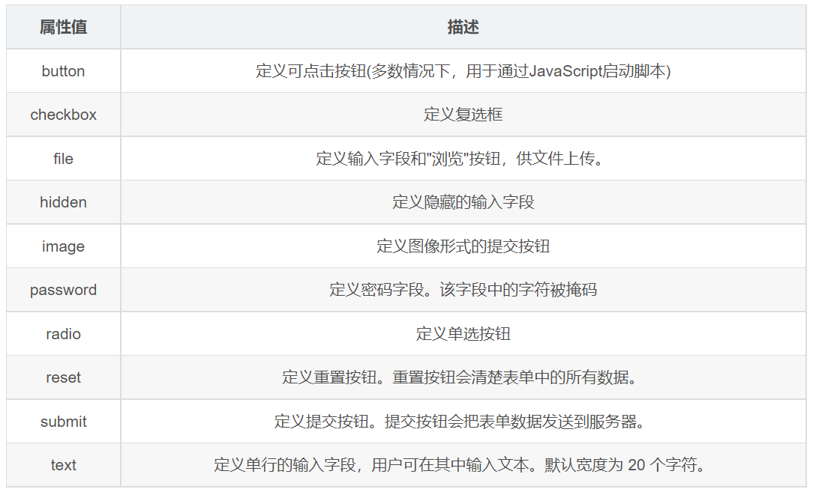

# 表單控件

> 所屬章節：第二十四章｜表單標籤  
> 關鍵字：表單控件、input、`input`、`type`、文字框、密碼框、單選框、複選框、隱藏域、提交按鈕、重置按鈕、普通按鈕、HTML5 input types  
> 建議回查情境：想知道 `<input>` 能做哪些輸入控件、想分清文字框 / 密碼框 / 單選框 / 複選框 / 按鈕的差別、想先理解 `name` / `value` / `checked` / `maxlength`

## 本節導讀

這篇整理表單控件，重點放在 `<input>`。  
核心不是死背所有 `type` 值，而是理解 `<input>` 會因為 `type` 不同而呈現不同用途，並分清常見屬性的實際作用。

原始內容主題方向正確，但有幾個需要先修正的地方：把單選框與複選框的 `name` 規則混成同一件事、把重置按鈕講成清空所有資料、以及整體順序偏講稿式。  
這裡改成較穩定的學習順序：先理解 `<input>` 是什麼，再分常見控件、按鈕與新增輸入類型來看。

## 你會在這篇學到什麼

- `<input>` 為什麼能表示很多不同控件
- `type` 在決定什麼
- `name`、`value`、`checked`、`maxlength` 常見屬性各自在做什麼
- 文字框、密碼框、單選框、複選框、隱藏域、按鈕怎麼分
- HTML5 新增輸入類型的基本用途

## 30 秒複習入口

- `<input>` 是常見的表單控件標籤，會因為 `type` 不同而變成不同輸入形式。
- `text`、`password`、`radio`、`checkbox`、`hidden`、`submit`、`reset`、`button` 都是常見 `type`。
- 單選框想形成同一組互斥選項時，`name` 要一致。
- 複選框是否共用同一個 `name`，取決於你想怎麼把它們當成同一組資料處理。
- 重置按鈕的重點是恢復表單初始狀態，不是單純清空一切。

## 速查區

### 核心概念

- `<input>` 是很常見的表單控件標籤。
- 它不是只有一種外觀，而是靠 `type` 這個屬性決定具體用途。
- 同一個標籤，可以變成文字輸入、密碼輸入、單選、複選、按鈕或檔案上傳。

### 關鍵規則 / 判準

- `type` 決定控件類型。
- `name` 通常和提交資料的欄位名稱有關。
- `value` 常代表預設值或提交值，依控件類型不同而意義略有差異。
- `checked` 主要用於單選框與複選框的預設選中。
- `maxlength` 常用於限制文字輸入長度。

### 常見使用場景

- 帳號密碼輸入
- 性別或單選題
- 興趣或多選題
- 提交、重置與一般互動按鈕
- 檔案上傳
- 手機、日期、信箱等格式化輸入

### 常見混淆點

- `name` 不是所有單選框和複選框都必須完全同一種寫法，而是要看是否屬於同一組資料。
- 單選框的互斥效果，關鍵在同組 `radio` 是否共用相同 `name`。
- 重置按鈕不是把表單硬清空，而是恢復成頁面初始載入時的狀態。
- `<button>` 如果沒寫 `type`，在表單裡預設通常會是 `submit`。

### 一句話抓核心

- `<input>` 的關鍵不是背標籤本身，而是理解 `type` 如何把它變成不同表單控件。

## 正文筆記

## 1. `<input>` 在做什麼？

> `type` 屬性透過不同屬性值，指定不同的控件類型。

- 在 `<input>` 標籤中，`type` 是最核心的屬性之一。
- 根據不同的 `type` 值，輸入欄位會呈現很多不同形式，例如文字框、密碼框、複選框、單選按鈕等。
- `input` 在英文裡有輸入的意思；在表單中，`<input>` 常用來收集使用者資訊。
- `<input>` 是單標籤。



### 常見其他屬性


- `name`：資料欄位名稱，通常和提交資料時的欄位名有關。
- `value`：可能是預設值，也可能是提交值，要看控件類型。
- `checked`：讓單選框或複選框預設被選中。
- `maxlength`：限制使用者可輸入的最大字元數。

## 2. 常見控件類型

```html
<form action="xxx.php" method="get">
  <!-- text: 單行文字輸入 -->
  使用者名稱:
  <input
    type="text"
    name="username"
    value="請輸入使用者名稱"
    placeholder="文字框占位符"
    maxlength="6"
  />
  <br />

  <!-- password: 密碼輸入 -->
  密碼:
  <input type="password" name="pwd" placeholder="文字框占位符" />
  <br />

  <!-- radio: 單選框，同組要共用相同 name -->
  性別:
  男 <input type="radio" name="sex" value="男" />
  女 <input type="radio" name="sex" value="女" checked="checked" />
  其他 <input type="radio" name="sex" value="其他" />
  <br />

  <!-- checkbox: 複選框，可多選 -->
  愛好:
  吃飯 <input type="checkbox" name="hobby" value="吃飯" />
  睡覺 <input type="checkbox" name="hobby" value="睡覺" />
  打豆豆 <input type="checkbox" name="hobby" value="打豆豆" checked="checked" />
  <br />

  <!-- submit: 提交按鈕 -->
  <input type="submit" value="免費註冊" />
  <br />

  <!-- reset: 重置按鈕 -->
  <input type="reset" value="重新填寫" />
  <br />

  <!-- button: 一般按鈕 -->
  <input type="button" value="獲取簡訊驗證碼" />
  <br />

  <!-- file: 檔案上傳 -->
  上傳頭像: <input type="file" /><br />
  上傳多張生活照: <input type="file" multiple />
</form>
```

## 3. 文字框 `text`

```html
<input type="text" />
```

### 常用屬性

- `name`：資料名稱。
- `value`：輸入框預設值。
- `maxlength`：最大輸入長度。

## 4. 密碼框 `password`

```html
<input type="password" />
```

### 常用屬性

- `name`：資料名稱。
- `value`：可設定預設值，但實務上通常不會這樣做。
- `maxlength`：最大輸入長度。

## 5. 單選框 `radio`

```html
<input type="radio" name="sex" value="female" /> 女
<input type="radio" name="sex" value="male" /> 男
```

### 常用屬性

- `name`：同一組單選框若要形成互斥選擇，`name` 必須一致。
- `value`：提交的資料值。
- `checked`：讓該單選按鈕預設選中。

### 重點怎麼記？

- 單選框是「多個選項中選一個」。
- 同組 `radio` 用相同 `name`，瀏覽器才知道它們屬於同一組。

## 6. 複選框 `checkbox`

```html
<input type="checkbox" name="hobby" value="smoke" /> 抽菸
<input type="checkbox" name="hobby" value="drink" /> 喝酒
<input type="checkbox" name="hobby" value="perm" /> 燙頭髮
```

### 常用屬性

- `name`：資料名稱；若多個複選框代表同一組選項，常會共用同一個 `name`。
- `value`：提交的資料值。
- `checked`：讓該複選框預設選中。

### 重點怎麼記？

- 複選框是「多個選項可同時選多個」。
- 是否共用同一個 `name`，取決於你是否想把它們視為同一組提交資料。

## 7. 隱藏域 `hidden`

> 使用者不可見的一個輸入區域。常見用途是在提交表單時，一起攜帶固定資料。

```html
<input type="hidden" name="tag" value="100" />
```

### 常用屬性

- `name`：資料名稱。
- `value`：真正提交的資料值。

## 8. 提交、重置與普通按鈕

### 提交按鈕

```html
<input type="submit" value="點我提交表單" />
<button>點我提交表單</button>
```

- `input` 型按鈕用 `value` 指定按鈕文字。
- `button` 標籤若在表單中沒寫 `type`，預設通常是 `submit`。

### 重置按鈕

```html
<input type="reset" value="點我重置" />
<button type="reset">點我重置</button>
```

- 重置按鈕的作用是把表單恢復成初始狀態。
- `input` 型按鈕用 `value` 指定按鈕文字。

### 普通按鈕

> 普通按鈕的 `type` 值是 `button`。如果在表單中省略 `type`，`<button>` 可能會變成提交按鈕。

```html
<input type="button" value="普通按鈕" />
<button type="button">普通按鈕</button>
```

## 9. 新增的 `input` 類型


```html
<!-- 驗證通常會搭配 form 表單域一起觀察 -->
<form action="">
  <ul>
    <li>信箱: <input type="email" /></li>
    <li>網址: <input type="url" /></li>
    <li>日期: <input type="date" /></li>
    <li>時間: <input type="time" /></li>
    <li>數量: <input type="number" /></li>
    <li>手機號碼: <input type="tel" /></li>
    <li>搜尋: <input type="search" /></li>
    <li>顏色: <input type="color" /></li>
    <li><input type="submit" value="提交" /></li>
  </ul>
</form>
```

### 先怎麼理解這些新增類型？

- 它們是 HTML5 增加的輸入形式。
- 重點不是一次背完所有細節，而是先知道不同型別會對應不同輸入情境。
- 某些類型也會帶來較符合情境的驗證或輸入體驗。

## 常見問法

### `name` 是不是每個單選框和複選框都一定要完全一樣？

- 不是這樣背。
- 單選框若要形成同一組互斥選項，`name` 必須一致。
- 複選框是否共用同一個 `name`，要看你是否想把它們當成同一組資料提交。

### `value` 在不同控件裡意思都一樣嗎？

- 不完全一樣。
- 在文字框中，它常表示預設內容；在單選框或複選框中，它常表示被提交的值；在按鈕中，它常表示按鈕文字。

### 重置按鈕是不是把所有欄位直接清空？

- 不一定。
- 更精確的理解是：它會把表單恢復成初始載入時的狀態。

### `<button>` 和 `<input type="submit">` 有什麼要先注意的？

- 在表單裡，`<button>` 沒寫 `type` 時，常會直接變成提交按鈕。
- 這是初學者很容易忽略的地方。

## 自測問題

1. 為什麼同一個 `<input>` 能表示很多不同控件？
2. `type`、`name`、`value`、`checked` 各自在處理什麼？
3. 為什麼同組單選框通常要共用相同 `name`？
4. 複選框和單選框在 `name` 使用上有什麼差異？
5. 重置按鈕更精確的作用是什麼？

## 延伸閱讀

- [第二十四章｜表單標籤](./README.md)
- [表單域](./表單域.md)
- [返回首頁](../README.md)
