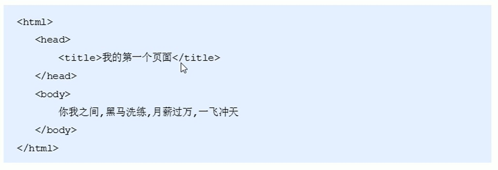

# HTML骨架

> 所屬章節：第二章｜HTML 簡介  
> 關鍵字：HTML骨架、骨架標籤、基本結構、`<!DOCTYPE html>`、`<html>`、`<head>`、`<title>`、`<body>`、HTML文檔、`.html`、`.htm`  
> 建議回查情境：想知道一個 HTML 頁面最基本要有哪些結構、想分清 `head`、`title`、`body` 的角色、想確認 HTML 檔案副檔名與瀏覽器的關係

## 本節導讀

這一節整理 `HTML` 頁面最基本的骨架概念。  
如果你已經知道網頁是用 `HTML` 描述的，接下來就要進一步理解：一個頁面不是隨便把內容丟進去，而是有固定的基本結構。

## 你會在這篇學到什麼

- 為什麼網頁也有固定結構
- 什麼是 HTML 的骨架標籤
- 最基本的 HTML 頁面通常包含哪些部分
- HTML 文檔的副檔名與瀏覽器的關係

## 30 秒複習入口

- 每個 `HTML` 頁面都有一組基本骨架，頁面內容是寫在這個骨架裡。
- 常見的基本結構會看到 `<!DOCTYPE html>`、`<html>`、`<head>`、`<title>`、`<body>`。
- `HTML` 文檔的副檔名通常是 `.html` 或 `.htm`。
- 瀏覽器會讀取 `HTML` 文檔，並把它顯示成我們看到的網頁。

## 速查區

### 核心概念

- 網頁可以類比成一篇文章，文章有開頭、正文、落款等結構；網頁也有自己的基本結構。
- 這些結構不是靠口頭約定，而是透過 `HTML` 標籤描述出來。
- 所謂「骨架標籤」，就是每個頁面最基本、最外層的那組結構標籤。

### 骨架標籤對應

- `<!DOCTYPE html>`：宣告這是一份 `HTML5` 文件。
- `<html>`：整份頁面的根元素，可以把它理解成整個頁面的外框。
- `<head>`：放頁面的基本資訊。
- `<title>`：定義頁面標題，通常會顯示在瀏覽器分頁名稱上。
- `<body>`：放實際會呈現在頁面上的內容。

### 常見錯誤

- 把 `HTML` 理解成只是在寫文字內容，忽略它本身也在描述頁面結構。
- 以為瀏覽器只是把原始碼直接顯示出來；實際上瀏覽器會先讀取並解析 `HTML`。
- 把 `.html` 和 `.htm` 當成不同技術；在入門理解上，它們都可作為 `HTML` 文檔的常見副檔名。

## 正文筆記

### 這篇在解決什麼問題？

- 初學 `HTML` 時，常常只注意到「標題、段落、圖片」這些內容標籤，卻忽略一個完整頁面本身也有固定外框。
- 如果沒有先理解骨架，之後在寫完整頁面時就容易不知道哪些內容應該放在哪裡。
- 這篇的目標，是先建立「頁面先有骨架，再把內容放進去」這個基本觀念。

### 網頁也有固定結構

- 一篇文章通常會有固定的組成方式，例如開頭、正文、落款等。
- 網頁也是一樣，它不是一團隨意堆在一起的內容，而是有基本結構可遵循。
- 在網頁中，常見可以先對應出來的部分包括：整體、頭部、標題、主體等。

### HTML 用標籤描述這個結構

- 網頁中的固定結構，是透過特定的 `HTML` 標籤來描述的。
- 也就是說，`HTML` 不只是標示某段文字長什麼樣，還會標示整個頁面的結構層次。
- 因此每一個網頁都會有一組最基本的結構標籤，頁面內容也是在這些標籤之中書寫。

### 基本骨架可以先這樣理解

下面這段可以先當成最基本的頁面骨架：

```html
<!DOCTYPE html>
<html>
  <head>
    <title>網頁標題</title>
  </head>
  <body>
    頁面內容寫在這裡
  </body>
</html>
```

可以先用最直觀的方式理解它：

- `<!DOCTYPE html>` 告訴瀏覽器這是一份 `HTML5` 文件。
- `<html>` 包住整份頁面。
- `<head>` 放頁面的基本資訊。
- `<title>` 放頁面標題。
- `<body>` 放真正要顯示在頁面上的內容。

### 骨架標籤示意




### HTML 頁面也是 HTML 文檔

- `HTML` 頁面也可以稱為 `HTML` 文檔。
- `HTML` 文檔的後綴名必須是 `.html` 或 `.htm`。
- 瀏覽器的作用，是讀取 `HTML` 文檔，並以網頁的形式顯示出它們。

### 先建立一個最小流程

可以先把整件事記成下面這條線：

1. 先建立一份 `HTML` 文檔。
2. 用骨架標籤把頁面的基本結構搭起來。
3. 把實際內容寫進 `body` 等對應位置。
4. 交給瀏覽器讀取與顯示。

### 常見混淆點

- 骨架標籤不是額外裝飾，而是頁面成立的基本框架。
- `title` 是頁面標題的一部分，但它不等於整個頁面內容。
- 瀏覽器不是創造頁面內容，而是讀取 `HTML` 文檔後再把它呈現出來。

## 一句話抓核心

- `HTML` 頁面就像有固定章法的文章，而骨架標籤就是用來搭起這個固定結構的基本框架。

## 延伸閱讀

- [網頁和網站](./網頁和網站.md)
- [HTML 版本的區別](./HTML版本的區別.md)
- [返回第二章：HTML 簡介](./README.md)
- [返回首頁](../README.md)
