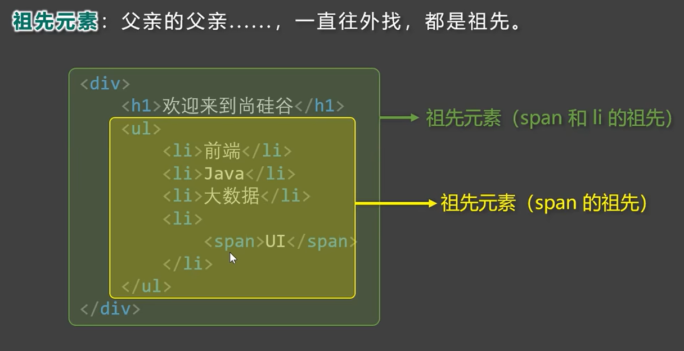

# 標籤組成和關係

> 所屬章節：第二章｜HTML 簡介  
> 關鍵字：HTML標籤、標籤結構、起始標籤、結束標籤、雙標籤、單標籤、HTML元素、巢狀、嵌套、並列、父元素、子元素、祖先元素、後代元素、兄弟元素  
> 建議回查情境：想分清標籤和元素的基本結構、想理解雙標籤與單標籤差別、想看懂父子兄弟這些 HTML 關係名稱

## 本節導讀

這一節處理兩個入門時一定會碰到的基本概念：標籤怎麼組成，以及元素彼此之間的關係怎麼描述。  
如果你後面要學 CSS 選擇器、DOM 結構或頁面巢狀結構，這篇會是很重要的基礎。

## 你會在這篇學到什麼

- HTML 標籤最基本的組成方式
- 什麼是雙標籤與單標籤
- 元素之間常見的嵌套與並列關係
- 父元素、子元素、祖先元素、後代元素、兄弟元素各自代表什麼

## 30 秒複習入口

- HTML 標籤通常由 `<`、`>`、`/` 和標籤名組成。
- 多數標籤是成對出現的雙標籤，也就是起始標籤加結束標籤。
- 少數標籤是單標籤，不需要再寫一個結束標籤。
- 雙標籤之間常見兩種關係：嵌套關係與並列關係。
- 一旦發生嵌套，就可以進一步描述父、子、祖先、後代與兄弟元素。

## 速查區

### 核心定義

- 標籤名：寫在 `< >` 中的英文單詞或字母，例如 `html`、`body`、`p`。
- 起始標籤：像 `<p>` 這樣，表示元素開始。
- 結束標籤：像 `</p>` 這樣，表示元素結束。
- 雙標籤：由起始標籤和結束標籤成對組成。
- 單標籤：只需要一個標籤本身，不再另外寫結束標籤。

### 關係名稱快查

- 父元素：直接包住其他元素的那一層。
- 子元素：被父元素直接包含的那一層。
- 祖先元素：一路往外包住目前元素的所有上層元素。
- 後代元素：某元素內部所有更深層的子孫元素。
- 兄弟元素：同一層、共享同一個父元素的元素。

### 常見錯誤

- 把標籤和元素完全混成同一個詞使用；入門時可以先近似理解，但遇到結構討論時最好知道標籤是語法外殼，元素是整個節點概念。
- 把「父子」和「祖先後代」當成同一層關係；前者強調直接一層，後者可以跨多層。
- 以為只要寫了兩個標籤就是兄弟元素；前提是它們必須有同一個父元素。

## 正文筆記

### 這篇在解決什麼問題？

- 初學 `HTML` 時，通常會先看到很多尖括號，但不一定知道每個部分各自叫什麼。
- 等到開始看巢狀結構時，又很容易被「父元素」「子元素」「兄弟元素」這些說法搞混。
- 這篇的目標，是先把標籤結構和元素關係這兩組基礎語言建立起來。

### HTML 標籤的結構


#### 結構說明

- 標籤由 `<`、`>`、`/`、英文單詞或字母組成。
- 被 `< >` 包起來的英文單詞或字母，稱為標籤名。
- 多數情況下，一個完整標籤會由兩部分組成，也就是我們常說的雙標籤。

#### 雙標籤

- 標籤對中的第一個叫做起始標籤。
- 標籤對中的第二個叫做結束標籤。
- 例如：

```html
<p>這是一段文字</p>
```

這裡可以這樣看：

- `<p>` 是起始標籤。
- `</p>` 是結束標籤。
- 中間包住的是這個元素的內容。

#### 單標籤

- 有些特殊標籤只需要單獨出現一次，不需要再寫一個結束標籤。
- 這類標籤稱為單標籤。
- 入門時可以先把它理解成「這個標籤本身就已經足夠表達它的用途」。

### HTML 元素間的關係

雙標籤形成結構之後，元素彼此之間常見可以分成兩類關係：

- 嵌套關係
- 並列關係

#### 嵌套關係

- 當一個元素包住另一個元素時，就形成嵌套關係。
- 只要有嵌套，就可以進一步談父元素、子元素、祖先元素和後代元素。

下面用簡單範例先建立概念：

```html
<body>
  <div>
    <p>文字</p>
  </div>
</body>
```

在這段裡：

- `body` 是 `div` 的父元素。
- `div` 是 `p` 的父元素。
- `p` 是 `div` 的子元素。
- `body` 和 `div` 都可以算是 `p` 的祖先元素。
- `div` 和 `p` 都可以算是 `body` 的後代元素。

#### 並列關係

- 如果兩個元素位在同一層，且同時被同一個父元素包住，它們就是並列關係。
- 在這種情況下，也常稱它們為兄弟元素。

例如：

```html
<ul>
  <li>第一項</li>
  <li>第二項</li>
</ul>
```

這裡兩個 `li` 都在同一層，並且同樣被 `ul` 包住，所以它們是兄弟元素。

### 各種元素關係圖示

#### 父元素


#### 子元素


#### 祖先元素



#### 後代元素


#### 兄弟元素


### 怎麼判斷這些關係？

可以先用這個順序判斷：

1. 先看兩個元素是不是在同一層。
2. 如果是同一層，再看它們是不是共享同一個父元素。
3. 如果不是同一層，就看其中一個是否包在另一個裡面。
4. 如果是直接包住，談父子。
5. 如果中間隔了不只一層，談祖先與後代。

### 常見混淆點

- 父元素與祖先元素不一樣；父元素一定是直接上一層，祖先元素可以是更外層。
- 子元素與後代元素不一樣；子元素一定是直接下一層，後代元素可以跨很多層。
- 兄弟元素一定要同層，不能只是剛好都出現在同一份文件中。

## 一句話抓核心

- 先看標籤怎麼開和怎麼關，再看元素之間是包住彼此還是並排同層，你就能判斷大部分 HTML 基本結構關係。

## 延伸閱讀

- [HTML骨架](./HTML骨架.md)
- [HTML 版本的區別](./HTML版本的區別.md)
- [返回第二章：HTML 簡介](./README.md)
- [返回首頁](../README.md)
