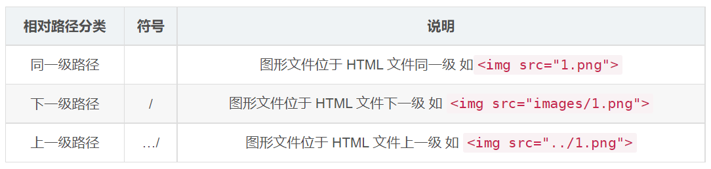

# 路徑

所屬章節：[第六章｜路徑](./README.md)

## 本節導讀

這篇在整理 HTML 中最常見的資源定位觀念，也就是如何讓頁面正確找到圖片等外部文件。  
重點是先分清絕對路徑與相對路徑的參考基準，再理解它們各自的使用情境與限制。  
如果你在寫 `img`、`link`、`script` 等引用路徑時容易搞混，這篇就是最適合回查的入口。

## 關鍵字

- 主題：HTML 路徑、資源路徑
- 別名：文件路徑、圖片路徑
- 英文：path、absolute path、relative path
- 常見搜尋：HTML 圖片路徑怎麼寫、絕對路徑和相對路徑差別、`./` 可以省略嗎
- 易混淆：絕對路徑 vs 相對路徑、本地絕對路徑 vs 網路絕對路徑

## 建議回查情境

- 當你想確認圖片或其他資源到底該怎麼寫路徑時
- 當你忘記絕對路徑與相對路徑的差別時
- 當你移動了檔案位置，懷疑原本路徑為什麼失效時

## 30 秒複習入口

- 路徑的核心任務，是讓頁面正確找到目標文件。
- 絕對路徑以根位置或完整網址為基準，相對路徑以當前檔案位置為基準。
- 相對路徑更常用，但只要調整檔案位置，原本路徑就可能要一起修改。

## 速查區

### 核心定義

- 路徑：用來指定目標文件位置的寫法，常用於圖片等外部資源引用。
- 絕對路徑：以根位置或完整網址作為參考點，可直接定位到目標。
- 相對路徑：從當前程式碼檔案的位置出發，去尋找目標文件。

### 關鍵規則 / 判準

- 盤符開頭的本地地址與完整網路地址，都屬於絕對路徑。
- 相對路徑依賴當前檔案位置，不是依賴網站或電腦中的任意位置。
- 相對路徑中的 `./` 可以省略不寫。

### 常見錯誤

- 直接使用本地絕對路徑，換電腦或換目錄後就失效。
- 看到外部圖片網址能打開，就忽略防盜鏈造成的引用失敗。
- 調整 HTML 或資源檔位置後，忘記同步修改相對路徑。

### 一句話對比

- 絕對路徑是直接寫出完整位置；相對路徑是從目前檔案位置往目標位置走。

## 正文

### 1. 路徑介紹

> 場景：頁面中的圖片會非常多，通常我們會新建一個文件夾來存放這些圖像文件，這時再查找圖像，就需要採用「路徑」的方式來指定圖像文件的位置。

- 類似於生活中兩個人，我要去找你，需要通過一定的路徑才能找到。

  

- 同理，頁面需要找到圖片，也是需要通過路徑才能找到。
- 路徑可分為：
  - 絕對路徑
  - 相對路徑

### 2. 絕對路徑

> 指目錄下的絕對位置，可直接到達目標位置。以根位置作為參考點，去建立路徑。

- 例如：
  - 盤符開頭：`D:\day01\images\1.jpg`
  - 完整的網路地址：`https://www.itcast.cn/2018czgw/images/logo.gif`
- 注意點：
  - 使用本地的絕對路徑，一旦更換設備，路徑處理起來比較麻煩，所以很少使用。
  - 使用網路絕對路徑，確實方便，但要注意若服務器開啟了防盜鏈，會造成圖片引入失敗。
    - 防盜鏈：也就是說透過瀏覽器去看是正常的，但是如果是在自己開發的網站中，使用別人的圖片，就可能顯示未經允許不可引用的字樣。

### 3. 相對路徑

> 相對路徑是從程式碼所在的這個文件出發，去尋找目標文件的，而我們這裡所說的上一級、下一級和同一級，就是圖片相對於 HTML 頁面的位置。

- 以引用文件所在位置為參考基礎，而建立出的目錄路徑。

  

- 注意點：
  - 相對路徑中的 `./` 可以省略不寫。
  - 相對路徑依賴的是當前位置，後期若調整了文件位置，那麼文件中的路徑也要修改。

## 自測問題

1. 絕對路徑與相對路徑，各自是以什麼作為參考基準？
2. 為什麼本地絕對路徑通常不適合直接拿來寫在網頁中？
3. 如果你移動了 HTML 檔案位置，哪些路徑最需要優先檢查？

## 延伸閱讀

- 前置知識：[HTML 基本結構標籤](../第四章_HTML基本結構標籤/第04章_HTML基本結構標籤.md)
- 返回章節入口：[第六章｜路徑](./README.md)
