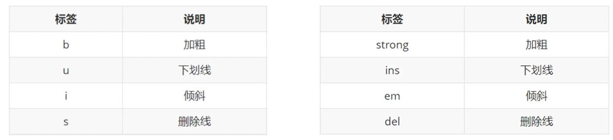

# 文本格式化標籤

> 所屬章節：第十七章｜文本格式化標籤  
> 關鍵字：文本格式化標籤、`<b>`、`<strong>`、`<i>`、`<em>`、`<u>`、`<ins>`、`<s>`、`<del>`、文字強調、文字語意、視覺樣式  
> 建議回查情境：想知道常見文本格式化標籤怎麼分、想分清純外觀效果和語意強調的差別、想確認加粗、斜體、底線、刪除線該用哪一組標籤

## 本節導讀

這篇整理 HTML 常見的文本格式化標籤。  
重點不是只背哪個標籤會變粗、變斜或加刪除線，而是理解「純視覺效果」和「帶有語意的強調」有什麼差別。

初學時，很容易把這些標籤都當成外觀工具。  
但更穩定的理解方式是：有些標籤偏向呈現樣式，有些則同時在表達重要性、強調或內容變更的語意。

## 你會在這篇學到什麼

- 常見文本格式化標籤有哪些
- 成對標籤之間的用途差別
- 為什麼教材常建議優先用帶語意的那一組
- 什麼情況該選擇語意標籤，而不是只改外觀

## 30 秒複習入口

- `b` / `strong` 都可能讓文字看起來變粗，但 `strong` 更偏重要性強調。
- `i` / `em` 都可能讓文字看起來傾斜，但 `em` 更偏語意上的強調。
- `u` / `ins` 都可能呈現底線，但 `ins` 更接近「插入內容」或新增內容的語意。
- `s` / `del` 都可能呈現刪除線，但 `del` 更接近「刪除內容」的語意。

## 速查區

### 核心概念

- 文本格式化標籤不只是在改外觀，也可能同時承擔語意表達。
- 初學時可以先把它們分成兩類：偏視覺樣式的標籤，以及偏語意強調的標籤。

### 關鍵規則 / 判準

- `b` 偏向粗體外觀；`strong` 偏向重要性強調。
- `i` 偏向斜體外觀；`em` 偏向語氣或語意強調。
- `u` 偏向底線外觀；`ins` 偏向插入、補上的內容。
- `s` 偏向畫掉但未必表示真的刪除；`del` 偏向被刪除的內容。
- 如果內容本身有明確語意，通常優先考慮使用帶語意的那組標籤。

### 常見使用場景

- 強調重要提醒或關鍵詞
- 表示語氣上的重讀
- 標示新增或刪除的內容
- 在教材中比較不同文本格式化標籤的功能

### 常見混淆點

- 看起來一樣，不代表語意一樣。
- 不應只因為想改粗體或斜體，就忽略內容本身是否有語意需要表達。
- 若需求純粹是視覺樣式，實務上也常交給 CSS 處理。

### 一句話對比

- 文本格式化標籤不只在改字的樣子，也在表達「這段文字為什麼要這樣呈現」。

## 正文筆記

### 這篇在解決什麼問題？

- 在 HTML 裡，文字不一定只是普通顯示。
- 有時你想讓某段內容看起來更重要、被強調、被插入或被刪除，這時就會用到文本格式化標籤。

## 1. 這組標籤在做什麼？

> 標籤語意：突出重要性的強調語境。

- 這句話可以再說得更完整一些。
- 這組標籤的共同點，是讓文字在畫面上呈現不同效果；其中一部分還會傳達強調、重要性或內容變更的語意。

## 2. 常見標籤對照

```html
<b>加粗</b>
<strong>加粗</strong>

<u>下划线</u>
<ins>下划线</ins>

<i>倾斜</i>
<em>倾斜</em>

<s>删除线</s>
<del>删除线</del>
```

### 這段例子在展示什麼？

- 它把常見的「純外觀標籤」和「較有語意的標籤」放在一起比較。
- 畫面效果可能很接近，但它們背後想表達的意思不完全一樣。

## 3. 每一組怎麼理解？

### `b` 和 `strong`

- `b` 通常偏向把文字做成粗體外觀。
- `strong` 除了常見的粗體效果，也更偏向表示這段內容很重要。

### `i` 和 `em`

- `i` 通常偏向斜體外觀。
- `em` 則更偏向語氣或語意上的強調。

### `u` 和 `ins`

- `u` 通常偏向底線效果。
- `ins` 更常拿來表示新增、插入的內容，因此不只是畫底線。

### `s` 和 `del`

- `s` 常見為刪除線效果，但不一定表示內容真的被刪除。
- `del` 更明確表示某段內容已被刪除。

## 4. 為什麼教材常建議用後者？

- 更準確的說法是：後者通常不只描述外觀，也比較能表達內容本身的意義，所以在學 HTML 語意時更有價值。



## 5. 使用這些標籤時的注意點

- 不要把所有格式需求都直接交給 HTML 標籤處理。
- 如果需求只是改外觀，很多情況也可以交給 CSS。
- 如果內容本身有「重要、強調、新增、刪除」等語意，則可優先選擇對應的語意標籤。
- 學習時先理解每組標籤的語意差別，會比只背畫面效果更穩定。

## 常見問法

### `b` 和 `strong` 看起來都會變粗，差在哪？

- 差別在語意。
- `b` 比較偏外觀；`strong` 比較偏重要性強調。

### `i` 和 `em` 看起來都會斜，差在哪？

- `i` 比較偏斜體樣式。
- `em` 比較偏語氣上的強調。

### 為什麼會建議優先用 `strong`、`em`、`ins`、`del`？

- 因為這組標籤通常更能表達內容本身的意義，不只是改畫面效果。

## 自測問題

1. 文本格式化標籤的共同用途是什麼？
2. `b` 和 `strong` 的主要差別是什麼？
3. `u` 和 `ins`、`s` 和 `del` 各自差在哪裡？
4. 什麼情況應優先考慮語意標籤，而不是只追求視覺效果？

## 延伸閱讀

- [第十七章｜文本格式化標籤](./README.md)
- [第十三章｜語意化標籤](../第十三章_語意化標籤/README.md)
- [返回首頁](../README.md)
