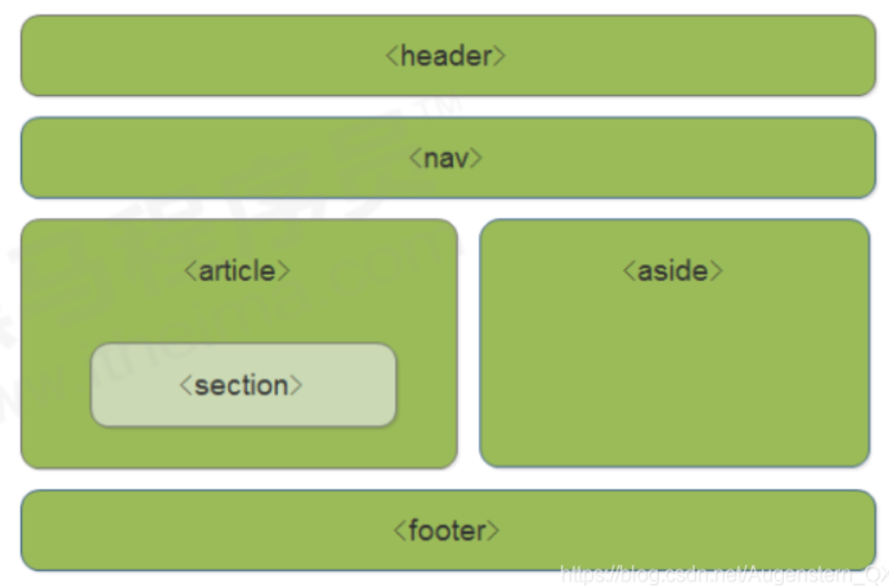

# 語意化標籤

> 所屬章節：第十三章｜語意化標籤  
> 關鍵字：語意化標籤、semantic HTML、`<header>`、`<nav>`、`<article>`、`<section>`、`<aside>`、`<footer>`、SEO、可存取性、語意結構  
> 建議回查情境：想知道什麼是語意化標籤、想分清語意化和 `div` 佈局的差別、想快速回查常見語意化標籤用途、想知道語意化對 SEO 與可讀性有什麼幫助

## 本節導讀

這篇整理 HTML 的語意化標籤。  
所謂語意化，不是單純把標籤名字換得比較好看，而是讓標記本身能更清楚描述內容在頁面中的角色。

初學時，很多教材會把語意化標籤和 SEO 綁得很緊，這並不算完全錯，但如果只這樣理解，會忽略它更核心的價值：  
讓人、瀏覽器、搜尋引擎與輔助技術都更容易理解頁面的結構。

## 你會在這篇學到什麼

- 什麼是語意化標籤
- 常見語意化標籤有哪些
- 語意化和 `div` 佈局的差別
- 語意化標籤的主要優點與注意點

## 30 秒複習入口

- 語意化標籤是能描述內容角色與結構的 HTML 標籤。
- 常見例子有 `header`、`nav`、`article`、`section`、`aside`、`footer`。
- 語意化的重點不只在 SEO，也包含可讀性、維護性與輔助技術理解。
- `div` 不是錯，但如果內容本身有更明確的語意標籤，通常應優先使用對應標籤。

## 速查區

### 核心概念

- 語意化標籤是在描述「這段內容是什麼角色」。
- 它讓頁面結構更清楚，不必所有區塊都只靠 `div` 命名來猜。

### 關鍵規則 / 判準

- `header` 常表示頁首或某區塊的標頭。
- `nav` 常表示導覽區。
- `article` 常表示一篇可獨立閱讀的內容。
- `section` 常表示文件中的某個主題區段。
- `aside` 常表示側欄、補充資訊或與主內容間接相關的內容。
- `footer` 常表示頁尾或某區塊的尾部資訊。

### 常見優點

- 結構更清楚，樣式拿掉後也較容易讀。
- 對搜尋引擎理解頁面結構有幫助，但不是保證排名提升的魔法。
- 對螢幕閱讀器等輔助技術更友善。
- 對團隊維護與後續擴充較有利。

### 常見混淆點

- 語意化不等於只服務搜尋引擎。
- 語意化標籤不是只能各出現一次，要看頁面結構與內容角色。
- 語意化標籤不是拿來取代所有 `div`；沒有合適語意時，`div` 仍然是合理容器。

### 一句話對比

- 語意化標籤是在描述內容角色；`div` 比較像通用容器，本身不說明內容是什麼。

## 正文筆記

### 這篇在解決什麼問題？

- 以前做頁面時，很多區塊都只用 `div` 來包，光看標籤本身很難知道每一塊內容在做什麼。
- 語意化標籤就是在改善這件事：讓頁面結構更容易被理解，而不是滿頁都是沒有角色說明的容器。

## 1. 什麼是語意化標籤

> 語意化顧名思義，就是能讓人一眼比較容易看出每個標籤的作用和含義。

- 這個理解方向是對的，但可以再講得更準確一點。
- 所謂語意化，指的是你使用的標籤本身，能傳達該內容在頁面中的角色，例如導覽、文章、區段、側欄或頁尾。
- 這樣不只人比較容易讀，程式、搜尋引擎與輔助技術也比較容易判讀。

## 2. 常見語意化標籤



- `<header>`：頁首，或某區塊的標頭部分。
- `<nav>`：導覽區，通常放主要導航連結。
- `<article>`：可獨立理解的內容，例如文章、貼文、新聞項目。
- `<section>`：文件中的主題區段。
- `<aside>`：側欄、補充資訊、延伸資訊。
- `<footer>`：頁尾，或某區塊的尾部資訊。

### 這些標籤要怎麼理解？

- 它們不是只在首頁版型裡才會出現。
- 重點不是記住它們長得像網站哪一塊，而是判斷內容在結構上扮演什麼角色。

## 3. 為什麼要用語意化標籤

### 對閱讀與維護有幫助

- 樣式拿掉時，頁面結構仍然比較清楚。
- 開發者在回頭看程式碼時，也比較容易理解每個區塊的用途。

### 對搜尋引擎理解有幫助

- 搜尋引擎可以更容易理解頁面不同區域的角色與內容結構。
- 但這不代表只要改成語意化標籤，排名就一定上升；SEO 仍然是多因素問題。

### 對輔助技術較友善

- 螢幕閱讀器等工具在適當情況下，能更好理解頁面區塊與內容順序。
- 所以語意化除了 SEO，也和可存取性有關。

## 4. 原本全用 `div` 的寫法

```css
.header, .nav {
  height: 120px;
  background-color: pink;
  border-radius: 15px;
  width: 800px;
  margin: 15px auto;
}

.section {
  width: 500px;
  height: 300px;
  background-color: skyblue;
}
```

```html
<body>
  <div class="header">頭部標籤</div>
  <div class="nav">導航欄標籤</div>
  <div class="section">某個區域</div>
</body>
```

### 這段在說什麼？

- 這種寫法不是不能用，而是標籤本身沒有直接表達內容角色。
- 你必須靠 `class="header"`、`class="nav"` 這些名稱，才知道每個區塊的用途。

## 5. 換成語意化標籤的寫法

```css
header, nav {
  height: 120px;
  background-color: pink;
  border-radius: 15px;
  width: 800px;
  margin: 15px auto;
}

section {
  width: 500px;
  height: 300px;
  background-color: skyblue;
}
```

```html
<body>
  <header>頭部標籤</header>
  <nav>導航欄標籤</nav>
  <section>某個區域</section>
</body>
```

### 這樣改有什麼差別？

- 只看 HTML，就比較容易知道每個區塊的角色。
- 這就是語意化標籤的核心價值：讓結構資訊直接存在於標記本身，而不是全靠類名補充。

## 6. 使用語意化標籤時的注意點

- 不要把語意化理解成「只對搜尋引擎有用」；它同時也在改善結構可讀性與可存取性。
- 這些標籤可以依頁面需要出現多次，重點是角色是否合理，不是死背每頁只能有一個。
- 在現代開發中，語意化標籤已經是很常見的基本做法；若談到舊版 IE 相容性，應視為歷史背景知識，不是現在學習的主要核心。
- 若真的沒有合適語意標籤可用，`div` 仍然是合理選擇，不需要為了語意化而硬套不合適的標籤。

## 常見問法

### 語意化標籤是不是主要為了 SEO？

- 不是只為了 SEO。
- 比較準確的說法是：它對 SEO 可能有幫助，但更大的價值在於讓頁面結構更清楚，也更利於維護與輔助技術理解。

### `header`、`footer`、`section` 這些標籤可以重複使用嗎？

- 可以，前提是結構上合理。
- 例如整頁可以有頁首，某個文章區塊也可以有自己的 header。

### 既然有語意化標籤，還需要 `div` 嗎？

- 需要。
- `div` 仍然是非常常見的通用容器，只是在有明確語意可用時，通常優先選擇對應的語意標籤。

## 自測問題

1. 什麼是語意化標籤？
2. 為什麼說語意化的價值不只在 SEO？
3. `div` 和語意化標籤的主要差別是什麼？
4. 什麼情況下應優先用語意化標籤，而不是只用 `div`？

## 延伸閱讀

- [第十三章｜語意化標籤](./README.md)
- [第十二章｜盒子標籤](../第十二章_盒子標籤/README.md)
- [返回首頁](../README.md)
