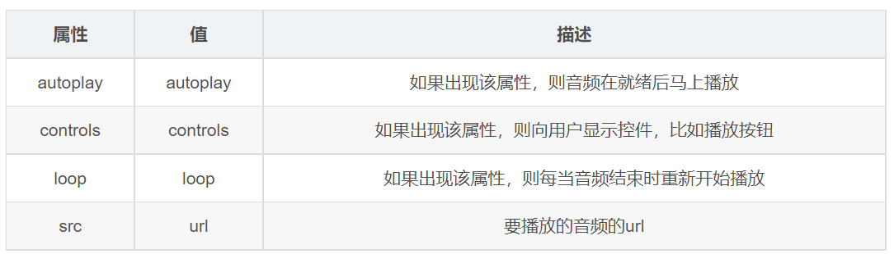

# 音頻標籤

> 所屬章節：第十九章｜音頻標籤  
> 關鍵字：音頻標籤、`audio`、`src`、`controls`、`autoplay`、`loop`、`muted`、`source`、`audio/mpeg`、`audio/ogg`、`audio/wav`  
> 建議回查情境：想知道 HTML 音頻怎麼插入、想分清 `controls` / `autoplay` / `loop` / `muted` 的差別、想知道 `<source>` 為什麼要寫多組、想理解音頻自動播放限制

## 本節導讀

這篇整理 HTML 的音頻標籤 `<audio>`。  
重點不只是把聲音放進頁面，而是理解音頻來源怎麼指定、控制屬性在做什麼，以及為什麼實務上常搭配多個 `<source>` 來提供不同格式。

原始內容能看出核心方向，但順序偏像講稿，也把一些影片標籤的結論直接混進音頻標籤。  
這裡改成較穩定的學習順序：先理解 `<audio>` 基本用途，再看常見屬性、`<source>` 備援寫法，以及自動播放限制。

## 你會在這篇學到什麼

- `<audio>` 是什麼、基本語法怎麼寫
- `controls`、`autoplay`、`loop`、`muted` 各自在做什麼
- 為什麼 `<source>` 常用來提供多種音頻格式
- 為什麼現代瀏覽器常限制自動播放
- 音頻標籤和視頻標籤哪些地方像、哪些地方不能直接混著學

## 30 秒複習入口

- `<audio>` 用來在網頁中嵌入音頻。
- `controls` 會顯示播放控制介面；`loop` 會循環播放。
- `autoplay` 不代表一定會自動播；現代瀏覽器常限制未經使用者互動的自動播放。
- `<source>` 常用來提供多個格式，讓瀏覽器挑自己支援的版本。
- `muted` 不只是影片可用，音頻元素也可以使用這個屬性。

## 速查區

### 核心概念

- `<audio>` 的核心任務是把音頻資源放進頁面。
- 真正要一起學的是：來源、控制方式、格式支援與播放限制。

### 關鍵規則 / 判準

- `src` 指向音頻資源位置。
- `controls` 決定要不要顯示播放介面。
- `autoplay` 只是提出自動播放要求，實際是否生效仍要看瀏覽器政策。
- `loop` 讓音頻播完後重新開始。
- `<source>` 常用於同一段音頻提供多個格式版本。

### 常見使用場景

- 頁面背景音效或提示音
- 教學語音、朗讀內容、Podcast 片段
- 需要讓使用者手動播放的音頻
- 需要針對不同瀏覽器提供不同格式音頻檔的情境

### 常見混淆點

- `autoplay` 不是寫了就一定自動播放。
- `<source>` 不是只為了「低版本瀏覽器」，而是為了多格式備援。
- `muted` 不是只有 `<video>` 能用，`<audio>` 也可以。
- 音頻標籤通常不需要像影片那樣處理畫面尺寸。

### 一句話抓核心

- 音頻標籤的重點不只是把聲音放進頁面，而是同時處理來源、控制方式、格式備援與播放限制。

## 正文筆記

### 這篇在解決什麼問題？

- 在 HTML 裡，如果你要把聲音放進頁面，最直接的方式就是用 `<audio>`。
- 但只會寫 `<audio src="...">` 還不夠；你還需要分清控制屬性怎麼影響播放，以及不同格式為什麼要準備多個來源。

## 1. `<audio>` 標籤在做什麼？

- `<audio>` 用來在網頁中嵌入音頻。
- 它和 `<video>` 一樣，都是 HTML 的媒體元素，但音頻標籤主要處理聲音，不處理影片畫面。

```html
<audio
  src="音頻地址"
  controls
  autoplay
  loop
  muted
></audio>
```



## 2. 常見屬性怎麼理解？

### `src`

- 指定音頻檔案的位置。
- 可以寫相對路徑或其他可被瀏覽器讀取的 URL。

### `controls`

- 讓瀏覽器顯示播放、暫停、進度列、音量等控制介面。
- 初學時通常最常一起寫，因為不寫它時，使用者可能看不到可操作的播放器介面。

### `autoplay`

- 表示頁面載入後希望自動播放音頻。
- 但現代瀏覽器通常會限制未經使用者互動的有聲自動播放，所以不能把它當成一定成功的規則。

### `loop`

- 音頻播放完畢後會重新開始。
- 常見於背景音效、環境音或循環提示音。

### `muted`

- 表示初始狀態為靜音。
- 這個屬性不只影片可用，音頻元素也能使用。

## 3. `<source>` 為什麼常和 `<audio>` 一起用？

- 不同瀏覽器對音頻格式的支援可能不同。
- 因此實務上常把多個 `<source>` 寫在 `<audio>` 裡，讓瀏覽器挑選自己支援的格式。
- 這個做法更準確的理解是「多格式備援」，不只是「照顧低版本瀏覽器」。

```html
<audio controls>
  <source src="./media/music.mp3" type="audio/mpeg" />
  <source src="./media/music.ogg" type="audio/ogg" />
  <source src="./media/music.wav" type="audio/wav" />
  您的瀏覽器不支持 audio 標籤。
</audio>
```

### 這段例子在展示什麼？

- 同一段音頻可以準備多個檔案格式。
- 瀏覽器會依序嘗試能播放的來源。
- 最後那段文字是 fallback：如果瀏覽器完全不支援 `<audio>`，就至少顯示提示訊息。

## 4. 常見音頻格式怎麼理解？

### `MP3`

- 最常見的網頁音頻格式之一。
- 相容性通常不錯，因此是很常見的預設選項。

### `Ogg`

- 也是常見的音頻格式之一。
- 有些情境會拿來作為 `MP3` 之外的備援格式。

### `WAV`

- 通常音質保留較完整，但檔案也可能較大。
- 若是在一般網頁中使用，要注意檔案大小與載入成本。

## 5. 自動播放要注意什麼？

- 原文提到「部分瀏覽器不支持」，這個方向不算錯，但更準確的說法是：現代瀏覽器通常會限制自動播放策略。
- 特別是帶聲音的媒體，常需要使用者互動後才允許播放。
- 所以實務上不要把 `autoplay` 學成「一定會自動播放」。

## 6. 音頻和視頻標籤哪些地方像，哪些地方不能混著學？

### 相似處

- 都屬於 HTML 媒體元素。
- 都可使用 `controls`、`autoplay`、`loop`、`muted`。
- 都可以搭配 `<source>` 提供多個來源。

### 不同處

- `<video>` 還要處理畫面呈現，因此常會碰到尺寸、海報圖等問題。
- `<audio>` 主要處理聲音，不需要把影片畫面相關屬性直接搬過來理解。

## 常見問法

### `controls` 一定要寫嗎？

- 不一定。
- 但如果你沒有自己做播放器介面，通常會先保留 `controls`，讓使用者能直接操作。

### 為什麼寫了 `autoplay` 還是不會自動播？

- 因為瀏覽器通常會限制未經互動的自動播放。
- 這不是標籤失效，而是瀏覽器播放政策在介入。

### `<source>` 是不是只在老瀏覽器才需要？

- 不是。
- 更穩定的理解是：當你要提供多格式備援時，就很適合使用 `<source>`。

### `muted` 能不能用在 `<audio>`？

- 可以。
- 原文把它寫成只有影片可用，這裡已修正。

## 自測問題

1. `<audio>` 的核心用途是什麼？
2. `controls`、`autoplay`、`loop`、`muted` 各自在處理什麼？
3. 為什麼 `<audio>` 常搭配多個 `<source>`？
4. 為什麼不能把 `autoplay` 當成一定生效的規則？
5. 音頻標籤和視頻標籤有哪些相似處與差異？

## 延伸閱讀

- [第十九章｜音頻標籤](./README.md)
- [第六章｜路徑](../第六章_路徑/README.md)
- [返回首頁](../README.md)
